# HX Eco-System

Authoritative repository for the clean-room HX Eco-System rebuild.

## Start here

Agentic tools and coding agents must read these files in order:

1. `AGENTS.md`
2. `docs/00-control/CURRENT-STATE.md`
3. `docs/00-control/BUILD-STATE.md`
4. `docs/00-control/DECISIONS.md`
5. `docs/00-control/HX-ECO-SYSTEM-BASE-IMPLEMENTATION-PRIORITY.md`
6. If smoke-testing, `docs/01-architecture/HX-SMOKE-TESTING-OPERATING-MODEL.md`.
7. The current server record and runbook for the server being worked on.
8. The relevant application standard.
9. If smoke-testing, the exact `/smoke-tests/*.md` authority and `tools/hx-smoke-runner/AGENTS.md`.

`CLAUDE.md` points back to `AGENTS.md` so agent instructions do not drift.

## Authoritative surfaces

- `docs/**/*.md` — current control, architecture, standards, server records, runbooks, and evidence indexes.
- `smoke-tests/*.md` — exact component smoke-test acceptance procedures.
- `docs/03-runbooks/**/*.sh` — approved execution/bootstrap artifacts.
- `tools/hx-smoke-runner/` — repository-owned HX-5 CentCom smoke-runner implementation and scoped AI instructions.
- `human-html/**/*.html` — human-readable mirrors; not execution authority.
- `archive/**` — superseded history; never current authority.

## Smoke Test Structure

HX uses a **remote, CentCom-driven smoke-test model**. The repository defines the test, **HX-5 CentCom executes it**, and the **System Under Test (SUT)** remains clean except for explicitly authorized temporary `hx_smoke_*` state.

```mermaid
flowchart LR
    subgraph AUTH["1 · Repository Authority"]
        A["Owner decision<br/>+ roadmap"]
        B["Component smoke test<br/><b>WHAT must pass</b>"]
        C["HX-5 standards + runner<br/><b>HOW to prove it</b>"]
        A --> B
        A --> C
    end

    subgraph CENTCOM["2 · HX-5 CentCom · Development / Test"]
        D["Disposable test project<br/>manifest · fixtures · runner"]
        E["Remote execution<br/>API · native client · MCP · UI"]
        D --> E
    end

    subgraph SUT["3 · System Under Test"]
        F["Installed application<br/>+ approved configuration"]
        G["Temporary<br/>hx_smoke_* state only"]
        F --> G
    end

    subgraph CLOSE["4 · Prove · Clean · Close"]
        H["Known-answer<br/>functional proof"]
        I["Cleanup<br/>+ verify cleanup"]
        J["Reboot / persistence<br/>proof"]
        K["Retained evidence<br/>+ review"]
        L["BASE PASS<br/>/ CLOSED"]
        H --> I --> J --> K --> L
    end

    B --> D
    C --> D
    E --> F
    G --> H

    classDef authority fill:#1565c0,color:#ffffff,stroke:#90caf9,stroke-width:2px;
    classDef runner fill:#6a1b9a,color:#ffffff,stroke:#ce93d8,stroke-width:2px;
    classDef sut fill:#ef6c00,color:#ffffff,stroke:#ffcc80,stroke-width:2px;
    classDef proof fill:#2e7d32,color:#ffffff,stroke:#a5d6a7,stroke-width:2px;

    class A,B,C authority;
    class D,E runner;
    class F,G sut;
    class H,I,J,K,L proof;
```

### How it works

1. **Repository authority** — the roadmap defines build order; `/smoke-tests/` defines the exact component PASS criteria; HX-5 standards and runner code define execution mechanics.
2. **HX-5 CentCom** — owns disposable test projects, client tooling, synthetic fixtures, manifests, browser automation, cleanup verification, and evidence assembly.
3. **SUT** — owns the installed application and approved configuration. General test harnesses, Python environments, fixtures, and retained evidence do not live on the SUT.
4. **Known-answer proof** — service health alone is not enough. The component must perform its primary function and, where assigned, pass its MCP/UI companion gate.
5. **Cleanup is part of PASS** — temporary collections, keys, workflows, routes, memories, test projects, or connections must be removed and their removal verified.
6. **Limited integration is allowed only for proof** — an already-PASS dependency may be used when required to prove a component's primary contract. Temporary validation wiring does **not** automatically become permanent architecture.

Detailed authorities:

- Architecture map: `docs/01-architecture/HX-SMOKE-TESTING-OPERATING-MODEL.md`
- Execution process: `docs/04-application-standards/HX-5-SMOKE-TEST-PROCESS-AND-PROCEDURES.md`
- CentCom toolset/bootstrap: `docs/04-application-standards/HX-5-CENTCOM-SMOKE-RUNNER-TOOLSET-AND-BOOTSTRAP.md`
- Component acceptance: `smoke-tests/`
- Runner implementation: `tools/hx-smoke-runner/`

## AI-centric operating model

The repository must contain enough current context, instructions, executable helpers, acceptance criteria, and evidence paths for an AI infrastructure/coding agent to operate without reconstructing material decisions from chat history. If an agent cannot determine **what to read, what it may change, how to prove success, and where evidence belongs**, repository context is incomplete.

## Core build philosophy

KISS: **one server, validate it, record it, then move on.**

Native Linux + systemd. No Docker, Podman, or Kubernetes unless explicitly approved by the infrastructure owner.

Historical HX-Infrastructure material is reference-only. It does not establish current state, configuration, or closure.

## Current state

- HX-1: PASS / CLOSED — Samba AD/DNS/Kerberos/NTP
- HX-2: PASS / CLOSED — Qwen-X / Ollama
- HX-3: PASS / CLOSED — Coder-X / Ollama
- HX-4: NEXT — Meta-X base build plus shared embedding/reranking plane
- HX-5 through HX-17: pending clean rebuild/base application stand-up in dependency order.

HX-5 is planned as CentCom / Ornith / DeepSeek Harness / dev-test and, after its activation gate, the standard remote smoke-test runner for later components. **Planned does not mean installed.**

## Document lifecycle

Active documents use stable, unversioned filenames. Version/date/status live inside the document where applicable.

When a document is superseded:
1. archive the prior copy under `archive/YYYY-MM-DD/<original-path>/`;
2. replace the active file at the same stable path;
3. update the matching HTML mirror when one exists;
4. leave exactly one active version.
