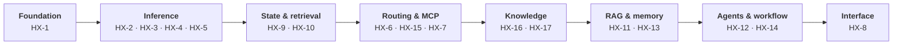

# HX Eco-System

Authoritative repository for the clean-room HX Eco-System rebuild: a
**17-server native-Linux AI ecosystem**, built one server at a time, each one
validated and recorded before the next begins.

> **Cornerstone first.** Understand the ecosystem and its configuration before
> applying skills or the smoke-test model. Skills augment expertise. Validation
> proves the architecture. Neither one defines the ecosystem.

---

## 1. Start here

| You are | Read this |
|---|---|
| An agent working in this repo | `AGENTS.md` — the operating contract |
| Building a server today | `docs/03-runbooks/RUN-SHEET.md` |
| Looking for current state | `docs/00-control/hx-fleet.tsv` |
| Deciding something | `docs/00-control/DECISIONS.md` |
| Reading as a human | `human-html/` — generated, never authority |

---

## 2. Build order

Each layer depends on the one before it. This is dependency sequencing, not
permanent integration wiring.



Two things cut across every layer and are deliberately **not** drawn, because
cross-cutting concerns make a diagram less readable rather than more:

- **Governed skills** (`skills/`) advise on any component. They never decide.
- **Validation** (`smoke-tests/`, run from HX-5 CentCom) proves any component.
  It never becomes an architecture layer of its own.

---

## 3. Current state

<!-- HX-FLEET:TABLE columns=id,ip,role,state -->
| Server | IP | Assignment | State |
|---|---|---|---|
| HX-1 | `192.168.50.200` | Samba AD / DNS / Kerberos / NTP | **PASS** |
| HX-2 | `192.168.50.202` | Qwen-X / Ollama | **PASS** |
| HX-3 | `192.168.50.203` | Coder-X / Ollama | **PASS** |
| HX-4 | `192.168.50.204` | Meta-X / GPT-OSS 20B + BGE-M3 + Nomic + BGE reranker | **NOT STARTED** |
| HX-5 | `192.168.50.205` | CentCom / Ornith / DeepSeek Harness / dev-test | **NOT STARTED** |
| HX-6 | `192.168.50.206` | OmniRoute | **NOT STARTED** |
| HX-7 | `192.168.50.207` | NGINX dev/test only | **NOT STARTED** |
| HX-8 | `192.168.50.208` | Open WebUI | **NOT STARTED** |
| HX-9 | `192.168.50.209` | PostgreSQL + MCP / Redis + MCP | **NOT STARTED** |
| HX-10 | `192.168.50.210` | Qdrant + Web UI + MCP | **NOT STARTED** |
| HX-11 | `192.168.50.211` | LightRAG + MCP | **NOT STARTED** |
| HX-12 | `192.168.50.212` | Deep Agents (LangChain) LOB agent factory | **NOT STARTED** |
| HX-13 | `192.168.50.213` | Mem0 + assigned MCP | **NOT STARTED** |
| HX-14 | `192.168.50.214` | n8n + MCP | **NOT STARTED** |
| HX-15 | `192.168.50.215` | FastMCP shared/custom MCP development host | **NOT STARTED** |
| HX-16 | `192.168.50.216` | Docling + Granite-Docling 258M + MCP | **NOT STARTED** |
| HX-17 | `192.168.50.217` | Crawl4AI + MCP | **NOT STARTED** |
<!-- /HX-FLEET:TABLE -->

Generated from `docs/00-control/hx-fleet.tsv`. Edit that file, then run
`tools/hx-doc/hx-fleet`. Do not hand-edit the table.

**Design readiness is not as-built completion.** A pinned version and a written
runbook mean the work is planned, not that it is running.

---

## 4. Foundational configuration

| Item | HX baseline |
|---|---|
| LAN | `192.168.50.0/24` |
| Gateway | `192.168.50.1` |
| Infrastructure DNS | HX-1 |
| AD domain | `hx.local.arpa` |
| Kerberos realm | `HX.LOCAL.ARPA` |
| Domain client pattern | SSSD / realmd / adcli |
| Deployment | Native Ubuntu Linux + systemd |
| Containers | Not used unless explicitly approved |
| Normal UI access | Direct native application server and port |
| NGINX | HX-7, development and test rendering only |

HX-1 through HX-3 have current as-built evidence. Everything else is planned
until verified during that server's own build.

---

## 5. Core rules

- **KISS.** One server, validate it, record it, move on.
- **Native.** Linux and systemd. No Docker, Podman or Kubernetes.
- **Clean room.** Historical HX-Infrastructure artifacts are reference only and
  do not establish current state.
- **Package sources.** Application software comes from PyPI, npm, a GitHub
  release, an upstream source tarball, a direct binary, or Hugging Face. The
  Ubuntu archive is used only for the NVIDIA driver and for build toolchains
  and library headers. Never Snap.
- **Companion services.** A product's own MCP server and native Web UI are part
  of that application's base build. HX-15 FastMCP is a shared development host,
  not a prerequisite for any of them.
- **Retrieval plane.** BGE-M3 primary at 1024 dimensions, Nomic Embed Text v1.5
  alternate at 768, and the BGE reranker — all on HX-4. Never mix embedding
  identities in one Qdrant collection; a model change means a new collection
  and re-embedding.
- **Granite-Docling** stays with Docling on HX-16, CPU-first for base validation.
- **NGINX** is HX-7 development and test only, never the ecosystem front door.
- **Base before integration.** Permanent routes, production schemas and
  collections, agent bindings, RAG ingestion, workflows and end-to-end wiring
  all come after standalone base closure.

---

## 6. Building a server

Every server follows the same six steps. Full detail, including what will stop
you on each host, is in `docs/03-runbooks/RUN-SHEET.md`.

```bash
tools/hx-doc/hx-preflight                        # from anywhere, before build day

cd docs/03-runbooks
./common/01-base-admin-network-updates.sh hx-9   # reboots
./common/02-domain-nvidia.sh hx-9                # reboots
./common/10-postgresql.sh hx-9                   # the application
```

One implementation of each block lives in `docs/03-runbooks/common/`, with
five-line per-server wrappers. Every block refuses to run on the wrong host.
Versions are pinned in `common/hx-base.env` and audited by
`tools/hx-doc/hx-version-pins`.

Validation is two questions, everywhere: **does the service start, and does it
survive a reboot.**

---

## 7. Two roadmaps — build first, prove second

```text
BASE IMPLEMENTATION ROADMAP     what gets built, in what dependency order
            |
SMOKE-TEST ROADMAP              what proof runs next, on which prior evidence
            |
COMPONENT SMOKE AUTHORITY       exactly how each known-answer test is run
```

- Build order: `docs/00-control/HX-ECO-SYSTEM-BASE-IMPLEMENTATION-PRIORITY.md`
- Proof order: `docs/00-control/HX-ECO-SYSTEM-SMOKE-TEST-ROADMAP.md`
- Exact procedures: `smoke-tests/`

The proof roadmap uses **cumulative evidence with minimal live coupling**. A
downstream test reuses prior PASS evidence and creates only the smallest
temporary integration needed to prove its own contract. Temporary wiring is
removed before closure.

Service health is never enough. A known-answer test is required, cleanup is
part of PASS, and reviewed evidence plus reboot persistence closes the loop.

---

## 8. Governed skills

`skills/` is the canonical HX library of reusable agent expertise. A skill may
improve planning, native installation and configuration reasoning,
troubleshooting, upgrades and validation preparation. It does **not** replace
architecture, runbooks, or acceptance criteria.

```text
HX context -> component runbook -> HX skill wrapper -> current vendor guidance
           -> reconcile with HX decisions -> execute from HX authority
```

Approved wrappers cover Qdrant, LightRAG, PostgreSQL, Redis, Mem0, Docling and
Crawl4AI. Each pins the exact upstream commit it was reviewed against, and
`tools/hx-doc/hx-upstream-drift` reports when one moves.

Skill approval is guidance only. It never changes the build state of the
assigned server.

Authorities: `skills/README.md`, `skills/SKILL-GOVERNANCE.md`,
`skills/SKILL-REGISTRY.md`, `skills/AGENTS.md`.

Skills never contain credentials of any kind.

---

## 9. Repository tooling

Rules kept only in prose drift. These enforce them, and CI runs all of them on
every change. Python 3 standard library only, no dependencies.

| Command | Enforces |
|---|---|
| `hx-preflight` | every pinned artifact is still fetchable, checked from anywhere |
| `hx-fleet` | every fleet table and the runbook IP map comes from the TSV |
| `hx-render-html` | every mirror matches its Markdown source |
| `hx-doc-check` | links resolve, vocabulary is defined, filenames are stable |
| `hx-version-pins` | pins are current, and no application comes from apt or Snap |
| `hx-upstream-drift` | the registry's reviewed commits are still current |
| `hx-record-check` | server records follow the template; open gaps stay visible |
| `hx-smoke-lint` | smoke authorities carry every required section |
| `hx-new-server` | a new server's runbook and record start complete |
| `hx-doc-supersede` | the archive procedure runs the same way every time |

```bash
tools/hx-doc/hx-doc-check          # before committing
tools/hx-doc/hx-render-html        # after editing any Markdown
```

`human-html/**` is **generated output**. Edit the Markdown and re-render; never
edit a mirror by hand. Detail in `tools/hx-doc/README.md`.

CI also runs shellcheck, a CRLF and executable-bit check, a Python compile, and
a secret scan, and CodeRabbit reviews every pull request against the rules in
`.coderabbit.yaml`. A weekly workflow reports version drift as a single issue.

---

## 10. Authoritative surfaces

| Path | Status |
|---|---|
| `docs/00-control/hx-fleet.tsv` | single source of truth for the fleet |
| `docs/**/*.md` | current control, architecture, standards, records, runbooks |
| `docs/03-runbooks/**/*.sh` | approved execution artifacts |
| `smoke-tests/*.md` | component acceptance authorities, validation only |
| `skills/**` | governed agent expertise, subordinate to the above |
| `tools/**` | repository tooling |
| `human-html/**` | generated human view, never execution authority |
| `archive/**` | superseded history, never current authority |

---

## 11. Reading order for agents

Learn the ecosystem before the skills, and the skills before the validation:

1. `README.md`
2. `docs/00-control/CURRENT-STATE.md` and `docs/00-control/BUILD-STATE.md`
3. `docs/00-control/DECISIONS.md`
4. `docs/01-architecture/ARCHITECTURE-ORIENTATION.md`
5. The relevant server record, runbook, and application standard
6. If a governed skill exists: `skills/SKILL-GOVERNANCE.md`, then the wrapper
7. **Only when validating:** the smoke-test roadmap, the operating model, then
   the exact `smoke-tests/` authority
8. If using the runner: `tools/hx-smoke-runner/AGENTS.md`

Before validating anything, an agent must be able to state the component's
owner server, target IP, role, current state, applicable foundation rules,
dependencies, BASE PASS boundary, and required prior PASS evidence. If it
cannot, it is not ready to run the test.

`CLAUDE.md` points back to `AGENTS.md` so agent instructions cannot drift apart.

---

## 12. Document lifecycle

Active documents use stable, unversioned filenames. Version, date and status
live inside the document.

To supersede one:

```bash
tools/hx-doc/hx-doc-supersede docs/00-control/DECISIONS.md --suffix pre-d021
# edit the active file, then:
tools/hx-doc/hx-render-html && tools/hx-doc/hx-doc-check
```

That archives the prior copy and its mirror under `archive/YYYY-MM-DD/`, leaves
the active file in place to edit, and leaves exactly one active version.
