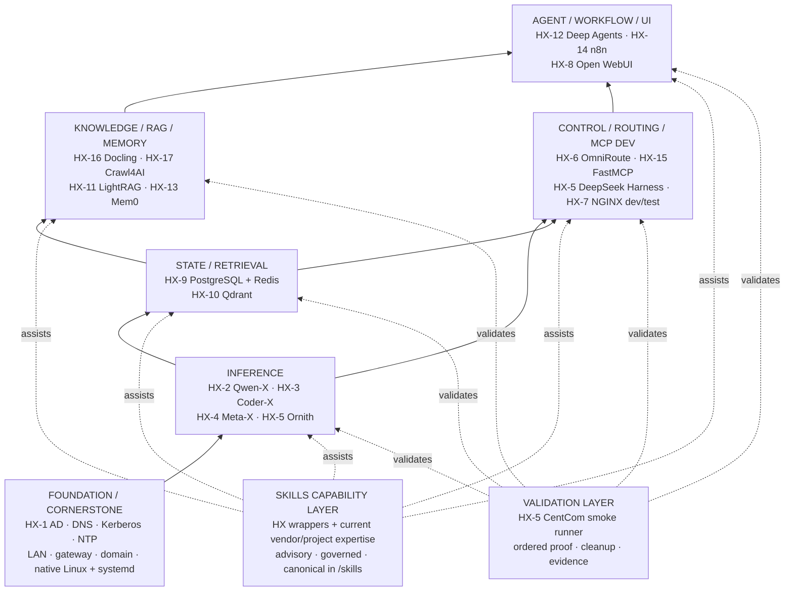

# HX Eco-System

Authoritative repository for the clean-room HX Eco-System rebuild.

> **Cornerstone first:** understand the HX ecosystem and its configuration before applying skills or the smoke-test validation model. Skills augment expertise; validation proves the architecture. Neither defines the ecosystem.

## 1. HX Eco-System cornerstone

HX is a **17-server native-Linux AI ecosystem** organized into foundation, inference, state/retrieval, control/routing, knowledge/RAG, agent/workflow, and user-interaction capabilities.



**Interpretation:** the foundation supports the ecosystem; service planes build capability upward; governed skills provide product expertise inside HX boundaries; the validation layer proves components without becoming a new architecture plane.

Detailed ecosystem authority: `docs/01-architecture/ARCHITECTURE-ORIENTATION.md`.

## 2. Foundational configuration

| Item | HX baseline |
|---|---|
| LAN | `192.168.50.0/24` |
| Gateway | `192.168.50.1` |
| Infrastructure DNS | HX-1 — `192.168.50.200` |
| AD domain | `hx.local.arpa` |
| Kerberos realm | `HX.LOCAL.ARPA` |
| Domain client pattern | SSSD / realmd / adcli |
| Foundation services | HX-1 — Samba AD / DNS / Kerberos / NTP |
| Deployment | Native Ubuntu Linux + systemd |
| Containers | Not used unless explicitly approved by the owner |
| Normal UI access | Direct native application server/port |
| NGINX | HX-7 dev/test UI rendering only; not the common reverse proxy |

HX-1 through HX-3 have current as-built evidence. Future-server target configuration is **planned until verified during that server's rebuild**.

## 3. Server and application map

| Server | IP | Assignment | State |
|---|---|---|---|
| HX-1 | `192.168.50.200` | Samba AD / DNS / Kerberos / NTP | **PASS / CLOSED** |
| HX-2 | `192.168.50.202` | Qwen-X / Ollama / Qwen3.8-27B Q6_K | **PASS / CLOSED** |
| HX-3 | `192.168.50.203` | Coder-X / Ollama / Qwen3-Coder-30B Q6_K | **PASS / CLOSED** |
| HX-4 | `192.168.50.204` | Meta-X / GPT-OSS 20B + BGE-M3 / Nomic / BGE reranker | **NEXT** |
| HX-5 | `192.168.50.205` | CentCom / Ornith / DeepSeek Harness / dev-test | **NOT STARTED** |
| HX-6 | `192.168.50.206` | OmniRoute | **NOT STARTED** |
| HX-7 | `192.168.50.207` | NGINX dev/test only | **NOT STARTED** |
| HX-8 | `192.168.50.208` | Open WebUI | **NOT STARTED** |
| HX-9 | `192.168.50.209` | PostgreSQL + MCP / Redis + MCP | **NOT STARTED** |
| HX-10 | `192.168.50.210` | Qdrant + Web UI + MCP | **NOT STARTED** |
| HX-11 | `192.168.50.211` | LightRAG + MCP | **NOT STARTED** |
| HX-12 | `192.168.50.212` | Deep Agents — LOB agent factory/runtime harness | **NOT STARTED** |
| HX-13 | `192.168.50.213` | Mem0 + assigned MCP | **NOT STARTED** |
| HX-14 | `192.168.50.214` | n8n + MCP | **NOT STARTED** |
| HX-15 | `192.168.50.215` | FastMCP shared/custom MCP development host | **NOT STARTED** |
| HX-16 | `192.168.50.216` | Docling + Granite-Docling 258M + MCP | **NOT STARTED** |
| HX-17 | `192.168.50.217` | Crawl4AI + MCP | **NOT STARTED** |

## 4. Two roadmaps — build first, prove second

HX has two complementary evergreen roadmaps:

```text
BASE IMPLEMENTATION ROADMAP
What gets built? In what dependency order? What is BASE PASS?
        ↓
SMOKE-TEST ROADMAP
What proof runs next? Which prior PASS evidence does it consume?
What limited temporary integration is permitted?
        ↓
COMPONENT SMOKE AUTHORITY
Exactly how is the known-answer test executed and cleaned up?
```

- Deployment/build roadmap: `docs/00-control/HX-ECO-SYSTEM-BASE-IMPLEMENTATION-PRIORITY.md`
- Ordered proof roadmap: `docs/00-control/HX-ECO-SYSTEM-SMOKE-TEST-ROADMAP.md`
- Exact procedures: `smoke-tests/`

The proof roadmap uses **cumulative evidence with minimal live coupling**.

## 5. Core architecture rules

- **KISS:** one server, validate it, record it, then move on.
- **Native deployment:** Linux + systemd; no Docker/Podman/Kubernetes unless explicitly approved.
- **Clean room:** historical HX-Infrastructure artifacts are reference only and do not establish current state.
- **Companion services:** assigned product MCP servers and native Web UIs are part of the parent application's base build.
- **FastMCP boundary:** HX-15 is shared/custom MCP development/runtime; it is not a prerequisite for product-specific MCP servers.
- **HX-4 retrieval inference:** BGE-M3 primary/default at 1024 dimensions; Nomic Embed Text v1.5 alternate/default 768; BGE-family reranker also on HX-4.
- **Qdrant rule:** never mix embeddings from different model identities in one collection; changing models requires a new collection and re-embedding.
- **Docling rule:** Granite-Docling 258M stays with Docling on HX-16 and is CPU-first for base validation.
- **NGINX boundary:** HX-7 is dev/test only, not normal ecosystem routing.
- **Base before integration:** permanent routes, production schemas/collections, agent bindings, RAG ingestion, workflows, and end-to-end integration come after standalone base closure.

## 6. Governed skills capability layer

`skills/` is the canonical HX library for reusable AI-agent expertise.

```text
HX ecosystem context
        ↓
component server/runbook/standard
        ↓
HX governed skill wrapper
        ↓
current official vendor/project guidance
        ↓
reconcile with HX decisions
        ↓
execute from HX authority
        ↓
validate from HX smoke authority
```

Skills may improve planning, native installation/configuration decisions, troubleshooting, upgrades, and validation preparation. They do **not** replace architecture, runbooks, or smoke-test acceptance criteria.

Current authorities:

- Architecture: `skills/README.md`
- Governance: `skills/SKILL-GOVERNANCE.md`
- Registry: `skills/SKILL-REGISTRY.md`
- Scoped agent instructions: `skills/AGENTS.md`

Approved implementations:

- Qdrant: `skills/qdrant/hx-qdrant-advisor/` — HX wrapper around the current official Qdrant Advisor.
- LightRAG: `skills/lightrag/hx-lightrag-advisor/` — HX wrapper around current official `HKUDS/LightRAG` repository guidance; community Claude/MCP projects remain reference-only unless separately admitted.
- PostgreSQL: `skills/postgresql/hx-postgresql-advisor/` — HX wrapper using PostgreSQL Global Development Group guidance as product authority, the Agent Skills open format, and reviewed Neon `postgres-skills` as subordinate community expert reference.
- Redis: `skills/redis/hx-redis-advisor/` — HX wrapper using official Redis product guidance plus reviewed `redis/agent-skills`, curated to preserve HX-9 native/systemd, shared-host, security/topology, and smoke-test authority.
- Mem0: `skills/mem0/hx-mem0-advisor/` — HX wrapper around current official `mem0ai/mem0` product guidance and six-skill graph, curated for HX-13 native/self-hosted OSS, approved Qdrant/Ollama dependencies, owner-gated integration automation, and HX smoke-test authority.

Agent-specific Claude/Codex/OpenCode skill installations are derived deployments from this canonical source, not separate authorities. Skills never store actual credentials or sshpass passwords.

## 7. Dependency-driven base-build sequence

```text
Inference
  HX-4 Meta-X -> HX-5 CentCom/Ornith
        ↓
State / Retrieval
  HX-9 PostgreSQL + Redis -> HX-10 Qdrant
        ↓
Routing / Control / MCP Development
  HX-6 OmniRoute -> HX-15 FastMCP -> HX-5 DeepSeek Harness -> HX-7 NGINX dev/test
        ↓
Knowledge Acquisition
  HX-16 Docling -> HX-17 Crawl4AI
        ↓
RAG / Memory
  HX-11 LightRAG -> HX-13 Mem0
        ↓
Agents / Workflow
  HX-12 Deep Agents -> HX-14 n8n
        ↓
User Interaction
  HX-8 Open WebUI
```

This is dependency sequencing, not permanent integration wiring.

## 8. Validation layer — ordered smoke testing

Only after the ecosystem role/configuration is understood do we apply the validation model.

```mermaid
flowchart LR
    A["Ecosystem authority<br/>role · host · config · state"]
    B["Smoke roadmap<br/>ordered prior proof"]
    C["Component smoke test<br/>known answer"]
    D["HX-5 CentCom<br/>remote disposable run"]
    E["SUT<br/>real application interface"]
    F["Cleanup + verify"]
    G["Reboot / persistence"]
    H["Evidence + review"]
    I["BASE PASS / CLOSED"]

    A --> B --> C --> D --> E --> F --> G --> H --> I
```



Validation rules:

1. **Architecture first.** Smoke tests inherit the ecosystem architecture; they do not redefine it.
2. **Ordered proof.** Downstream tests cite current prior PASS evidence when their primary contract depends on earlier capabilities.
3. **Minimal live integration.** Use only the temporary connection actually required to prove function.
4. **HX-5 executes remotely** after its CentCom activation gate passes; general test tooling stays off the SUT.
5. **Service health is not enough.** A known-answer primary-function test is required.
6. **Cleanup is part of PASS.** Temporary validation state is removed and verified.
7. **Evidence closes the loop.** Reviewed proof plus reboot persistence supports server-record and `BUILD-STATE.md` closure.

Detailed validation authorities:

- Smoke roadmap: `docs/00-control/HX-ECO-SYSTEM-SMOKE-TEST-ROADMAP.md`
- Validation architecture: `docs/01-architecture/HX-SMOKE-TESTING-OPERATING-MODEL.md`
- Component acceptance: `smoke-tests/`
- HX-5 execution process: `docs/04-application-standards/HX-5-SMOKE-TEST-PROCESS-AND-PROCEDURES.md`
- CentCom toolset/bootstrap: `docs/04-application-standards/HX-5-CENTCOM-SMOKE-RUNNER-TOOLSET-AND-BOOTSTRAP.md`
- Runner implementation: `tools/hx-smoke-runner/`

## 9. AI-centric reading order

Agentic tools and coding agents must learn the ecosystem before skills and validation:

1. `README.md`
2. `docs/00-control/CURRENT-STATE.md`
3. `docs/00-control/BUILD-STATE.md`
4. `docs/00-control/DECISIONS.md`
5. `docs/01-architecture/ARCHITECTURE-ORIENTATION.md`
6. `docs/00-control/HX-ECO-SYSTEM-BASE-IMPLEMENTATION-PRIORITY.md`
7. Relevant server record, runbook, and application/model standard.
8. If a governed component skill exists: `skills/SKILL-GOVERNANCE.md`, `skills/SKILL-REGISTRY.md`, and the component wrapper.
9. **Only when validating:** `docs/00-control/HX-ECO-SYSTEM-SMOKE-TEST-ROADMAP.md`.
10. `docs/01-architecture/HX-SMOKE-TESTING-OPERATING-MODEL.md`.
11. The exact `/smoke-tests/*.md` authority.
12. If using CentCom: `tools/hx-smoke-runner/AGENTS.md`.

Before validation, an agent must be able to state the component's **owner server, target IP, role, current state, applicable foundation rules, intended dependencies, BASE PASS boundary, and required prior PASS evidence**.

`CLAUDE.md` points back to `AGENTS.md` so agent instructions do not drift.

## 10. Authoritative surfaces

- `docs/**/*.md` — current control, architecture, standards, server records, runbooks, and evidence indexes.
- `skills/**/*.md`, `skills/**/SKILL.md`, and skill metadata — canonical governed agent expertise, subordinate to HX architecture/runbooks/smoke authority.
- `smoke-tests/*.md` — exact component smoke-test acceptance procedures; validation authority only.
- `docs/03-runbooks/**/*.sh` — approved execution/bootstrap artifacts.
- `tools/hx-smoke-runner/` — repository-owned CentCom validation implementation and scoped AI instructions.
- `human-html/**/*.html` — human-readable mirrors; not execution authority.
- `archive/**` — superseded history; never current authority.

## 11. Current build position

- HX-1: **PASS / CLOSED** — foundation services.
- HX-2: **PASS / CLOSED** — Qwen-X / Ollama.
- HX-3: **PASS / CLOSED** — Coder-X / Ollama.
- HX-4: **NEXT** — Meta-X plus shared embedding/reranking plane.
- HX-5 through HX-17: planned/not started except for staged repository documentation/runbooks where present.

**Design readiness is not as-built completion.**

## 12. Document lifecycle

Active documents use stable, unversioned filenames. Version/date/status live inside the document where applicable.

When a document is superseded:
1. archive the prior copy under `archive/YYYY-MM-DD/<original-path>/`;
2. replace the active file at the same stable path;
3. update the matching HTML mirror when one exists;
4. leave exactly one active version.
