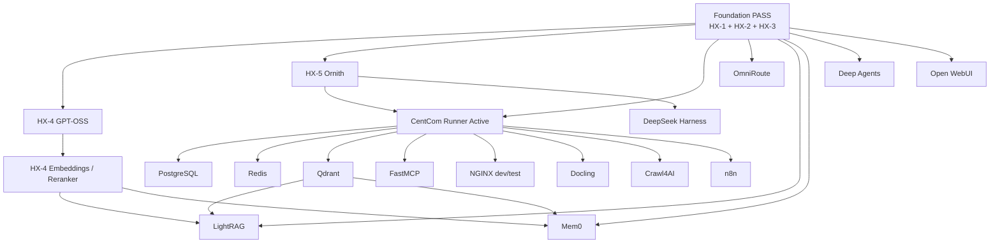

# HX Eco-System — Smoke-Test Roadmap

## 1. Purpose

The base implementation roadmap defines **what is built and in what dependency order**.

This roadmap defines **what is proven and in what proof-dependency order**.

```text
DEPLOYMENT ROADMAP
build the ecosystem foundation and components
                 ↓
SMOKE-TEST ROADMAP
prove each component using prior accepted evidence
and only the minimum temporary integration required
                 ↓
RETAINED EVIDENCE
supports BASE PASS / CLOSED
                 ↓
LATER INTEGRATION PROGRAM
permanent cross-service wiring and end-to-end validation
```

The smoke roadmap sits on top of the ecosystem architecture. It does not define server placement, network design, permanent integration, or component ownership.

## 2. Core rule — cumulative proof, minimal live coupling

The goal is **not** to force every smoke test to call every component tested before it. That would create unnecessary coupling and make failures harder to diagnose.

The HX rule is:

> A downstream smoke test reuses prior **PASS evidence** whenever that earlier capability is a real prerequisite, and creates only the smallest live temporary integration necessary to prove its own primary contract.

Therefore:

- prior PASS evidence is cumulative;
- live validation integration is minimal;
- temporary validation wiring is removed after proof;
- a smoke dependency does not automatically become production architecture;
- a downstream PASS must identify the upstream proof it relied on.

## 3. Dependency types

| Type | Meaning | Example |
|---|---|---|
| **Foundation prerequisite** | Required ecosystem state already established outside the component smoke test | HX-1 domain/DNS foundation; accepted SUT base OS/domain state |
| **Prior smoke PASS** | Earlier component proof must already be accepted | LightRAG requires accepted Qdrant and embedding/model proof |
| **Limited validation integration** | Temporary live connection required to prove primary function | OmniRoute temporarily routes to HX-2 Qwen-X |
| **Companion gate** | Parent component must pass first, then assigned UI/MCP proof | Qdrant core -> Qdrant Web UI -> Qdrant MCP |
| **No component dependency** | Test intentionally stays standalone for fault isolation | PostgreSQL create/write/read/drop; Redis PING/SET/GET/DELETE |

## 4. Proof-chain evidence rule

Every new CentCom-run smoke test records:

```text
prior_pass_evidence
limited_integration_plan
```

For `prior_pass_evidence`:

- use `NONE` when no earlier component proof is required;
- otherwise record the exact retained evidence path(s) or current accepted server record(s) that establish the prerequisite;
- use only current PASS/CLOSED evidence;
- do not reference an archive document as current proof.

Example for a future LightRAG run:

```text
prior_pass_evidence:
  docs/05-evidence/hx-10/qdrant/<run-id>,
  docs/05-evidence/hx-4/embedding-models/<run-id>,
  docs/02-server-records/HX-2.md

limited_integration_plan:
  HX-10 Qdrant + HX-4 BGE-M3 + one approved HX LLM; synthetic data only; remove LightRAG smoke document/state after proof
```

If a materially relevant dependency changes after its PASS—model revision/dimension, database/vector-store version/configuration, API contract, routing behavior, etc.—the prior proof may be stale. Revalidate the dependency before relying on it for a downstream PASS.

## 5. Smoke-test roadmap

### Phase 0 — Existing cornerstone proof

These are prerequisites, not new CentCom smoke runs.

| Proof | Current authority | State |
|---|---|---|
| HX-1 identity/DNS/Kerberos/NTP foundation | `docs/02-server-records/HX-1.md` + BUILD-STATE | **PASS / CLOSED** |
| HX-2 Qwen-X / Ollama | `docs/02-server-records/HX-2.md` + BUILD-STATE | **PASS / CLOSED** |
| HX-3 Coder-X / Ollama | `docs/02-server-records/HX-3.md` + BUILD-STATE | **PASS / CLOSED** |

**Exit:** current foundation and at least one known-good HX model endpoint exist.

---

### Phase A — Inference proof and CentCom activation

| Order | SUT / proof | Smoke authority | Required prior proof | Limited integration |
|---:|---|---|---|---|
| A1 | HX-4 GPT-OSS / Ollama inference | `../../smoke-tests/ollama-inference-smoke-test.md` | HX-4 accepted base/GPU/Ollama state | None |
| A2 | HX-4 BGE-M3 + Nomic embeddings | `../../smoke-tests/embedding-models-smoke-test.md` | HX-4 accepted serving runtime | None |
| A3 | HX-4 BGE-family reranker | `../../smoke-tests/reranker-smoke-test.md` | checkpoint/runtime pinned; HX-4 accepted runtime | None; **NOT EXECUTABLE until pinned** |
| A4 | HX-5 Ornith / Ollama inference | `../../smoke-tests/ollama-inference-smoke-test.md` | HX-5 accepted base/GPU/Ollama state | None |
| A5 | CentCom smoke-runner activation | HX-5 toolset/bootstrap standard + `hx-smoke-doctor --remote` | HX-5 Ornith/base persistence + current HX-2 PASS | One known-answer remote call to HX-2 |

**Exit:** CentCom is an evidence-proven remote smoke-test station, and HX has accepted generative plus retrieval-inference endpoints needed by later tests.

After A5, later component smoke tests run from HX-5 whenever the product exposes a remote/native-client/API/UI surface.

---

### Phase B — State and retrieval substrate

| Order | SUT / proof | Smoke authority | Required prior proof | Limited integration |
|---:|---|---|---|---|
| B1 | HX-9 PostgreSQL core | `../../smoke-tests/postgresql-smoke-test.md` | CentCom active | None; session-scoped disposable data |
| B2 | HX-9 PostgreSQL MCP | `../../smoke-tests/mcp-companion-smoke-test.md` | B1 PostgreSQL PASS | Parent PostgreSQL service only |
| B3 | HX-9 Redis core | `../../smoke-tests/redis-smoke-test.md` | CentCom active | None; TTL-protected disposable key |
| B4 | HX-9 Redis MCP | `../../smoke-tests/mcp-companion-smoke-test.md` | B3 Redis PASS | Parent Redis service only |
| B5 | HX-10 Qdrant core | `../../smoke-tests/qdrant-smoke-test.md` | CentCom active | None; deterministic raw vectors intentionally avoid embedding dependency |
| B6 | HX-10 Qdrant Web UI | `../../smoke-tests/native-web-ui-smoke-test.md` | B5 Qdrant PASS | Parent Qdrant live state only |
| B7 | HX-10 Qdrant MCP | `../../smoke-tests/mcp-companion-smoke-test.md` | B5 Qdrant PASS | Parent Qdrant service only |

**Exit:** relational, transient, and vector state capabilities are independently proven and may be cited by later tests.

---

### Phase C — Routing, MCP development, and control capability

| Order | SUT / proof | Smoke authority | Required prior proof | Limited integration |
|---:|---|---|---|---|
| C1 | HX-6 OmniRoute | `../../smoke-tests/omniroute-smoke-test.md` | one current approved HX model PASS; HX-2 preferred initially | one temporary route to the proven model; remove afterward |
| C2 | HX-15 FastMCP | `../../smoke-tests/fastmcp-smoke-test.md` | CentCom active | disposable custom MCP server/tool only |
| C3 | HX-5 DeepSeek Harness | `../../smoke-tests/deepseek-harness-smoke-test.md` | HX-5 model PASS + one approved HX model endpoint | direct model use for disposable generated AI project; no permanent OmniRoute/MCP/DB required |
| C4 | HX-7 NGINX dev/test | `../../smoke-tests/nginx-smoke-test.md` | CentCom active | HX-5 hosts one temporary private-IP HTTP upstream; remove proxy/upstream afterward |

**Exit:** routing, shared/custom MCP development, meta-agent solution construction, and dev/test proxy capability are proven without creating permanent integration architecture.

---

### Phase D — Knowledge acquisition

| Order | SUT / proof | Smoke authority | Required prior proof | Limited integration |
|---:|---|---|---|---|
| D1 | HX-16 Docling + Granite-Docling | `../../smoke-tests/docling-smoke-test.md` | CentCom active; Granite model staged | None; self-generated local PDF |
| D2 | HX-16 Docling MCP | `../../smoke-tests/mcp-companion-smoke-test.md` | D1 Docling PASS | Parent Docling service only |
| D3 | HX-17 Crawl4AI | `../../smoke-tests/crawl4ai-smoke-test.md` | CentCom active | None; deterministic inline `raw:` HTML |
| D4 | HX-17 Crawl4AI MCP | `../../smoke-tests/mcp-companion-smoke-test.md` | D3 Crawl4AI PASS | Parent Crawl4AI service only |

**Exit:** HX can independently convert documents and acquire web content. These proofs do not yet create a permanent RAG ingestion pipeline.

---

### Phase E — RAG and memory

This is where cumulative smoke proof becomes most useful: the applications intentionally consume already-proven state/model capabilities.

| Order | SUT / proof | Smoke authority | Required prior proof | Limited integration |
|---:|---|---|---|---|
| E1 | HX-11 LightRAG core | `../../smoke-tests/lightrag-smoke-test.md` | B5 Qdrant PASS + A2 accepted embedding PASS + one approved LLM PASS; include B1/B3 only if the accepted LightRAG config actually uses them | synthetic LightRAG document through accepted Qdrant/embedding/LLM path; delete document/state afterward |
| E2 | HX-11 LightRAG MCP | `../../smoke-tests/mcp-companion-smoke-test.md` | E1 LightRAG PASS | Parent LightRAG service only |
| E3 | HX-13 Mem0 core | `../../smoke-tests/mem0-smoke-test.md` | B5 Qdrant PASS + A2 accepted embedding PASS + one approved LLM PASS | dedicated disposable Qdrant collection + synthetic memory; delete both afterward |
| E4 | HX-13 Mem0 MCP | `../../smoke-tests/mcp-companion-smoke-test.md` | E3 Mem0 PASS | Parent Mem0 service only |

**Exit:** RAG and memory primary contracts are proven against the previously accepted state and model substrate.

Docling/Crawl4AI PASS is useful upstream ecosystem evidence but is **not forced into the LightRAG base smoke test**, because direct synthetic text ingestion isolates LightRAG's own contract. Document/web ingestion into LightRAG belongs to later integration validation unless the owner explicitly promotes that bridge into BASE PASS.

---

### Phase F — Agent and workflow consumers

| Order | SUT / proof | Smoke authority | Required prior proof | Limited integration |
|---:|---|---|---|---|
| F1 | HX-12 Deep Agents | `../../smoke-tests/deep-agents-smoke-test.md` | one approved HX model with proven reliable tool calling | model + local synthetic rules + disposable in-memory checkpointer; no production RAG/memory/DB required |
| F2 | HX-14 n8n core | `../../smoke-tests/n8n-smoke-test.md` | CentCom active | disposable deterministic workflow only |
| F3 | HX-14 n8n Web UI | `../../smoke-tests/native-web-ui-smoke-test.md` | F2 n8n PASS | parent n8n live state only |
| F4 | HX-14 n8n MCP | `../../smoke-tests/mcp-companion-smoke-test.md` | F2 n8n PASS | parent n8n service only |

**Exit:** application-agent creation/runtime and workflow execution are proven without requiring production memory, RAG, or external workflow integrations.

---

### Phase G — User interaction

| Order | SUT / proof | Smoke authority | Required prior proof | Limited integration |
|---:|---|---|---|---|
| G1 | HX-8 Open WebUI | `../../smoke-tests/open-webui-smoke-test.md` | one current approved Ollama model PASS | one temporary direct model connection and known-answer conversation; remove validation-only connection afterward |

**Exit:** the user-facing layer proves a real model interaction. A rendered page without a model response is not PASS.

---

## 6. Dependency graph



The graph shows **proof dependencies**, not permanent service wiring. Companion MCP/UI gates occur after their parent component PASS and are omitted from the diagram for readability.

## 7. Companion-gate rule

When a component has an assigned Web UI or product-specific MCP server:

```text
parent core smoke PASS
        ↓
companion UI/MCP smoke PASS
        ↓
reboot persistence
        ↓
component BASE PASS / CLOSED
```

Rules:

- MCP companion tests use the CentCom MCP client; they do **not** depend on the HX-15 FastMCP server.
- UI companion tests use the application's direct LAN endpoint; they do **not** require HX-7 NGINX unless NGINX itself is the SUT.
- A companion PASS cannot substitute for a failed parent core smoke test.

## 8. Failure and invalidation rules

1. A failed prerequisite prevents a downstream PASS.
2. A required prerequisite that has never been proven makes the downstream test `NOT EXECUTABLE — PREREQUISITE OR OWNER DECISION REQUIRED`.
3. Material changes to a prerequisite may invalidate downstream reliance on its old evidence.
4. Re-running a prerequisite creates a new evidence reference; downstream tests should cite the current accepted proof.
5. Failed runs are retained when materially useful; later PASS does not erase them.
6. Cleanup failure keeps the current run incomplete/failed even when the functional action succeeded.

Examples of material invalidation:

- embedding model/revision/dimension changes;
- Qdrant upgrade/configuration change affecting vector behavior;
- model alias/revision change used by a downstream application;
- major API or MCP contract change;
- SUT rebuild or data-path/configuration replacement.

## 9. What this roadmap does not authorize

It does not authorize:

- running a smoke test before the deployment roadmap has installed the SUT;
- permanent cross-service integration;
- production data ingestion;
- cloud providers/models without explicit approval;
- NGINX as a common reverse proxy;
- FastMCP as a prerequisite for product-specific MCP servers;
- copying the CentCom runner/harness onto application hosts;
- containers;
- firewall/TLS/DNS/network architecture changes;
- keeping temporary validation routes, collections, keys, workflows, connections, or test projects after proof unless explicitly approved.

## 10. Relationship among authorities

```text
ARCHITECTURE-ORIENTATION.md
    defines the ecosystem cornerstone and ownership

HX-ECO-SYSTEM-BASE-IMPLEMENTATION-PRIORITY.md
    defines deployment/build order and BASE PASS boundaries

HX-ECO-SYSTEM-SMOKE-TEST-ROADMAP.md
    defines ordered proof dependencies and permitted limited integration

HX-SMOKE-TESTING-OPERATING-MODEL.md
    defines how the validation subsystem operates

/smoke-tests/*.md
    defines exact executable component proof

HX-5 process/tooling
    executes, cleans up, records, and promotes evidence
```

## 11. Current position

As of 2026-09-09:

- Phase 0 cornerstone proof exists for HX-1, HX-2, and HX-3.
- Phase A is next; HX-4 is the next server in the deployment roadmap.
- HX-5 CentCom runner tooling is designed but **not active** because HX-5 is not yet built/accepted.
- Phases B through G remain blocked by their deployment prerequisites and, after HX-5, by CentCom activation.

The roadmap is evergreen. Update it when owner decisions or actual component dependencies change; do not silently infer new permanent architecture from a smoke-test dependency.
