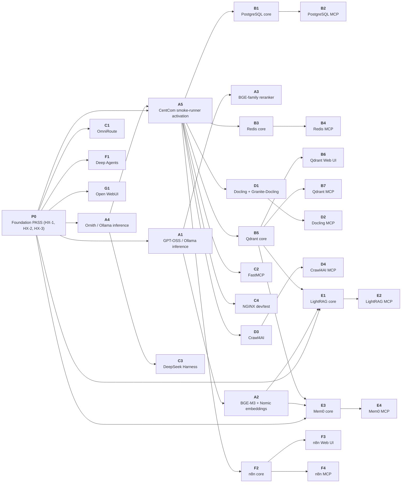

# HX Eco-System — Smoke-Test Roadmap

## 1. Purpose

The base implementation roadmap defines **what is built and in what dependency order**.

This roadmap defines **what is proven and in what proof-dependency order**.

```text
DEPLOYMENT ROADMAP
build the ecosystem foundation and components
                 ↓
SMOKE-TEST ROADMAP
prove each component using prior accepted evidence
and only the minimum temporary integration required
                 ↓
RETAINED EVIDENCE
supports BASE PASS / CLOSED
                 ↓
LATER INTEGRATION PROGRAM
permanent cross-service wiring and end-to-end validation
```

The smoke roadmap sits on top of the ecosystem architecture. It does not define server placement, network design, permanent integration, or component ownership.

## 2. Core rule — cumulative proof, minimal live coupling

The goal is **not** to force every smoke test to call every component tested before it. That would create unnecessary coupling and make failures harder to diagnose.

The HX rule is:

> A downstream smoke test reuses prior **PASS evidence** whenever that earlier capability is a real prerequisite, and creates only the smallest live temporary integration necessary to prove its own primary contract.

Therefore:

- prior PASS evidence is cumulative;
- live validation integration is minimal;
- temporary validation wiring is removed after proof;
- a smoke dependency does not automatically become production architecture;
- a downstream PASS must identify the upstream proof it relied on.

## 3. Dependency types

| Type | Meaning | Example |
|---|---|---|
| **Foundation prerequisite** | Required ecosystem state already established outside the component smoke test | HX-1 domain/DNS foundation; accepted SUT base OS/domain state |
| **Prior smoke PASS** | Earlier component proof must already be accepted | LightRAG requires accepted Qdrant and embedding/model proof |
| **Limited validation integration** | Temporary live connection required to prove primary function | OmniRoute temporarily routes to HX-2 Qwen-X |
| **Companion gate** | Parent component must pass first, then assigned UI/MCP proof | Qdrant core -> Qdrant Web UI -> Qdrant MCP |
| **No component dependency** | Test intentionally stays standalone for fault isolation | PostgreSQL create/write/read/drop; Redis PING/SET/GET/DELETE |

## 4. Proof-chain evidence rule

Every new CentCom-run smoke test records:

```text
prior_pass_evidence
limited_integration_plan
```

For `prior_pass_evidence`:

- use `NONE` when no earlier component proof is required;
- otherwise record one entry for each step in the `Requires` column, written as
  `<step-id> -> <evidence>` and separated by `;`;
- the evidence is the exact retained evidence path, or the current accepted
  server record, that establishes that step;
- use only current PASS/CLOSED evidence;
- do not reference an archive document as current proof.

`hx-smoke-promote` reads the inline value of each manifest field, so every
field stays on one line. A value indented over several lines reads as empty and
the promotion is refused. A bare list of paths is also refused: it cannot say
which path proves which dependency, so nothing can be checked.

Example for a future LightRAG run. `hx-proof.tsv` gives step `E1` the
dependencies `B5,A2,P0`, so each one is named:

```text
prior_pass_evidence: B5 -> docs/05-evidence/hx-10/qdrant/<run-id>; A2 -> docs/05-evidence/hx-4/embedding-models/<run-id>; P0 -> docs/02-server-records/HX-2.md
limited_integration_plan: HX-10 Qdrant + HX-4 BGE-M3 + one approved HX LLM; synthetic data only; remove LightRAG smoke document/state after proof
```

If a materially relevant dependency changes after its PASS—model revision/dimension, database/vector-store version/configuration, API contract, routing behavior, etc.—the prior proof may be stale. Revalidate the dependency before relying on it for a downstream PASS.

## 5. Smoke-test roadmap

### Phase 0 — Existing cornerstone proof

<!-- HX-PROOF:TABLE phase=0 -->
| Step | SUT | Proof | Authority | Requires | Limited integration | Status |
|---|---|---|---|---|---|---|
| **P0** | - | Foundation PASS (HX-1, HX-2, HX-3) | [`BUILD-STATE.md`](../../docs/00-control/BUILD-STATE.md) | — | None | **PASS** |
<!-- /HX-PROOF -->

**Exit:** current foundation and at least one known-good HX model endpoint exist.

---

### Phase A — Inference proof and CentCom activation

<!-- HX-PROOF:TABLE phase=A -->
| Step | SUT | Proof | Authority | Requires | Limited integration | Status |
|---|---|---|---|---|---|---|
| **A1** | hx-4 | GPT-OSS / Ollama inference | [`ollama-inference-smoke-test.md`](../../smoke-tests/ollama-inference-smoke-test.md) | P0 | None | NOT RUN |
| **A2** | hx-4 | BGE-M3 + Nomic embeddings | [`embedding-models-smoke-test.md`](../../smoke-tests/embedding-models-smoke-test.md) | A1 | None | NOT RUN |
| **A3** | hx-4 | BGE-family reranker | [`reranker-smoke-test.md`](../../smoke-tests/reranker-smoke-test.md) | A1 | None | NOT RUN |
| **A4** | hx-5 | Ornith / Ollama inference | [`ollama-inference-smoke-test.md`](../../smoke-tests/ollama-inference-smoke-test.md) | P0 | None | NOT RUN |
| **A5** | hx-5 | CentCom smoke-runner activation | [`HX-5-CENTCOM-SMOKE-RUNNER-TOOLSET-AND-BOOTSTRAP.md`](../../docs/04-application-standards/HX-5-CENTCOM-SMOKE-RUNNER-TOOLSET-AND-BOOTSTRAP.md) | A4,P0 | One known-answer remote call to HX-2 | NOT RUN |
<!-- /HX-PROOF -->

**Exit:** CentCom is an evidence-proven remote smoke-test station, and HX has accepted generative plus retrieval-inference endpoints needed by later tests.

A1-A4 run before CentCom exists. Execute the runner from the operator station
by exporting `HX_SMOKE_ALLOW_HOST="$(hostname -s)"`; the station used is
recorded in each manifest. Procedure: `../05-evidence/README.md`.

After A5, later component smoke tests run from HX-5 whenever the product exposes a remote/native-client/API/UI surface.

---

### Phase B — State and retrieval substrate

<!-- HX-PROOF:TABLE phase=B -->
| Step | SUT | Proof | Authority | Requires | Limited integration | Status |
|---|---|---|---|---|---|---|
| **B1** | hx-9 | PostgreSQL core | [`postgresql-smoke-test.md`](../../smoke-tests/postgresql-smoke-test.md) | A5 | None; session-scoped disposable data | NOT RUN |
| **B2** | hx-9 | PostgreSQL MCP | [`mcp-companion-smoke-test.md`](../../smoke-tests/mcp-companion-smoke-test.md) | B1 | Parent PostgreSQL service only | NOT RUN |
| **B3** | hx-9 | Redis core | [`redis-smoke-test.md`](../../smoke-tests/redis-smoke-test.md) | A5 | None; TTL-protected disposable key | NOT RUN |
| **B4** | hx-9 | Redis MCP | [`mcp-companion-smoke-test.md`](../../smoke-tests/mcp-companion-smoke-test.md) | B3 | Parent Redis service only | NOT RUN |
| **B5** | hx-10 | Qdrant core | [`qdrant-smoke-test.md`](../../smoke-tests/qdrant-smoke-test.md) | A5 | None; deterministic raw vectors avoid an embedding dependency | NOT RUN |
| **B6** | hx-10 | Qdrant Web UI | [`native-web-ui-smoke-test.md`](../../smoke-tests/native-web-ui-smoke-test.md) | B5 | Parent Qdrant live state only | NOT RUN |
| **B7** | hx-10 | Qdrant MCP | [`mcp-companion-smoke-test.md`](../../smoke-tests/mcp-companion-smoke-test.md) | B5 | Parent Qdrant service only | NOT RUN |
<!-- /HX-PROOF -->

**Exit:** relational, transient, and vector state capabilities are independently proven and may be cited by later tests.

---

### Phase C — Routing, MCP development, and control capability

<!-- HX-PROOF:TABLE phase=C -->
| Step | SUT | Proof | Authority | Requires | Limited integration | Status |
|---|---|---|---|---|---|---|
| **C1** | hx-6 | OmniRoute | [`omniroute-smoke-test.md`](../../smoke-tests/omniroute-smoke-test.md) | P0 | One temporary route to the proven model; remove afterward | NOT RUN |
| **C2** | hx-15 | FastMCP | [`fastmcp-smoke-test.md`](../../smoke-tests/fastmcp-smoke-test.md) | A5 | Disposable custom MCP server/tool only | NOT RUN |
| **C3** | hx-5 | DeepSeek Harness | [`deepseek-harness-smoke-test.md`](../../smoke-tests/deepseek-harness-smoke-test.md) | A4 | Direct model use for a disposable generated AI project | NOT RUN |
| **C4** | hx-7 | NGINX dev/test | [`nginx-smoke-test.md`](../../smoke-tests/nginx-smoke-test.md) | A5 | HX-5 hosts one temporary private-IP HTTP upstream; remove afterward | NOT RUN |
<!-- /HX-PROOF -->

**Exit:** routing, shared/custom MCP development, meta-agent solution construction, and dev/test proxy capability are proven without creating permanent integration architecture.

---

### Phase D — Knowledge acquisition

<!-- HX-PROOF:TABLE phase=D -->
| Step | SUT | Proof | Authority | Requires | Limited integration | Status |
|---|---|---|---|---|---|---|
| **D1** | hx-16 | Docling + Granite-Docling | [`docling-smoke-test.md`](../../smoke-tests/docling-smoke-test.md) | A5 | None; self-generated local PDF | NOT RUN |
| **D2** | hx-16 | Docling MCP | [`mcp-companion-smoke-test.md`](../../smoke-tests/mcp-companion-smoke-test.md) | D1 | Parent Docling service only | NOT RUN |
| **D3** | hx-17 | Crawl4AI | [`crawl4ai-smoke-test.md`](../../smoke-tests/crawl4ai-smoke-test.md) | A5 | None; deterministic inline raw HTML | NOT RUN |
| **D4** | hx-17 | Crawl4AI MCP | [`mcp-companion-smoke-test.md`](../../smoke-tests/mcp-companion-smoke-test.md) | D3 | Parent Crawl4AI service only | NOT RUN |
<!-- /HX-PROOF -->

**Exit:** HX can independently convert documents and acquire web content. These proofs do not yet create a permanent RAG ingestion pipeline.

---

### Phase E — RAG and memory

<!-- HX-PROOF:TABLE phase=E -->
| Step | SUT | Proof | Authority | Requires | Limited integration | Status |
|---|---|---|---|---|---|---|
| **E1** | hx-11 | LightRAG core | [`lightrag-smoke-test.md`](../../smoke-tests/lightrag-smoke-test.md) | B5,A2,P0 | Synthetic document through the accepted Qdrant/embedding/LLM path; delete afterward | NOT RUN |
| **E2** | hx-11 | LightRAG MCP | [`mcp-companion-smoke-test.md`](../../smoke-tests/mcp-companion-smoke-test.md) | E1 | Parent LightRAG service only | NOT RUN |
| **E3** | hx-13 | Mem0 core | [`mem0-smoke-test.md`](../../smoke-tests/mem0-smoke-test.md) | B5,A2,P0 | Dedicated disposable Qdrant collection + synthetic memory; delete both | NOT RUN |
| **E4** | hx-13 | Mem0 MCP | [`mcp-companion-smoke-test.md`](../../smoke-tests/mcp-companion-smoke-test.md) | E3 | Parent Mem0 service only | NOT RUN |
<!-- /HX-PROOF -->

**Exit:** RAG and memory primary contracts are proven against the previously accepted state and model substrate.

Docling/Crawl4AI PASS is useful upstream ecosystem evidence but is **not forced into the LightRAG base smoke test**, because direct synthetic text ingestion isolates LightRAG's own contract. Document/web ingestion into LightRAG belongs to later integration validation unless the owner explicitly promotes that bridge into BASE PASS.

---

### Phase F — Agent and workflow consumers

<!-- HX-PROOF:TABLE phase=F -->
| Step | SUT | Proof | Authority | Requires | Limited integration | Status |
|---|---|---|---|---|---|---|
| **F1** | hx-12 | Deep Agents | [`deep-agents-smoke-test.md`](../../smoke-tests/deep-agents-smoke-test.md) | P0 | Model + local synthetic rules + disposable in-memory checkpointer | NOT RUN |
| **F2** | hx-14 | n8n core | [`n8n-smoke-test.md`](../../smoke-tests/n8n-smoke-test.md) | A5 | Disposable deterministic workflow only | NOT RUN |
| **F3** | hx-14 | n8n Web UI | [`native-web-ui-smoke-test.md`](../../smoke-tests/native-web-ui-smoke-test.md) | F2 | Parent n8n live state only | NOT RUN |
| **F4** | hx-14 | n8n MCP | [`mcp-companion-smoke-test.md`](../../smoke-tests/mcp-companion-smoke-test.md) | F2 | Parent n8n service only | NOT RUN |
<!-- /HX-PROOF -->

**Exit:** application-agent creation/runtime and workflow execution are proven without requiring production memory, RAG, or external workflow integrations.

---

### Phase G — User interaction

<!-- HX-PROOF:TABLE phase=G -->
| Step | SUT | Proof | Authority | Requires | Limited integration | Status |
|---|---|---|---|---|---|---|
| **G1** | hx-8 | Open WebUI | [`open-webui-smoke-test.md`](../../smoke-tests/open-webui-smoke-test.md) | P0 | One temporary direct model connection; remove afterward | NOT RUN |
<!-- /HX-PROOF -->

**Exit:** the user-facing layer proves a real model interaction. A rendered page without a model response is not PASS.

---

## 6. Dependency graph

Generated from `hx-proof.tsv`. Every step appears. The hand-drawn version
carried 19 nodes — the foundation plus 18 of the 29 steps — so 11 were missing
from the picture, including every MCP companion gate.

<!-- HX-PROOF:DAG -->

<!-- /HX-PROOF -->

## 7. Companion-gate rule

When a component has an assigned Web UI or product-specific MCP server:

```text
parent core smoke PASS
        ↓
companion UI/MCP smoke PASS
        ↓
reboot persistence
        ↓
component BASE PASS / CLOSED
```

Rules:

- MCP companion tests use the CentCom MCP client; they do **not** depend on the HX-15 FastMCP server.
- UI companion tests use the application's direct LAN endpoint; they do **not** require HX-7 NGINX unless NGINX itself is the SUT.
- A companion PASS cannot substitute for a failed parent core smoke test.

## 8. Failure and invalidation rules

1. A failed prerequisite prevents a downstream PASS.
2. A required prerequisite that has never been proven makes the downstream test `NOT EXECUTABLE — PREREQUISITE OR OWNER DECISION REQUIRED`.
3. Material changes to a prerequisite may invalidate downstream reliance on its old evidence.
4. Re-running a prerequisite creates a new evidence reference; downstream tests should cite the current accepted proof.
5. Failed runs are retained when materially useful; later PASS does not erase them.
6. Cleanup failure keeps the current run incomplete/failed even when the functional action succeeded.

Examples of material invalidation:

- embedding model/revision/dimension changes;
- Qdrant upgrade/configuration change affecting vector behavior;
- model alias/revision change used by a downstream application;
- major API or MCP contract change;
- SUT rebuild or data-path/configuration replacement.

## 9. What this roadmap does not authorize

It does not authorize:

- running a smoke test before the deployment roadmap has installed the SUT;
- permanent cross-service integration;
- production data ingestion;
- cloud providers/models without explicit approval;
- NGINX as a common reverse proxy;
- FastMCP as a prerequisite for product-specific MCP servers;
- copying the CentCom runner/harness onto application hosts;
- containers;
- firewall/TLS/DNS/network architecture changes;
- keeping temporary validation routes, collections, keys, workflows, connections, or test projects after proof unless explicitly approved.

## 10. Relationship among authorities

```text
ARCHITECTURE-ORIENTATION.md
    defines the ecosystem cornerstone and ownership

HX-ECO-SYSTEM-BASE-IMPLEMENTATION-PRIORITY.md
    defines deployment/build order and BASE PASS boundaries

HX-ECO-SYSTEM-SMOKE-TEST-ROADMAP.md
    defines ordered proof dependencies and permitted limited integration

HX-SMOKE-TESTING-OPERATING-MODEL.md
    defines how the validation subsystem operates

/smoke-tests/*.md
    defines exact executable component proof

HX-5 process/tooling
    executes, cleans up, records, and promotes evidence
```

## 11. Current position

As of 2026-09-09:

- Phase 0 cornerstone proof exists for HX-1, HX-2, and HX-3.
- Phase A is next; HX-4 is the next server in the deployment roadmap.
- HX-5 CentCom runner tooling is designed but **not active** because HX-5 is not yet built/accepted.
- Phases B through G remain blocked by their deployment prerequisites and, after HX-5, by CentCom activation.

The roadmap is evergreen. Update it when owner decisions or actual component dependencies change; do not silently infer new permanent architecture from a smoke-test dependency.
