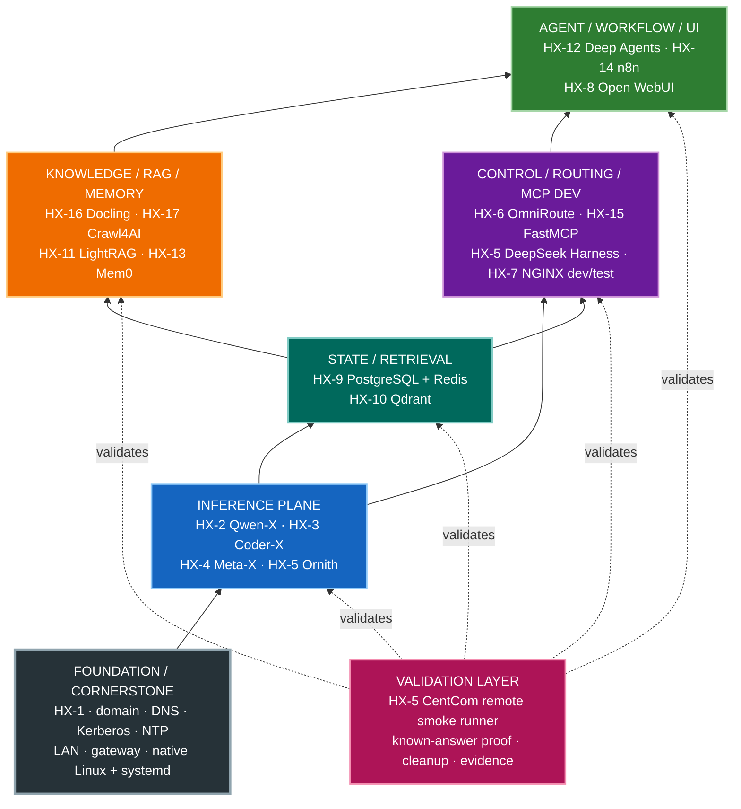

# HX Eco-System — Architecture Orientation

## 1. The cornerstone

The HX Eco-System is a **17-server, native-Linux AI platform**. Its architecture is the cornerstone. Validation exists to prove the ecosystem; validation does not define the ecosystem.

Every agent/operator must understand the base architecture before using smoke-test procedures.

```text
VALIDATION / ACCEPTANCE
HX-5 CentCom + ordered component smoke tests
            ↑ validates

USER / AGENT / WORKFLOW SERVICES
Open WebUI · Deep Agents · n8n
            ↑ consumes

RAG / MEMORY / KNOWLEDGE SERVICES
LightRAG · Mem0 · Docling · Crawl4AI
            ↑ consume

STATE / RETRIEVAL SERVICES
PostgreSQL · Redis · Qdrant
            ↑ support

ROUTING / MCP / INFERENCE SERVICES
OmniRoute · FastMCP · Qwen-X · Coder-X · Meta-X · Ornith
            ↑ rely on

FOUNDATION / CORNERSTONE
HX-1 identity + DNS + Kerberos + NTP
LAN addressing + gateway + domain membership
native Ubuntu Linux + systemd
```

The correct mental model is:

```text
FOUNDATION -> ECOSYSTEM SERVICES -> APPLICATION CAPABILITY -> VALIDATION
```

Do not invert this relationship. A smoke test is evidence that an assigned component behaves correctly inside the approved architecture; it is not an architecture source.

## 2. Foundational baseline configuration

The following is the accepted clean-build baseline pattern. HX-1 through HX-3 contain current as-built evidence. HX-4 through HX-17 remain planned until each server is rebuilt and verified; planned configuration must never be reported as as-built state.

| Foundation item | HX baseline |
|---|---|
| LAN | `192.168.50.0/24` |
| Default gateway | `192.168.50.1` |
| HX infrastructure DNS | HX-1 at `192.168.50.200` |
| Active Directory domain | `hx.local.arpa` |
| Kerberos realm | `HX.LOCAL.ARPA` |
| Identity client pattern | SSSD / realmd / adcli |
| Foundation server | HX-1 — Samba AD / DNS / Kerberos / NTP |
| Deployment standard | Native Ubuntu Linux + systemd |
| Container policy | No Docker, Podman, or Kubernetes unless explicitly approved by the owner |
| Network/security policy | Do not add firewall restrictions, segmentation, TLS mandates, or architecture changes without explicit owner approval |
| Application UI pattern | Direct native application endpoint by default |
| NGINX boundary | HX-7 is development/test UI rendering only; not the ecosystem reverse proxy |
| Documentation model | Active Markdown is machine/agent authority; human HTML is a mirror; archive is historical only |

The current HX-3 as-built record demonstrates the accepted network/domain pattern: gateway `192.168.50.1`, DNS `192.168.50.200`, domain `hx.local.arpa`, realm `HX.LOCAL.ARPA`, native Linux/systemd, and SSSD/realmd/adcli membership.

## 3. Ecosystem planes



The diagram is a capability/dependency orientation, not a statement that every cross-plane relationship is already permanently integrated. The current program is base stand-up; permanent integration comes later.

## 4. Current server/application map

This is the current owner-approved target assignment. State is shown separately so target architecture is not confused with live configuration.

| Server | IP | Assignment | Current state |
|---|---|---|---|
| HX-1 | `192.168.50.200` | Samba AD / DNS / Kerberos / NTP | **PASS / CLOSED** |
| HX-2 | `192.168.50.202` | Qwen-X / Ollama / Qwen3.8-27B Q6_K | **PASS / CLOSED** |
| HX-3 | `192.168.50.203` | Coder-X / Ollama / Qwen3-Coder-30B Q6_K | **PASS / CLOSED** |
| HX-4 | `192.168.50.204` | Meta-X / GPT-OSS 20B + BGE-M3 / Nomic / BGE reranker | **NEXT** |
| HX-5 | `192.168.50.205` | CentCom / Ornith / DeepSeek Harness / dev-test | **NOT STARTED** |
| HX-6 | `192.168.50.206` | OmniRoute | **NOT STARTED** |
| HX-7 | `192.168.50.207` | NGINX dev/test only | **NOT STARTED** |
| HX-8 | `192.168.50.208` | Open WebUI | **NOT STARTED** |
| HX-9 | `192.168.50.209` | PostgreSQL + MCP / Redis + MCP | **NOT STARTED** |
| HX-10 | `192.168.50.210` | Qdrant + Web UI + MCP | **NOT STARTED** |
| HX-11 | `192.168.50.211` | LightRAG + MCP | **NOT STARTED** |
| HX-12 | `192.168.50.212` | Deep Agents by LangChain — LOB agent factory/runtime harness | **NOT STARTED** |
| HX-13 | `192.168.50.213` | Mem0 + assigned MCP | **NOT STARTED** |
| HX-14 | `192.168.50.214` | n8n + MCP | **NOT STARTED** |
| HX-15 | `192.168.50.215` | FastMCP shared/custom MCP development host | **NOT STARTED** |
| HX-16 | `192.168.50.216` | Docling + Granite-Docling 258M + MCP | **NOT STARTED** |
| HX-17 | `192.168.50.217` | Crawl4AI + MCP | **NOT STARTED** |

The full dependency order and BASE PASS boundaries remain authoritative in `../00-control/HX-ECO-SYSTEM-BASE-IMPLEMENTATION-PRIORITY.md`.

## 5. Model and data-placement rules

### Generative inference

- **HX-2 Qwen-X** — Qwen3.8-27B Q6_K; current PASS/CLOSED inference endpoint.
- **HX-3 Coder-X** — Qwen3-Coder-30B Q6_K; current PASS/CLOSED inference endpoint.
- **HX-4 Meta-X** — GPT-OSS 20B target plus shared retrieval inference.
- **HX-5 CentCom** — Ornith target plus development/test and DeepSeek Harness responsibilities.

Only models on servers that have passed their own applicable BASE PASS may enter the active HX routing/model catalog.

### Shared retrieval inference

HX-4 owns:

```text
BGE-M3                 -> primary/default embedding model -> 1024 dimensions
Nomic Embed Text v1.5 -> alternate/fallback             -> 768 dimensions default
BGE-family reranker    -> shared reranking               -> exact checkpoint/runtime must be pinned
```

### Qdrant collection rule

Qdrant on HX-10 stores vectors; it does not own the embedding models.

Never mix embeddings from different model identities in the same Qdrant collection. A model change requires a new collection and re-embedding.

### Docling model rule

Granite-Docling 258M remains on HX-16 inside the Docling capability boundary. Base validation is CPU-first. It is not a general shared embedding or conversational model.

Detailed authority: `../00-control/HX-ECO-SYSTEM-MODEL-PLACEMENT-AND-EMBEDDING-STANDARD.md`.

## 6. Application companion-service rule

Where assigned, a product-specific MCP server or native Web UI is part of the parent application's base build.

Examples:

- PostgreSQL includes PostgreSQL MCP.
- Redis includes its assigned MCP.
- Qdrant includes Qdrant + Web UI + Qdrant MCP.
- LightRAG includes LightRAG MCP.
- Docling includes Granite-Docling + Docling MCP.
- Crawl4AI includes Crawl4AI MCP.
- n8n includes n8n MCP.

HX-15 FastMCP is the **shared/custom MCP development/runtime host**. It is not a prerequisite for these product-specific MCP servers.

## 7. Dependency-driven build waves

The base program builds the ecosystem in dependency order:

1. **Inference** — HX-4, HX-5.
2. **State/retrieval** — HX-9 PostgreSQL, HX-9 Redis, HX-10 Qdrant.
3. **Routing/control/MCP development** — HX-6 OmniRoute, HX-15 FastMCP, HX-5 DeepSeek Harness, HX-7 NGINX dev/test.
4. **Knowledge acquisition** — HX-16 Docling, HX-17 Crawl4AI.
5. **RAG/memory** — HX-11 LightRAG, HX-13 Mem0.
6. **Agent/workflow consumers** — HX-12 Deep Agents, HX-14 n8n.
7. **User interaction** — HX-8 Open WebUI.

This sequencing is a dependency model. It does not authorize permanent cross-service integration during base installation.

## 8. Base-build versus integration boundary

### Current program — base stand-up

Each assigned component is installed natively, proven independently, reboot-validated, documented, and closed before moving on.

Small, reversible dependencies may be used only when required to prove a component's primary function.

### Later program — ecosystem integration

Permanent service contracts, credentials, routing, production schemas/collections, RAG ingestion, MCP client registrations, agent bindings, Open WebUI permanent backends, workflows, observability, and true end-to-end tests belong to the later integration program.

Do not mistake smoke-test wiring for permanent architecture.

## 9. Validation sits on top of the cornerstone

Once an agent understands the foundation, server role, target component, current state, and relevant architecture rules, it may apply the HX validation model.

Validation authority:

- `../00-control/HX-ECO-SYSTEM-SMOKE-TEST-ROADMAP.md` — ordered proof dependencies and permitted limited validation integration.
- `HX-SMOKE-TESTING-OPERATING-MODEL.md` — how the validation subsystem fits together.
- `../../smoke-tests/` — exact component acceptance procedures.
- `../04-application-standards/HX-5-SMOKE-TEST-PROCESS-AND-PROCEDURES.md` — how HX-5 executes and retains proof.
- `../04-application-standards/HX-5-CENTCOM-SMOKE-RUNNER-TOOLSET-AND-BOOTSTRAP.md` — CentCom client tooling and bootstrap.

The validation model must **inherit** the ecosystem architecture; it must never redefine server placement, permanent dependencies, network architecture, or component ownership.

## 10. AI orientation sequence

Before an AI agent changes or validates a component, it should be able to answer these questions from current repository authority:

1. What is HX and what layer is this component in?
2. Which server owns it, at what target IP, and what is that server's current state?
3. What foundational network/domain/deployment rules apply?
4. What upstream dependencies are architecturally required versus validation-only?
5. What model/data placement rules apply?
6. What is the current build priority and BASE PASS boundary?
7. If validating, what prior PASS evidence does the smoke roadmap require?
8. What exact smoke test proves the component works?
9. How is evidence captured, cleanup verified, and closure recorded?

If the agent cannot answer 1–7, it is **not ready to execute validation**.

## 11. Current state boundary

As of 2026-09-09:

- HX-1, HX-2, and HX-3 are the current PASS/CLOSED as-built foundation.
- HX-4 is next.
- HX-5 through HX-17 remain planned/not started except for staged repository documentation/runbooks where present.
- Smoke-test authorities and CentCom runner tooling may be designed in the repository before their corresponding runtime capability exists.

Design readiness is not as-built completion.
