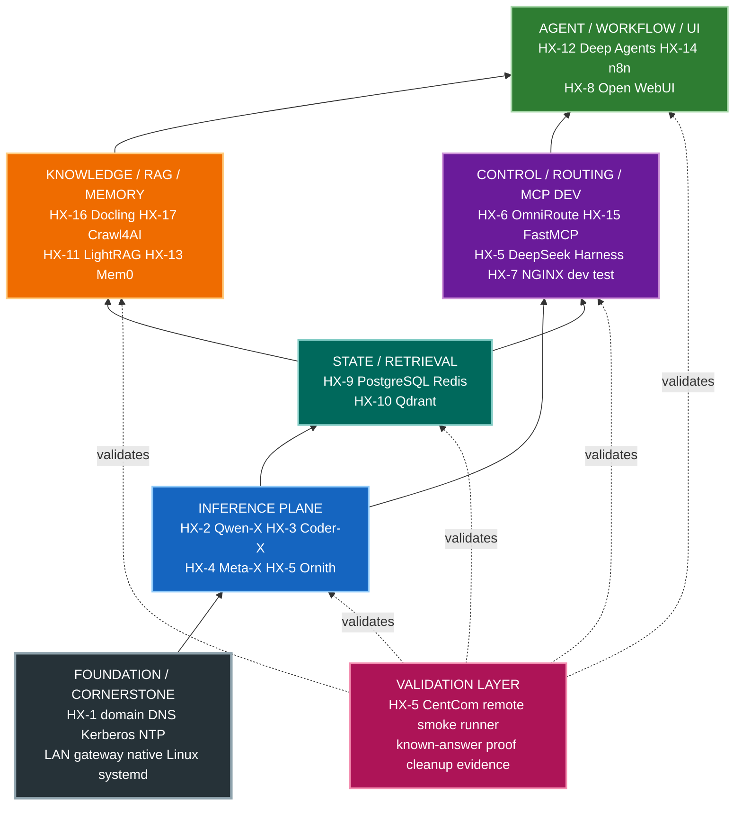
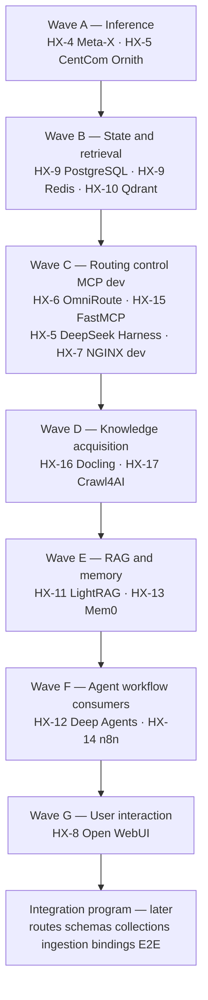

# Ecosystem Architecture Orientation

This page is **context, not authority.** It restates the orientation an agent must
hold before building or validating anything in the HX Eco-System. The authoritative
source for this orientation is
`docs/01-architecture/ARCHITECTURE-ORIENTATION.md`; when this page and that document
disagree, that document wins. Use this page to build the mental model, then defer to
the control documents it points to for the authoritative build order and model
placement detail.

The HX Eco-System is a **17-server, native-Linux AI platform**. Its architecture is
the cornerstone: validation exists to prove the ecosystem, it does not define the
ecosystem. The correct mental model is

```text
FOUNDATION -> ECOSYSTEM SERVICES -> APPLICATION CAPABILITY -> VALIDATION
```

Do not invert it. A smoke test is evidence that an assigned component behaves
correctly inside the approved architecture; it is not an architecture source.

## Ecosystem planes and dependency direction

The ecosystem is organized into capability planes that depend on the ones below them.
The dependency direction is fixed:

```text
FOUNDATION -> INFERENCE -> STATE/RETRIEVAL -> ROUTING/MCP -> KNOWLEDGE/RAG/MEMORY -> AGENTS/WORKFLOW/UI -> VALIDATION
```



*The ecosystem planes and the validation layer that sits on top of them. Foundation
underpins inference; state/retrieval and routing depend on inference; knowledge/RAG
and agents/workflow/UI consume the lower planes; validation validates each plane but
never becomes an architecture layer of its own. (Reproduced from
`docs/01-architecture/ARCHITECTURE-ORIENTATION.md` section 3.)*

The diagram is a capability/dependency orientation, not a statement that every
cross-plane relationship is already permanently integrated. Two concerns cut across
every layer and are deliberately **not** drawn, because cross-cutting concerns make a
diagram less readable rather than more:

- **Governed skills** (`skills/`) advise on any component. They never decide.
- **Validation** (`smoke-tests/`, run from HX-5 CentCom) proves any component. It
  never becomes an architecture layer of its own.

## Foundational baseline

This is the accepted clean-build baseline. Only HX-1 through HX-3 carry current
as-built evidence; HX-4 through HX-17 remain planned until each server is rebuilt and
verified. Planned configuration must never be reported as as-built state.

| Foundation item | HX baseline |
|---|---|
| LAN | `192.168.50.0/24` |
| Default gateway | `192.168.50.1` |
| HX infrastructure DNS | HX-1 at `192.168.50.200` |
| Active Directory domain | `hx.local.arpa` |
| Kerberos realm | `HX.LOCAL.ARPA` |
| Identity client pattern | SSSD / realmd / adcli |
| Foundation server | HX-1 — Samba AD / DNS / Kerberos / NTP |
| Deployment standard | Native Ubuntu Linux + systemd |
| Container policy | No Docker, Podman, or Kubernetes unless explicitly approved by the owner |
| Application UI pattern | Direct native application endpoint by default |
| NGINX boundary | HX-7 is development/test UI rendering only; not the ecosystem reverse proxy |

## Server/application map

This is the current owner-approved target assignment, generated from
`docs/00-control/hx-fleet.tsv`. Do not hand-edit this table; edit the TSV and run
`tools/hx-doc/hx-fleet`. State is shown separately from role so target architecture
is not confused with live configuration.

| Server | IP | Assignment | Current state |
|---|---|---|---|
| HX-1 | `192.168.50.200` | Samba AD / DNS / Kerberos / NTP | **PASS / CLOSED** |
| HX-2 | `192.168.50.202` | Qwen-X / Ollama / Qwen3.8-27B Q6_K | **PASS / CLOSED** |
| HX-3 | `192.168.50.203` | Coder-X / Ollama / Qwen3-Coder-30B Q6_K | **PASS / CLOSED** |
| HX-4 | `192.168.50.204` | Meta-X / GPT-OSS 20B + BGE-M3 + Nomic + BGE reranker | **NEXT** |
| HX-5 | `192.168.50.205` | CentCom / Ornith / DeepSeek Harness / dev-test | **NOT STARTED** |
| HX-6 | `192.168.50.206` | OmniRoute | **NOT STARTED** |
| HX-7 | `192.168.50.207` | NGINX dev/test only | **NOT STARTED** |
| HX-8 | `192.168.50.208` | Open WebUI | **NOT STARTED** |
| HX-9 | `192.168.50.209` | PostgreSQL + MCP / Redis + MCP | **NOT STARTED** |
| HX-10 | `192.168.50.210` | Qdrant + Web UI + MCP | **NOT STARTED** |
| HX-11 | `192.168.50.211` | LightRAG + MCP | **NOT STARTED** |
| HX-12 | `192.168.50.212` | Deep Agents (LangChain) LOB agent factory | **NOT STARTED** |
| HX-13 | `192.168.50.213` | Mem0 + assigned MCP | **NOT STARTED** |
| HX-14 | `192.168.50.214` | n8n + MCP | **NOT STARTED** |
| HX-15 | `192.168.50.215` | FastMCP shared/custom MCP development host | **NOT STARTED** |
| HX-16 | `192.168.50.216` | Docling + Granite-Docling 258M + MCP | **NOT STARTED** |
| HX-17 | `192.168.50.217` | Crawl4AI + MCP | **NOT STARTED** |

Only HX-1, HX-2, and HX-3 are **PASS / CLOSED**. HX-4 is **NEXT**. HX-5 through
HX-17 are **NOT STARTED** (runbooks may be staged in the repository before the
runtime capability exists). **Design readiness is not as-built completion** — a
pinned version and a written runbook mean the work is planned, not that it is
running.

## Model and data-placement rules

### Generative inference

- **HX-2 Qwen-X** — Qwen3.8-27B Q6_K; current PASS/CLOSED inference endpoint.
- **HX-3 Coder-X** — Qwen3-Coder-30B Q6_K; current PASS/CLOSED inference endpoint.
- **HX-4 Meta-X** — GPT-OSS 20B target plus shared retrieval inference.
- **HX-5 CentCom** — Ornith target plus development/test and DeepSeek Harness
  responsibilities.

Only models on servers that have passed their own applicable BASE PASS may enter the
active HX routing/model catalog.

### Shared retrieval inference — HX-4

HX-4 Meta-X owns the shared embedding and reranking plane (decision **D-005**):

| Component | Role | Dimension | Placement |
|---|---|---|---|
| `BAAI/bge-m3` | Primary/default embedding model | 1024 | HX-4 |
| `nomic-ai/nomic-embed-text-v1.5` | Alternate benchmark/fallback embedding model | 768 default | HX-4 |
| BGE-family reranker | Shared retrieval reranking | — | HX-4 |

The BGE-family reranker was left unnamed by D-005; decision **D-022** pinned it to
`BAAI/bge-reranker-v2-m3` at revision
`953dc6f6f85a1b2dbfca4c34a2796e7dde08d41e`, served by `infinity-emb` 0.0.77 from
PyPI under systemd on port 7997. The revision is an immutable commit, so a later
upstream edit cannot change the model under a stable name. Authoritative pins live in
`docs/03-runbooks/common/hx-base.env`, audited by `tools/hx-doc/hx-version-pins`.

### Qdrant collection rule — never mix embedding identities

Qdrant on HX-10 stores vectors; it does **not** own the embedding models. Embedding
models produce different semantic spaces, and their vectors must never be mixed in the
same Qdrant collection. BGE-M3 and Nomic also use different default dimensions
(1024 vs 768), so they cannot share a collection even by dimension alone.

Therefore every Qdrant collection must be **pinned to one embedding identity**. A
model change requires a new collection and complete re-embedding — there is no
in-place vector-model switch. The model-switch procedure is: create a new
collection, pin the new model/revision/dimension, re-embed the source corpus, load
the new vectors, run retrieval acceptance tests, change the consuming application only
after PASS, then retain or retire the prior collection by owner decision. A
production collection must never be repointed from one embedding model to another.

### Docling model rule — Granite-Docling stays on HX-16

Decision **D-006**: Granite-Docling 258M stays with Docling on HX-16, inside the
Docling capability boundary. It is an embedded document-understanding VLM, **not** a
general text-vector embedding model and **not** part of the shared Qdrant embedding
plane. Base validation is **CPU-first** — GPU hardware is not a prerequisite for
placing it on HX-16, and GPU acceleration is considered only as a later measured
architecture decision if CPU throughput proves inadequate. Do not route routine
Granite-Docling inference through OmniRoute, and do not move it to Meta-X merely to
obtain GPU access.

### Routing and NGINX boundaries

- **OmniRoute discovery is not approval (D-010).** HX maintains two explicit
  controls: an approved-**provider** allowlist and an approved-**model** allowlist.
  Discovery/support does not equal approval, and approving a provider does not approve
  its entire model catalog. Free/no-auth/discovered providers are not automatically
  active. Build both allowlists before HX-6 closes.
- **NGINX is dev/test only (D-004).** HX-7 NGINX is limited to development/test UI
  rendering. It is **not** the common reverse proxy for HX ecosystem services. Normal
  application UIs remain directly accessible on their own native server/port; do not
  route Qdrant, LightRAG, n8n, Open WebUI, databases, or MCP servers through NGINX.

### Application companion services

Where assigned, a product-specific MCP server or native Web UI is part of the parent
application's base build (decision **D-003**): PostgreSQL/Redis/Qdrant/LightRAG/n8n/
Docling/Crawl4AI/Mem0 each include their own MCP server where applicable, and Qdrant
includes its Web UI. HX-15 FastMCP is the **shared/custom MCP development and runtime
host**; it is **not** a prerequisite for any product-specific MCP server. MCP client
registration, agent tool binding, and permanent orchestration wiring remain
integration-phase work.

Detailed model-placement authority lives in
`docs/00-control/HX-ECO-SYSTEM-MODEL-PLACEMENT-AND-EMBEDDING-STANDARD.md`.

## Base-build versus integration boundary

The current program is **base stand-up**. Each assigned component is installed
natively, proven independently, reboot-validated, documented, and closed before
moving on. Small, reversible dependencies may be used only when required to prove a
component's primary function, and only against an already-proven dependency, with
synthetic/disposable data that is removed after evidence capture.

The **later** program is ecosystem integration. Permanent service contracts,
credentials, OmniRoute permanent routes, production database schemas, Qdrant
production collections, RAG ingestion, MCP client registrations, agent bindings,
Open WebUI permanent backends, workflows, observability, and true end-to-end tests
all belong to that later program.

> **Do not mistake smoke-test wiring for permanent architecture.** A temporary
> Ollama link, a temporary OmniRoute route, or a throwaway Qdrant collection used to
> prove a contract is validation-only state, removed before closure unless explicitly
> approved as permanent.

### Build order

The authoritative build order and BASE PASS boundaries are in
`docs/00-control/HX-ECO-SYSTEM-BASE-IMPLEMENTATION-PRIORITY.md`. The roadmap builds in
dependency waves: inference (HX-4, HX-5), then state/retrieval (HX-9 PostgreSQL,
HX-9 Redis, HX-10 Qdrant), then routing/control/MCP development (HX-6 OmniRoute,
HX-15 FastMCP, HX-5 DeepSeek Harness, HX-7 NGINX), then knowledge acquisition
(HX-16 Docling, HX-17 Crawl4AI), then RAG/memory (HX-11 LightRAG, HX-13 Mem0), then
agent/workflow consumers (HX-12 Deep Agents, HX-14 n8n), and finally user interaction
(HX-8 Open WebUI). This sequencing is a dependency model; it does not authorize
permanent cross-service integration during base installation.



*Dependency-driven build waves. Each wave exits only when its components are
independently healthy; the integration program begins only after every server
reaches BASE PASS. (Authoritative order: `docs/00-control/HX-ECO-SYSTEM-BASE-IMPLEMENTATION-PRIORITY.md`.)*

### Base acceptance — what closes a server

A component reaches **BASE PASS** only when the host is cleanly rebuilt and joined to
`hx.local.arpa`; the application is installed natively on Linux with long-running
services under systemd; expected local/LAN health endpoints respond; required storage
is mounted and persistent; the native Web UI and product-specific MCP server are
validated where applicable; the defined component smoke test passes with only the
minimum temporary integration required; validation-only data/routes/collections are
removed after the test; **reboot persistence is proven**; and no unapproved network,
storage, security, or cross-service architecture changes are introduced. Service
health alone is never enough — a known-answer test is required, cleanup is part of
PASS, and reviewed evidence plus reboot persistence closes the loop.

## Where to go next

- **Build order and BASE PASS boundaries** — `docs/00-control/HX-ECO-SYSTEM-BASE-IMPLEMENTATION-PRIORITY.md`
- **Model placement detail** — `docs/00-control/HX-ECO-SYSTEM-MODEL-PLACEMENT-AND-EMBEDDING-STANDARD.md`
- **Architecture orientation (authority)** — `docs/01-architecture/ARCHITECTURE-ORIENTATION.md`
- **Current fleet state** — `docs/00-control/hx-fleet.tsv` (regenerate the table with `tools/hx-doc/hx-fleet`)
- **Owner decisions** — `docs/00-control/DECISIONS.md`
- **Proof order** — `docs/00-control/HX-ECO-SYSTEM-SMOKE-TEST-ROADMAP.md` and `smoke-tests/`

Before changing or validating a component, an agent should be able to answer, from
current repository authority: what HX is and which plane this component is in; which
server owns it, at what IP, and what that server's current state is; which
foundational network/domain/deployment rules apply; which upstream dependencies are
architecturally required versus validation-only; which model/data placement rules
apply; what the current build priority and BASE PASS boundary are; and what prior PASS
evidence the smoke roadmap requires. If the agent cannot answer these, it is **not
ready to execute validation.**
