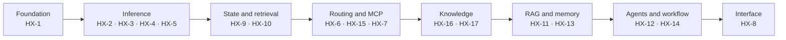

# HX fleet and ecosystem layout

This repository does not contain the ecosystem's application code. It contains
the authority that decides where each application runs, in what order it is
built, and what has to be true before a server is called finished. This page
describes that target ecosystem.

## The fleet is a table, not prose

Seventeen servers, `HX-1` through `HX-17`, sit on the `192.168.50.0/24` lab
LAN. Their identity, address, assignment, build state and gate live in one
tab-separated file, `docs/00-control/hx-fleet.tsv`, and every server table in
the documentation plus the runbooks' host-to-IP lookup is generated from it.
Editing a rendered table by hand is a defect, not a shortcut — see
[generated artifacts and single sources of truth](../concepts/generated-artifacts-and-single-source-of-truth.md).

| Server | IP | Assignment |
|---|---|---|
| HX-1 | `192.168.50.200` | Samba AD / DNS / Kerberos / NTP |
| HX-2 | `192.168.50.202` | Qwen-X / Ollama |
| HX-3 | `192.168.50.203` | Coder-X / Ollama |
| HX-4 | `192.168.50.204` | Meta-X / GPT-OSS 20B + BGE-M3 + Nomic + BGE reranker |
| HX-5 | `192.168.50.205` | CentCom / Ornith / DeepSeek Harness / dev-test |
| HX-6 | `192.168.50.206` | OmniRoute |
| HX-7 | `192.168.50.207` | NGINX dev/test only |
| HX-8 | `192.168.50.208` | Open WebUI |
| HX-9 | `192.168.50.209` | PostgreSQL + MCP / Redis + MCP |
| HX-10 | `192.168.50.210` | Qdrant + Web UI + MCP |
| HX-11 | `192.168.50.211` | LightRAG + MCP |
| HX-12 | `192.168.50.212` | Deep Agents (LangChain) LOB agent factory |
| HX-13 | `192.168.50.213` | Mem0 + assigned MCP |
| HX-14 | `192.168.50.214` | n8n + MCP |
| HX-15 | `192.168.50.215` | FastMCP shared/custom MCP development host |
| HX-16 | `192.168.50.216` | Docling + Granite-Docling 258M + MCP |
| HX-17 | `192.168.50.217` | Crawl4AI + MCP |

The `state` and `gate` columns are deliberately not reproduced here. They move,
and the TSV is where they move.

## The shared baseline every server inherits

Each host is joined to the same foundation before any application is installed.

| Foundation item | HX baseline |
|---|---|
| LAN | `192.168.50.0/24` |
| Default gateway | `192.168.50.1` |
| Infrastructure DNS | HX-1 at `192.168.50.200` |
| Active Directory domain | `hx.local.arpa` |
| Kerberos realm | `HX.LOCAL.ARPA` |
| Identity client pattern | SSSD / realmd / adcli |
| Deployment standard | Native Ubuntu Linux + systemd |
| Containers | No Docker, Podman or Kubernetes without explicit owner approval |
| Normal UI access | Direct native application endpoint and port |

HX-1 is therefore load-bearing for the whole fleet: it is the domain
controller, the DNS server and the Kerberos realm. The base runbook refuses to
continue on a host whose address, gateway or resolver does not match this
baseline, so the table above is enforced at build time rather than trusted.

Two consequences of the baseline are decided, not accidental. There is no host
firewall anywhere on the fleet, and Ollama listens on `0.0.0.0:11434` with no
authentication. The LAN is treated as a trusted lab segment, the build scripts
produce exactly that posture, and the decision register closes the topic: it is
a chosen position, not an open gap. HX-7's NGINX is likewise bounded — it
renders development and test UIs and is never the ecosystem's front door.

## Layers, and what they mean

The fleet is built in dependency waves. Each wave can only be proven once the
one before it exists.

This is sequencing, not wiring. An arrow says "build this first", not "connect
these permanently". The current programme is base stand-up: every component is
installed natively, proven on its own, reboot-checked, recorded and closed
before the next one starts. Permanent routes, production schemas and
collections, agent bindings, RAG ingestion and end-to-end workflows all belong
to a later integration programme, and a temporary link created to prove one
component must be removed before that component closes.

Two concerns cut across every layer and are deliberately absent from the
diagram. Governed skills advise on any component without deciding anything —
see [governed agent skills](../integrations/governed-agent-skills.md).
Validation proves any component without becoming a layer of its own — see
[the proof chain](../concepts/proof-chain-and-cumulative-evidence.md).

## Where models are allowed to live

Placement is a decision, not an optimisation an operator may revisit on the day.

**Generative inference.** HX-2 serves Qwen-X, HX-3 serves Coder-X, HX-4 is the
Meta-X target, and HX-5 is the Ornith target alongside its CentCom and
DeepSeek Harness duties. Only a model on a server that has passed its own base
gate may enter the active routing catalogue.

**Shared retrieval.** HX-4 owns the whole embedding and reranking plane:
BGE-M3 as the primary embedding model at 1024 dimensions, Nomic Embed Text
v1.5 as the alternate at 768, and a BGE-family reranker. Placing an embedding
model anywhere else is a change to the architecture, not a convenience.

**Vector storage.** Qdrant on HX-10 stores vectors but does not own the models
that produced them. Embeddings from different model identities must never share
a collection, because the vectors are not comparable; changing the model means a
new collection and re-embedding, not an in-place swap.

**Document conversion.** Granite-Docling 258M stays with Docling on HX-16,
inside the Docling boundary, and its base validation is CPU-first. It is not a
shared embedding or chat model, and GPU acceleration is considered only if a
measured need later justifies it.

## Companion services belong to their parent

Where a product ships its own MCP server or its own native Web UI, those are
part of that application's base build, not separate projects: PostgreSQL with
its MCP, Qdrant with its Web UI and MCP, Docling with Granite-Docling and its
MCP, n8n with its MCP, and so on. HX-15 FastMCP is a shared host for custom MCP
development and is explicitly **not** a prerequisite for any of those
product-specific companions.

This is why a single server can carry several independent closures. HX-9 hosts
PostgreSQL and Redis, and each application closes on its own evidence.

## Design readiness is not as-built completion

The repository documents all seventeen servers. It has built three. HX-1, HX-2
and HX-3 hold current as-built evidence; HX-4 is next; the rest are planned.
A pinned version, a written runbook and a drafted smoke test mean the work is
designed, not that anything is running, and planned configuration must never be
reported as observed state.

The bar for calling a server done is explicit: it reaches `PASS / CLOSED` only
once its base, domain, workload, functional and reboot-persistence gates are all
satisfied **and** its as-built record has been updated. Service health on its
own never closes anything. What that record must contain, and how the proof
behind it is retained, is covered in
[server records and evidence retention](../operations/server-records-and-evidence-retention.md);
how the build itself runs is in
[server base-build runbooks](../workflows/server-base-build-runbooks.md).
