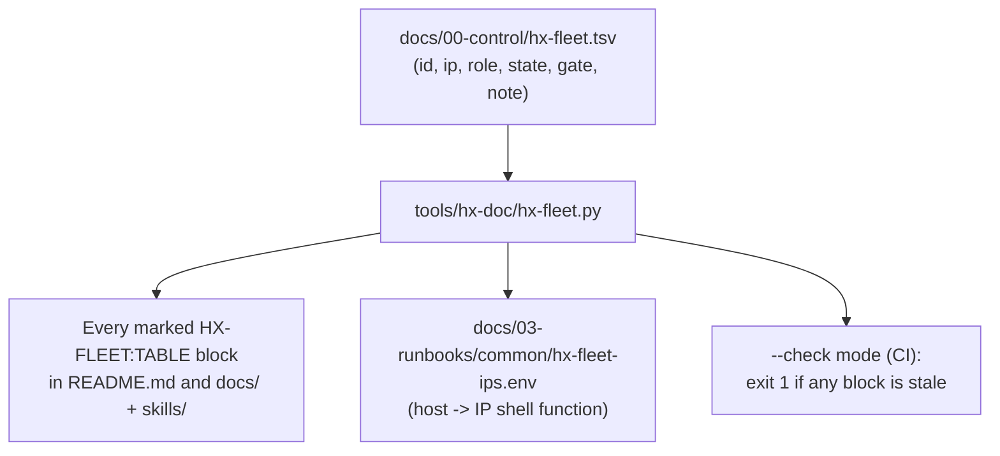
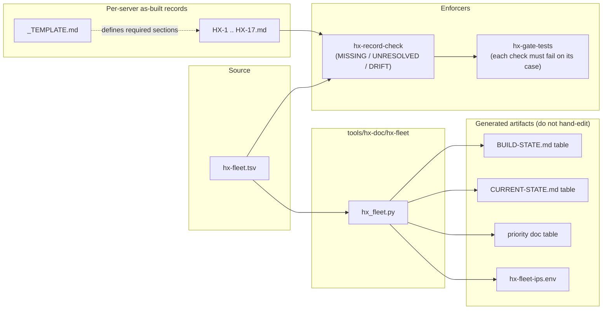

# Server Fleet Map and Build State

The HX Eco-System is a clean-room rebuild of seventeen servers, **HX-1 through HX-17**, performed one server at a time. This page documents where the fleet map lives, how that map flows into every document and runbook, how build state is recorded, and what it takes for a server to move from `NOT STARTED` to `PASS / CLOSED`.

## 1. One source of truth: `hx-fleet.tsv`

The 17-server map is defined in exactly one place:

```text
docs/00-control/hx-fleet.tsv
```

It is a tab-separated file with a header row and one row per server. The columns are:

| Column | Meaning |
|---|---|
| `id` | Server identifier (`HX-1` ... `HX-17`) |
| `ip` | Static LAN IPv4 (`192.168.50.20N`) |
| `role` | Assigned workload(s) |
| `state` | Build state: `PASS`, `NOT_STARTED`, (and the in-flight values used while building) |
| `gate` | Closure gate: `CLOSED`, `NEXT`, or `-` (none yet) |
| `note` | One-line constraint or caveat |

The fleet was previously typed by hand in six separate places in the documents. They agreed on the day they were written — "which is the only day that is ever true" — so the TSV was made the single source and every table is now generated from it. To change the fleet, edit the TSV and run the generator; never hand-edit the generated tables.



## 2. The generator: `tools/hx-doc/hx-fleet`

`tools/hx-doc/hx_fleet.py` is the renderer, invoked through the `tools/hx-doc/hx-fleet` wrapper (a small bash shim that resolves a Python 3 and execs the `.py` body). Two modes:

- **Generate** (no argument): rewrite every marked table and the runbook IP map in place, then report how many files changed.
- **Check** (`--check`): CI mode. It prints `STALE <path>` for every generated block that does not match the TSV and exits `1` if any are stale, `0` if all are current.

### 2.1 The `HX-FLEET:TABLE` markers

A document opts in by carrying a marker pair:

```text
<!-- HX-FLEET:TABLE columns=id,ip,role,state -->
...generated table...
<!-- /HX-FLEET:TABLE -->
```

The `columns=` attribute selects which TSV columns appear and in what order; the recognized names are `id`, `ip`, `role`, `state`, `gate`, `note` (rendered with headings `Server`, `IP`, `Assignment`, `State`, `Gate`, `Notes`). The generator renders `state` and `gate` bold (so status reads at a glance), `ip` as code, and a missing cell as an em dash `—`. Different documents request different column subsets — for example, `BUILD-STATE.md` asks for `id,role,state,gate,note` while `CURRENT-STATE.md` asks only for `id,role,state`.

The generator is deliberately defensive about malformed markers, because each defect has actually happened:

- **Unclosed / orphaned markers.** It counts opening markers, closing markers, and complete regex pairs; all three must agree. An unclosed block matches nothing and is reported as drift rather than silently left "current".
- **Unknown columns.** A column name not in `HEADINGS` is reported (e.g. `unknown fleet column(s): bogus`) and that document is skipped, instead of a junk column rendering as a heading of its own name with em-dash cells that matches itself.

`tools/` is intentionally excluded as a target: its `README.md` documents the marker syntax and must not have a table injected into the example. The scanned targets are `README.md` plus every `*.md` under `docs/` and `skills/`.

### 2.2 The runbook IP map

The generator also writes `docs/03-runbooks/common/hx-fleet-ips.env` so runbooks source the same host→IP map instead of carrying their own copy. The generated file defines a `hx_ip_for()` shell function whose `case` statement maps each lowercased host (`hx-1` ... `hx-17`) to its IP, returning `1` for an unknown host. It carries a `# Do not edit. Change the TSV and re-run the generator.` header.

## 3. Current fleet (quoted from the source TSV)

The fleet table below is **generated**, so the authoritative values are the TSV rows — this page quotes them rather than asserting an independent copy. As of the source file:

- **HX-1** — `192.168.50.200` — Samba AD / DNS / Kerberos / NTP — `PASS` / `CLOSED` — *Clean base retained; foundation for the whole fleet.*
- **HX-2** — `192.168.50.202` — Qwen-X / Ollama — `PASS` / `CLOSED` — *Qwen3.8-27B Q6_K; 2 x RTX 4070 Ti SUPER 16GB; model source URI UNRESOLVED.*
- **HX-3** — `192.168.50.203` — Coder-X / Ollama — `PASS` / `CLOSED` — *Qwen3-Coder-30B-A3B-Instruct Q6_K; 2 x RTX 5060 Ti 16GB; full artifact hash UNRESOLVED.*
- **HX-4** — `192.168.50.204` — Meta-X / GPT-OSS 20B + BGE-M3 + Nomic + BGE reranker — `NOT_STARTED` / `NEXT` — *Shared embedding/reranking plane; reranker pinned in common/hx-base.env.*
- **HX-5** — `192.168.50.205` — CentCom / Ornith / DeepSeek Harness / dev-test — `NOT_STARTED` / `-` — *Becomes the smoke-test runner station after its own base closes.*
- **HX-6** — `192.168.50.206` — OmniRoute — `NOT_STARTED` / `-` — *Provider and model allowlists required (D-010).*
- **HX-7** — `192.168.50.207` — NGINX dev/test only — `NOT_STARTED` / `-` — *Not the ecosystem reverse proxy (D-004).*
- **HX-8** — `192.168.50.208` — Open WebUI — `NOT_STARTED` / `-` — *Last in build order; temporary Ollama link for base proof (D-008).*
- **HX-9** — `192.168.50.209` — PostgreSQL + MCP / Redis + MCP — `NOT_STARTED` / `-` — *Two applications on one host; each closes separately.*
- **HX-10** — `192.168.50.210` — Qdrant + Web UI + MCP — `NOT_STARTED` / `-` — *One embedding identity per collection (D-005).*
- **HX-11** — `192.168.50.211` — LightRAG + MCP — `NOT_STARTED` / `-` — *Needs HX-10 and HX-4 proof first.*
- **HX-12** — `192.168.50.212` — Deep Agents (LangChain) LOB agent factory — `NOT_STARTED` / `-` — *Prose runbook; pin deepagents version at implementation time.*
- **HX-13** — `192.168.50.213` — Mem0 + assigned MCP — `NOT_STARTED` / `-` — *MCP implementation not yet selected.*
- **HX-14** — `192.168.50.214` — n8n + MCP — `NOT_STARTED` / `-` — *Install from GitHub release or npm tarball, not Snap.*
- **HX-15** — `192.168.50.215` — FastMCP shared/custom MCP development host — `NOT_STARTED` / `-` — *Not a prerequisite for product-specific MCP servers.*
- **HX-16** — `192.168.50.216` — Docling + Granite-Docling 258M + MCP — `NOT_STARTED` / `-` — *Granite-Docling stays here, CPU-first (D-006).*
- **HX-17** — `192.168.50.217` — Crawl4AI + MCP — `NOT_STARTED` / `-` — *Native install; official MCP bridge is Docker-coupled, needs a native choice.*

In summary: **HX-1, HX-2, and HX-3 are PASS / CLOSED; HX-4 is NEXT; HX-5 through HX-17 are NOT STARTED.**

## 4. State and gate progression

Each server carries two independent values:

- **State** (`state` column) — how far the build has progressed.
- **Gate** (`gate` column) — the closure boundary.

A server becomes `PASS / CLOSED` only after its required base, domain, workload, functional, and reboot-persistence gates are satisfied **and** its as-built server record is updated (see §5–§6). The governing build rule is strictly serial:

```text
one server
→ verify base state
→ install assigned workload
→ prove primary function
→ reboot
→ record evidence
→ close PASS
→ move to next server
```

Deployment proceeds in a dependency-driven order (HX-4 first, then HX-5, then HX-9 PostgreSQL, HX-9 Redis, HX-10, …, ending with HX-8 Open WebUI last). This order is the authority of `HX-ECO-SYSTEM-BASE-IMPLEMENTATION-PRIORITY.md`; the fleet TSV records the resulting `state`/`gate`, it does not itself encode the ordering.

### 4.1 HX-9 is a shared host

HX-9 is the one host that carries two distinct applications — **PostgreSQL + MCP** and **Redis + MCP** — and the build order treats them as two separate closure steps (priority 3 and 4). Each application must independently reach its own BASE PASS on the shared host; the fleet row collapses both into one `state`/`gate` pair until both are closed.

## 5. The BASE PASS / CLOSED closure gates

A component reaches **BASE PASS** only when all fourteen gates in the base implementation priority document are satisfied. These are the closure criteria — quoted here as the gating list:

1. The assigned host is cleanly rebuilt and joined to `hx.local.arpa`.
2. Required OS packages are installed.
3. The application is installed natively on Linux.
4. Long-running services use systemd where applicable.
5. The service is active and enabled.
6. Expected local/LAN health endpoints respond.
7. Required local storage is mounted and persistent.
8. The application-specific Web UI is validated directly on its native endpoint where applicable.
9. The assigned application-specific MCP server is installed and independently smoke-tested where applicable.
10. The defined component smoke test passes using only the minimum temporary integration required to prove primary function.
11. Validation-only data, routes, connections, projects, collections, workflows, and other temporary state are removed/disabled after the test unless explicitly approved as permanent.
12. Reboot persistence is proven.
13. The server record and `BUILD-STATE.md` are updated.
14. No unapproved network, storage, security, or cross-service architecture changes are introduced.

Two boundaries frame these gates. The **clean-room boundary** means historical HX-Infrastructure material is reference evidence only — it does not establish current configuration or completion. The **native deployment boundary** mandates native Linux + systemd; no Docker, Podman, Kubernetes, or other containerized deployment unless the infrastructure owner explicitly changes the rule.

## 6. State summaries: `BUILD-STATE.md` and `CURRENT-STATE.md`

Two control documents carry the fleet state summary, both holding generated `HX-FLEET:TABLE` blocks:

- **`docs/00-control/BUILD-STATE.md`** — the build-state roll-up. Its generated table requests `id,role,state,gate,note` and it additionally carries per-server closed-server notes for HX-2 and HX-3 (the exact driver version, GPU count, storage path, Ollama version, model, and the CLI/API/LAN/reboot-persistence PASS lines). It states the operating rule: a server becomes `PASS / CLOSED` only after its required gates are satisfied and its as-built record is updated.
- **`docs/00-control/CURRENT-STATE.md`** — the current-state view. Its generated table requests only `id,role,state`, and it carries the deployment order and validation (smoke-test) order pointers, plus the current constraints (clean-room build, native/systemd, no unapproved network/disk changes, application MCP servers installed with their parents, NGINX is not the reverse proxy, etc.).

Because both tables are generated from the TSV, they cannot drift from it: editing the TSV and running `hx-fleet` regenerates both.

### Design/runbook readiness is not as-built completion

`CURRENT-STATE.md` states this explicitly: **"Design/runbook readiness is not as-built completion."** A runbook being staged or present does not mean a server has reached PASS; only the closure gates in §5 — performed on the actual host and recorded in its server record — constitute completion. In the priority doc, HX-4 and HX-5 are described as "NEXT — runbooks staged" and "NOT STARTED — runbooks staged" respectively: the runbooks exist, but the TSV still records `NOT_STARTED` until the build is performed and proven. The fleet `state`/`gate` therefore lags behind documentation readiness by design.

## 7. The server record system

Each server has an as-built record under `docs/02-server-records/HX-N.md`. The records are the durable proof that the closure gates were met; the generated fleet tables only summarize `state`/`gate`.

### 7.1 The template

`docs/02-server-records/_TEMPLATE.md` defines the required record structure. To start a build, the template is copied to `HX-N.md` (in practice scaffolded by `tools/hx-doc/hx-new-server`). Every heading is required; a section may be deleted only when it genuinely does not apply, with a one-line reason rather than silent removal. The template's required sections are:

1. **Identity and Network** — hostname, IP, gateway, DNS, domain join, SSSD, domain user resolution; states a *Domain join gate: PASS/FAIL*.
2. **Operating System** — distribution/release, kernel, firmware version, sudo policy.
3. **GPU Configuration** — driver package and exact version, GPU models and count, `nvidia-smi` proof; states a *GPU gate: PASS/FAIL*.
4. **Storage Layout** — devices, filesystems, mount points, dedicated application path; states a *Storage gate: PASS/FAIL*.
5. **Runtime** — package source, exact installed version, service unit, systemd overrides, listener address and port.
6. **Model / Application Provenance** — mandatory for any host carrying a model or downloaded artifact.
7. **Functional Validation** — known-answer CLI proof, HTTP/API proof, LAN proof, reboot persistence, each with the exact command and response.
8. **Final State** — a gate/result table covering clean base build, domain join, GPU, dedicated storage, runtime version, service active/enabled, model loaded, known-answer proof, and reboot persistence.
9. **Evidence References** — either a retained bundle under `docs/05-evidence/<server>/...` or an explicit statement that proof is recorded inline in section 7.

### 7.2 Provenance fields and the UNRESOLVED rule

Section 6 of the template requires **five mandatory provenance fields** for every server that hosts a model or a downloaded artifact:

```text
HX alias:              <ollama name or service identifier>
Upstream identity:     <official model/product name and version>
Source URI:            <exact hf.co/... repo:file, package URL, or registry ref>
Artifact SHA-256:      <full 64-character hash of the downloaded artifact>
Import method:         <pull | GGUF import | package install | build from source>
```

The rule is strict: an unknown value is recorded as `UNRESOLVED`, **never blank or omitted**, because a missing field cannot be told apart from a forgotten one. Both Source URI and SHA-256 are required for a reason stated in the template — the hash proves *what* is running, and the URI proves *where* it came from; public model registries carry modified community rebuilds under names close to the official ones, so neither field alone establishes provenance.

### 7.3 Backfill items on HX-2 and HX-3

Both closed inference hosts carry recorded — not hidden — provenance gaps:

- **HX-2 (Qwen-X)** has a known **artifact SHA-256** (`7d590099...36ed`) but its **Source URI is `UNRESOLVED`**. The exact Hugging Face repository that supplied the GGUF blob was not recorded at build time; the hash identifies the artifact but not its origin. The record instructs recovering the source repository from shell/browser/CLI history and replacing `UNRESOLVED`.
- **HX-3 (Coder-X)** has a known **Source URI** (`hf.co/lmstudio-community/Qwen3-Coder-30B-A3B-Instruct-GGUF:Q6_K`) but its **Artifact SHA-256 is `UNRESOLVED`** — only the 12-character layer prefix `72a9b20a19c7` from the pull transcript was recorded. The record notes `lmstudio-community` is a third-party requantiser (an accepted, recorded decision) and instructs recovering the full hash via `ollama show --modelfile` and the blob path under `/srv/ollama/models/blobs/`.

These `UNRESOLVED` fields are why the fleet TSV notes for HX-2 and HX-3 carry "model source URI UNRESOLVED" and "full artifact hash UNRESOLVED" respectively.

## 8. Enforcement: `hx-record-check`

`tools/hx-doc/hx-record-check` runs `hx_record_check.py`, which makes the template a gate rather than advice. For each record in `docs/02-server-records/` (skipping `_TEMPLATE.md`), it reports three classes of problem:

- **MISSING** — a required section (matched loosely on key words so a record can word its own heading) is absent. A record may exempt sections that genuinely do not apply via a `**Not applicable:** <sections> — <reason>` line.
- **UNRESOLVED** — a field explicitly recorded as not yet known (matched as `<Field>:` `UNRESOLVED`). These are recorded gaps, not errors; the tool keeps them visible so they do not fade into a file nobody re-reads.
- **DRIFT** — the record's declared state disagrees with `hx-fleet.tsv`. It parses the `**Build state:**` (or `**State:**`) line, splits off any ` / CLOSED` gate suffix, normalizes, and compares the state part to the TSV's `state` column. A near-miss like `NOT APPLICABLE` no longer satisfies `NOT STARTED`; a missing State line is itself drift; an option list (`NOT STARTED | IN PROGRESS | PASS` left from the template) is drift; and a record whose `HX-N` stem is absent from the TSV is drift.

By default `--strict` is off, so `UNRESOLVED` fields do not fail the check (the message advises closing them while the server is still reachable). With `--strict`, unresolved fields also fail the build.

### 8.1 The gate that tests the gates

`tools/hx-doc/hx-gate-tests` proves each repository check *fails* on the case it is meant to catch — a check that cannot fail is treated as a defect. For the fleet/record machinery it asserts, against a throwaway copy of the repo, that: an unclosed `HX-FLEET:TABLE` marker is drift; an unknown fleet column is drift; a template option list left in a record is drift; a near-miss state (`NOT APPLICABLE`) is drift; and a missing State line is drift.

## 9. How the pieces relate



The TSV is the input; the generator and the record checker are the two consumers. The generator pushes the TSV outward into every marked table and the IP map. The record checker pulls the TSV inward as the state-of-record authority against which each `HX-N.md` is compared for drift, while also enforcing the template's required sections and surfacing `UNRESOLVED` provenance gaps. A closed server therefore requires both directions to agree: the TSV must say `PASS / CLOSED`, and the matching record must declare the same state with all gates recorded and no hidden provenance blanks.
