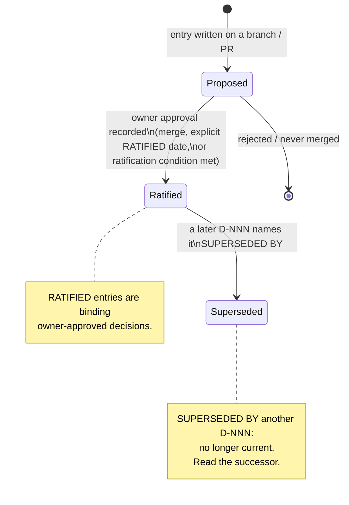

# Authority Model and Truth Order

> This page is **context, not authority.** It restates the authority model so an
> agent can answer "where is the authority for this?" without reading the whole
> repository. The authoritative source for the truth order is `AGENTS.md`
> section 2; the authoritative source for ratified decisions is
> `docs/00-control/DECISIONS.md`. When this page and those sources disagree,
> those sources win. Generated pages, this wiki included, are context and never
> authority. Source code and tests are evidence, not authority, and are not in
> the truth-order list.

The HX Eco-System is governance first and code second. Before changing
anything, an agent must know which instruction outranks which. That order is
fixed in `AGENTS.md` section 2 and is reproduced here **verbatim** — never
restated differently. Below the order sit the control documents that carry it:
the decision ledger (`docs/00-control/DECISIONS.md`), the current state
(`docs/00-control/CURRENT-STATE.md`), the build state
(`docs/00-control/BUILD-STATE.md`), and the open findings
(`docs/00-control/FINDINGS.md`). For architecture authority — server roles,
ownership boundaries, model/data placement — see
[/openwiki/architecture/ecosystem-orientation.md](/openwiki/architecture/ecosystem-orientation.md),
whose own authoritative source is
`docs/01-architecture/ARCHITECTURE-ORIENTATION.md`.

## The truth order

Reproduced verbatim from `AGENTS.md` section 2:

1. Explicit current instruction from the infrastructure owner.
2. Current active control/architecture Markdown in `docs/` and the exact current component acceptance authority in `smoke-tests/` when testing.
3. Current live evidence from the server being worked on.
4. Current approved runbook/execution artifact.
5. Governed HX wrapper skill plus current official vendor guidance for product-specific expertise.
6. Historical/archive material, only as reference.
7. General model knowledge.

The order is a strict precedence ladder. A higher-numbered source cannot
override a lower-numbered one: a runbook (tier 4) does not amend owner
instruction (tier 1); a vendor skill (tier 5) does not redefine active
architecture (tier 2). Within tier 2, `smoke-tests/` acceptance authority is the
authority **when testing** — it defines what a component must prove, not where
it sits in the ecosystem (that inheritance comes from
`docs/01-architecture/ARCHITECTURE-ORIENTATION.md`).

### The contradiction rule

Also verbatim from `AGENTS.md` section 2:

> If current live evidence or current official vendor requirements contradict
> an active document, stop treating the document as sufficient proof and report
> the contradiction. Do not silently let a vendor skill redesign HX.

The rule is a stop-and-report obligation, not a permission to pick a side. If
live evidence from the server (tier 3) or an official vendor requirement
(tier 5) contradicts an active `docs/` document (tier 2), the document is no
longer sufficient proof of the thing it claims. The agent reports the
contradiction rather than resolving it unilaterally — and a vendor skill may
never silently redesign HX. Correcting an active document is itself a change
that goes through a pull request (see `AGENTS.md` section 13), not an in-flight
edit.

## What is not in the order

Two categories are deliberately **absent** from the list above, and `AGENTS.md`
section 16 states this plainly:

- **Generated pages, this wiki included, are context and never authority.**
  `openwiki/` is generated output. A generated block that disagrees with
  section 2 is a defect to fix, not an instruction to follow. Section 2 wins.
- **Source code and tests are evidence, not authority, and are not in the
  truth-order list.** They may prove or disprove a claim made by an authority,
  but they do not outrank any tier.

`hx-doc-check` enforces this boundary: it refuses a generated block that calls
source code or tests authoritative. A red build there means the generator
regressed — correct `openwiki/INSTRUCTIONS.md`, which steers what the wiki
covers, rather than editing the generated block.

## How a decision becomes binding

`docs/00-control/DECISIONS.md` is the **decision ledger**. It is an
owner-approved, auditable record of the decisions that shape the fleet. Each
entry is a **D-NNN** record. An entry must be **cited, not paraphrased** — when
a document relies on a decision, it points at the D-NNN entry rather than
restating it in its own words.

A D-NNN entry has one of three life states:

### RATIFIED — binding owner-approved decisions

An entry marked **RATIFIED** (with or without an explicit ratification date) is
a binding owner-approved decision. Examples in the current ledger:

- **D-018** (Host firewall and inference listener posture — `RATIFIED 2026-09-11`)
  sets the fleet-wide posture: no UFW anywhere, Ollama on `0.0.0.0:11434` with
  no authentication. It closes the subject: "Do not re-raise UFW or listener
  hardening as a finding against this repository: it is a decided posture, not
  an open item."
- **D-021** (Snap is never a package source — `RATIFIED 2026-09-11`) resolves a
  contradiction between `.coderabbit.yaml` and `hx-base.env`: Snap is never
  permitted, for anything, the NVIDIA driver included.
- **D-025** (OpenWiki generation is manual, not scheduled —
  `RATIFIED 2026-09-14`) withdraws the scheduled-workflow posture of D-023 and
  makes `openwiki/` regeneration a manual host-agent action.

### SUPERSEDED — no longer current

An entry whose heading carries **`SUPERSEDED BY <D-NNN>`** is no longer current.
It is retained in the ledger for audit history, but the named successor is the
authority. The active example:

- **D-023** — `SUPERSEDED BY D-025 on 2026-09-14`. D-023 authorised two Actions
  secrets for a weekly regeneration workflow. D-025 replaces it: the workflow
  file is deleted, the secrets are to be revoked, and regeneration becomes a
  manual host-agent run. When a document cites D-023, read D-025 instead.

### Proposed — binds nothing until ratified

A decision entry is not binding merely by being written. The ledger records
this distinction explicitly. The active example:

- **D-024** — `RATIFIED WHEN PR #15 MERGES`. Its own text states the rule:
  "This entry reaches `main` only when pull request #15 is merged there … Until
  then it is a proposal on a branch and binds nothing. Once merged, that event
  is the only approval claimed." The record of approval is the GitHub merge
  event itself, read with
  `gh pr view 15 --repo HX-Infratstructure/HX-Eco-System --json mergedBy,mergeCommit,mergedAt`.
  This repository has a single operator who merges their own pull requests, so
  the merge is the approval and there is no separate review step.

The same pattern applies to the `RATIFIED <date>` entries (D-018 through
D-023, D-025): the date and the merge that landed the entry are the approval of
record. An entry on an unmerged branch is a proposal; it does not bind an agent
until it is ratified on `main`.

## The control documents that carry the order

The truth order is lived through a small set of control files under
`docs/00-control/`. These are the tier-2 authorities an agent reads before
acting:

| File | Role | Authority boundary |
|---|---|---|
| `docs/00-control/DECISIONS.md` | **Decision ledger.** Every D-NNN record; ratified decisions are binding, superseded entries point to their successor. | Cited, not paraphrased. A decision's approval is its merge/ratification event, not a restatement. |
| `docs/00-control/CURRENT-STATE.md` | **Current state.** Program objective, fleet table, deployment order, validation order, and current constraints. | Ecosystem architecture is the cornerstone; validation is subordinate to deployment readiness. |
| `docs/00-control/BUILD-STATE.md` | **Build state.** Per-server assignment, state, gate, and notes; closed-server evidence. | A server is not `PASS / CLOSED` until workload, functional, cleanup, and reboot-persistence gates are satisfied and its record is updated. |
| `docs/00-control/FINDINGS.md` | **Open findings.** Infrastructure findings with status, severity, scope, resolution, and disposition. | Closed findings record the authoritative merged commit; open/deferred findings carry required follow-up. |

Findings in `docs/00-control/FINDINGS.md` interact with the decision ledger: a
finding can be **CLOSED** (corrected and merged, e.g. HX4-F01, HX4-F03, HX4-F04),
**OPEN / DEFERRED** (outside approved scope, follow-up required, e.g. HX4-F02),
or **OPEN / MONITOR** (defect does not fire yet, convert when next touched,
e.g. HX4-F05). A decided posture recorded as a ratified decision — D-018 on
UFW/listener hardening — closes the subject and forbids reopening it as a
finding.

For architecture authority — which server owns which role, the dependency
direction between planes, model/data placement — the authority is
`docs/01-architecture/ARCHITECTURE-ORIENTATION.md`, summarized in context by
[/openwiki/architecture/ecosystem-orientation.md](/openwiki/architecture/ecosystem-orientation.md).
Smoke-test documents inherit that architecture; they never redefine ecosystem
placement, server roles, or network architecture.

## Quickstart: where to take a question

| Question | Authority |
|---|---|
| "Which instruction wins?" | The truth order above, reproduced from `AGENTS.md` section 2. |
| "Is this decision binding?" | `docs/00-control/DECISIONS.md` — RATIFIED binds; SUPERSEDED BY points to the successor; an unmerged proposal binds nothing. |
| "What is the fleet's current state / build state?" | `docs/00-control/CURRENT-STATE.md` and `docs/00-control/BUILD-STATE.md`. |
| "What open issues exist?" | `docs/00-control/FINDINGS.md`. |
| "Where does this server sit in the ecosystem?" | `docs/01-architecture/ARCHITECTURE-ORIENTATION.md` (see [ecosystem-orientation](/openwiki/architecture/ecosystem-orientation.md)). |
| "What must this component prove?" | `smoke-tests/<component>.md` — but only **when testing**, and only what to prove, not where it sits. |

For the full required reading order before changing anything, see
`AGENTS.md` section 1 and the [quickstart](/openwiki/quickstart.md) page.
