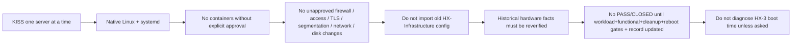
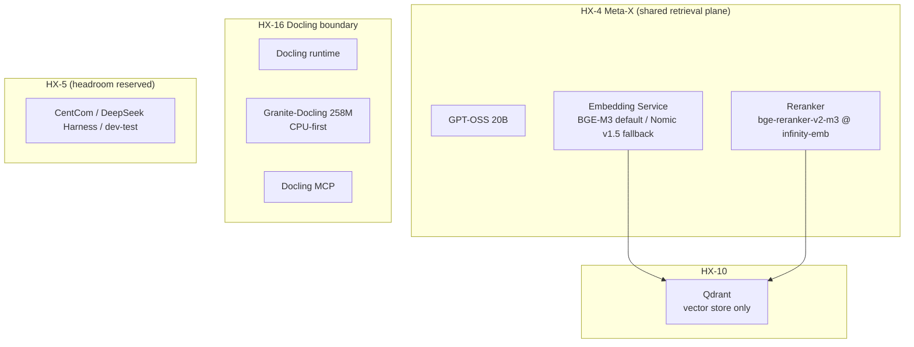

# Owner Decisions and Non-Negotiable Rules

This page is the rule lookup for the HX eco-system. It catalogs the owner-approved decisions (D-001 through D-023) recorded in `docs/00-control/DECISIONS.md` and the non-negotiable operating rules stated in `AGENTS.md`, plus the related model-placement and embedding standard. Agents consult it instead of re-deriving policy from first principles. Two companion pages extend this material: [truth-order-and-authority](/openwiki/concepts/truth-order-and-authority.md) for the precedence of sources, and [ci-and-review](/openwiki/integrations/ci-and-review.md) for how the rules are enforced in review/CI.

The decisions and rules are grouped by theme below. A decision identifier (`D-0xx`) is stable; the prose here summarizes it by theme rather than quoting it verbatim, and points at the authoritative source for each.

## Non-negotiable operating rules

These come from section 3 of `AGENTS.md` and bind every agent action. They are not preferences; violating one is a defect even if the immediate result works.



- **KISS one-server-at-a-time.** Build one server, validate it, record it, then move on.
- **Native Linux + systemd.** No Docker, Podman, Kubernetes, or containerized workload deployment unless explicitly approved by the owner.
- **No unapproved network/security/disk changes.** Do not impose firewall rules, access restrictions, TLS requirements, segmentation, or security-hardening changes, and do not change network architecture, without explicit approval. Do not mount, wipe, repartition, format, or repurpose an old/unmounted disk without explicit approval.
- **Clean-room rebuild.** Do not import old HX-Infrastructure configuration or closure claims into this clean rebuild. Historical hardware facts may inform planning but must be reverified before becoming current authority.
- **PASS/CLOSED gate.** A server is not PASS/CLOSED until workload, functional, cleanup (where applicable), and reboot-persistence gates are satisfied **and** its server record is updated.
- **HX-3 boot time is an observation, not a task.** Do not diagnose or remediate HX-3's longer boot time unless explicitly asked; it is a recorded observation only.

## Clean-room and deployment posture

- **D-001 — Clean-room rebuild.** HX-1's clean Samba foundation is retained; HX-2 through HX-17 are rebuilt from scratch. Old HX-Infrastructure configuration and closure claims are reference-only.
- **D-002 — Native deployment, no containers.** Native Linux + systemd. No Docker, Podman, or Kubernetes unless explicitly changed by the owner. This is the same posture as the operating rule above; the decision record ratifies it as an owner decision rather than only a rule.
- **D-015 — Ecosystem architecture is the cornerstone.** The HX ecosystem architecture and current configuration context must be understood before validation is designed or executed. Validation sits on top of the ecosystem; it does not define it. `ARCHITECTURE-ORIENTATION.md` is the foundational orientation authority, and smoke-test documents must inherit rather than redefine that architecture.

## Package-source / Snap policy

This policy is enforced by tooling, not just written down.

- **D-020 — PostgreSQL source build.** HX-9 PostgreSQL is built from the official source tarball at `https://www.postgresql.org/ftp/source/v18.6/`, not from the PGDG repository. The owner chose the source build so no application software on the fleet comes from an apt repository. The runbook `docs/03-runbooks/common/10-postgresql.sh` downloads the tarball, verifies it against the SHA-256 published beside it and pinned in `hx-base.env`, builds with `./configure --prefix=/srv/postgresql`, runs `initdb`, and installs the `hx-postgresql` unit.
- **D-021 — Snap is never a package source.** Snap is never permitted, for anything, including the NVIDIA driver. The Ubuntu archive stays available for the NVIDIA driver, build toolchains, and library headers, and nothing else.

The approved application sources are PyPI, npm, a GitHub release, an upstream source tarball, a direct binary, or Hugging Face. The Ubuntu archive is acceptable only for the NVIDIA driver and for build toolchains/library headers. The rule is codified in `tools/hx-doc/hx_version_pins.py`:

```python
APP_SOURCES = {"pypi", "github", "binary", "huggingface", "npm", "source"}
DRIVER_ONLY_SOURCES = {"ubuntu-archive"}
NEVER_SOURCES = {"snap"}
```

`source_problem()` returns a REVIEW migration note for any violation: a Snap pin is reported as "never permitted" regardless of whether it is an app or a driver; an `ubuntu-archive` pin is accepted only for `kind == "driver"` and is reported as needing migration for any other kind. The gate tests in `tools/hx-doc/hx_gate_tests.py` prove each branch fails on the case it guards:

- a Snap application is refused;
- a Snap driver is refused too;
- the Ubuntu archive is allowed for a driver;
- the Ubuntu archive is refused for an application;
- PyPI is accepted.

## Firewall and listener posture

- **D-018 — Host firewall and inference listener posture (ratified 2026-09-11).** The HX LAN is a trusted lab segment. **No UFW is used anywhere on the fleet** — the common base runbook disables it on every server, and that is the intended posture, not a gap. Ollama listens on `0.0.0.0:11434` with no authentication, and that listener posture stands as stated.

The posture is read directly from what the build scripts produce: `docs/03-runbooks/common/01-base-admin-network-updates.sh` disables and stops `ufw`, and `docs/03-runbooks/common/03-storage-ollama.sh` sets `OLLAMA_HOST=0.0.0.0:11434`. On a built host, any host that can reach the HX LAN can call the inference endpoint without credentials and reach the service ports the host exposes. That is accepted. This decision **closes** UFW/listener hardening as a decided posture: do not re-raise it as a finding against this repository.

## Model placement

Model placement is fixed by D-005, D-006, D-007, and D-022, and elaborated in `docs/00-control/HX-ECO-SYSTEM-MODEL-PLACEMENT-AND-EMBEDDING-STANDARD.md`.



- **D-005 — Embedding/reranking placement.** HX-4 Meta-X hosts BGE-M3 as the primary/default embedding model, Nomic Embed Text v1.5 as the alternate benchmark/fallback, and a BGE-family reranker. Embeddings from different models are never mixed in one Qdrant collection; a model change requires a new collection and re-embedding.
- **D-006 — Granite-Docling placement.** Granite-Docling 258M stays with Docling on HX-16. It is an embedded document-understanding VLM, not the HX general embedding model, and is not routed through OmniRoute or exposed as a general endpoint. Base validation is CPU-first; GPU acceleration is considered only if measured need later justifies it.
- **D-007 — HX-5 headroom.** Even if HX-5 is upgraded to 2 × 16 GB GPUs, shared embedding/reranking remains on HX-4. HX-5 headroom is reserved for CentCom, Ornith, DeepSeek Harness, and dev/test work. A future move of the embedding plane from HX-4 to HX-5 requires an explicit architecture decision based on measured contention or capacity, not simply available VRAM.
- **D-022 — BGE reranker checkpoint and runtime (ratified 2026-09-10).** The exact checkpoint is `BAAI/bge-reranker-v2-m3` at revision `953dc6f6f85a1b2dbfca4c34a2796e7dde08d41e`, served by `infinity-emb` 0.0.77 from PyPI, under systemd, on port 7997. The revision is an immutable commit, so a later upstream edit cannot change the model under a stable name. Authoritative pins live in `docs/03-runbooks/common/hx-base.env` (`HX_RERANKER_MODEL`, `HX_RERANKER_REVISION`, `HX_RERANKER_RUNTIME`, `HX_RERANKER_RUNTIME_VERSION`, `HX_RERANKER_PORT`), and `tools/hx-doc/hx-version-pins` checks them against upstream.

BGE-M3 (1024-dim) is the default for new HX knowledge collections; Nomic Embed Text v1.5 (768-dim default) is installed for benchmarking and fallback. Each Qdrant collection is pinned to one embedding model/revision/dimension. There is no in-place vector-model switch — only the create-new-collection / re-embed / retest procedure in the standard.

## Companion services and NGINX

- **D-003 — Application companion services.** Product-specific MCP servers and native Web UIs are part of the parent application's base build where applicable (e.g., Qdrant = Qdrant + Qdrant Web UI + Qdrant MCP; PostgreSQL = PostgreSQL + PostgreSQL MCP; Docling = Docling + Granite-Docling + Docling MCP). HX-15 FastMCP is a shared/custom MCP development host and is not a prerequisite for product-specific MCP servers.
- **D-004 — NGINX dev/test only.** HX-7 NGINX is limited to dev/test application rendering. It is **not** the common reverse proxy for HX ecosystem services — not for Qdrant, LightRAG, n8n, Open WebUI, databases, MCP servers, or normal services.

## OmniRoute catalog and temporary test wiring

- **D-008 — Open WebUI base functional test.** HX-8 Open WebUI BASE PASS includes a temporary direct connection to one already-proven Ollama endpoint, one prompt, one model response in the UI, evidence capture, and cleanup/removal of the temporary connection.
- **D-009 — OmniRoute base functional test.** HX-6 OmniRoute BASE PASS includes one temporary route to one already-proven Ollama endpoint, direct-versus-routed known-answer validation, evidence capture, and cleanup/removal of the temporary test route.
- **D-010 — OmniRoute provider/model catalog.** OmniRoute maintains an explicit approved-provider allowlist and an explicit approved-model allowlist. Discovery/support does not equal approval; approving a provider does not approve its entire model catalog. Free/no-auth/discovered providers are not automatically active.
- **D-019 — OmniRoute product identity (ratified 2026-09-10).** HX-6 OmniRoute is `https://github.com/diegosouzapw/OmniRoute.git`, MIT licence. The headless server installs from the npm package `omniroute`, pinned in `hx-base.env`, onto Node.js taken from the official nodejs.org binary tarball. The project's GitHub release assets are desktop builds and its documented container path is not used. D-010 applies in full and is the reason this server exists.

Temporary validation wiring must be recorded and removed/disabled before closure unless explicitly approved as permanent architecture. Temporary smoke-test dependencies do not automatically become permanent production architecture.

## Agent and runner roles

- **D-012 — DeepSeek Harness meta-agent role.** DeepSeek Harness on HX-5 is the HX meta-agent/orchestration layer for AI-agent and AI-solution construction. Worker agents invoked beneath the Harness are sub-agents that receive bounded application-building work packages. Harness BASE PASS requires more than runtime health: a bounded multi-agent solution-building smoke test proving task decomposition, sub-agent delegation, artifact handoff, creation of a runnable AI application, independent validation, and Harness-level synthesis of the final PASS/FAIL.
- **D-013 — Deep Agents LOB agent factory role.** Deep Agents by LangChain on HX-12 is the HX line-of-business agent factory/application-agent harness, complementary to (not a replacement for) the HX-5 DeepSeek Harness. BASE PASS requires an explicit tool-calling-capable HX model plus a bounded LOB Agent Factory smoke test proving real filesystem artifact creation, creation/configuration of domain sub-agents, actual `task` delegation, business-rule/tool use, correct execution of a generated LOB agent package, short-lived thread continuity, independent validation, evidence capture, and reboot persistence. A package import or plain LLM response is not sufficient.
- **D-014 — HX-5 CentCom smoke-test runner role.** After HX-5 closes its own base inference foundation, CentCom becomes the standard remote execution station for subsequent HX component smoke tests. Disposable test projects, runner/client tooling, synthetic fixtures, manifests, logs, and cleanup verification live on HX-5 rather than on the application host. The system under test keeps only its installed application, approved configuration, and explicitly smoke-namespaced temporary data. Remote API/protocol/client execution is preferred; approved SSH is used only when the component's primary contract genuinely requires local execution. Cleanup and cleanup verification are mandatory parts of PASS. DeepSeek Harness is **not** a prerequisite for enabling the CentCom smoke-runner role.

## Ordered smoke roadmap and governed skills

- **D-016 — Ordered smoke-test proof roadmap.** HX maintains a separate evergreen smoke-test roadmap in addition to the base implementation roadmap. The implementation roadmap defines deployment/build order; `HX-ECO-SYSTEM-SMOKE-TEST-ROADMAP.md` defines proof order, required prior PASS evidence, companion gates, and the minimum temporary integrations permitted during validation. Downstream smoke tests must reference current prior PASS evidence when they rely on earlier capabilities. HX favors **cumulative proof with minimal live coupling**: do not force unnecessary cross-service integration merely to make tests sequential. The proof DAG is enforced by `tools/hx-doc/hx-proof` and `hx-smoke-promote`, which refuses a PASS when a required prior step has not passed and been cited in `prior_pass_evidence`; there is no bypass flag.

### Governed skills layer (D-017)

`skills/` is the canonical HX capability library for reusable agent expertise — a layer between ecosystem context and execution. Its governance rules, stated in `AGENTS.md` section 6 and D-017, are:

- Read `skills/SKILL-GOVERNANCE.md` and `skills/SKILL-REGISTRY.md` before operational use of a component skill.
- HX wrappers load current HX context before vendor/community guidance; vendor-official skills are preferred over community skills for product-specific expertise.
- A skill may guide planning, native installation/configuration, troubleshooting, upgrades, and validation preparation, but it **does not replace** the HX runbook or smoke-test authority.
- **External skills cannot authorize** host-placement changes, container/cloud/embedded deployment, cluster topology, network/security/storage changes, model-placement changes, permanent integration, or changes to PASS criteria.
- Agent-specific skill installations are derived deployments from the canonical `skills/` source; do not maintain divergent hand-edited copies.
- **Skills never contain actual credentials** — passwords, PATs, API keys, private keys, service-account secrets, or sshpass passwords.
- Qdrant is the first approved reference implementation at `skills/qdrant/hx-qdrant-advisor/`, preserving HX-10/native-systemd/vector-space/smoke-test rules while consuming current official Qdrant Advisor guidance live.

## Active document and change/PR rules

- **D-011 — Active document rule.** Only the latest version of a document remains active; superseded versions go under `archive/`. Active Markdown is agent authority; HTML is a human mirror. Do not create duplicate active documents with timestamps, `(1)`, `final-final`, or model-name prefixes; stable active filenames are mandatory.

- **Change rule — everything goes through a pull request.** `main` is not a working branch. Every change, including a one-line fix, goes through a pull request so CodeRabbit reviews it; review is not optional. `coderabbit review --agent` before every push is required, not a convenience, because the hosted reviewer runs after the push and can refuse for the day once the review limit is reached on a public repository, while the command-line reviewer reads the working tree and configuration as they are now. `.coderabbit.yaml` matches every base branch, not just `main`, so stacked branches are reviewed too. Keep a pull request under 100 changed files or CodeRabbit skips it (a skipped review is the same as no review). When CodeRabbit raises a finding, fix it; if a finding is wrong, say why on the thread rather than ignoring it.

## OpenWiki Actions secrets (D-023)

- **D-023 — A write-capable token in Actions secrets, for OpenWiki (ratified 2026-09-11).** OpenWiki generates `openwiki/` from the code. Two Actions secrets are accepted on the public repository: `OPENWIKI_PR_TOKEN` (a fine-grained PAT or GitHub App token scoped to this repository only, with Contents read+write and Pull requests read+write) and `ANTHROPIC_API_KEY` (a model key; every scheduled run is billable). A pull request opened with the default `GITHUB_TOKEN` does not start `pull_request` workflows, so the checks in `hx-checks.yml` would never run on generated documentation — the weak option is also the broken one.

The workflow `.github/workflows/openwiki-update.yml` meets all six conditions: `add-paths` is `openwiki` only; every action and package is pinned (OpenWiki at `0.5.1`); OpenWiki pull requests are not auto-merged; the job refuses to start when either secret is missing (a separate `preflight` job so a missing secret skips the whole run instead of spending the model budget and failing late); the schedule is weekly (Sunday 08:00 UTC), not daily; and telemetry is off with LangSmith tracing removed.

The stated residual risk: `workflow_dispatch` runs the workflow file from the ref the operator picks, so a branch that edits that file can read both secrets and no line inside the file can prevent it. The control is who holds write access to the repository plus branch protection on the default branch. The checkout is pinned to the default branch so generated documentation always describes `main` — a correctness measure, not a security one. Reversal is delete the workflow file and revoke both secrets; running `openwiki --update` by hand from inside Claude Code costs nothing because the host integration uses the session's model instead of a key, and that remains the fallback.

## How the rules are enforced

Written rules that nothing checks will drift. The repository's tooling is the enforcement layer; a failure is a real defect, not noise to work around. The package-source rule (D-020/D-021) is enforced by `tools/hx-doc/hx-version-pins`, which reports a Snap pin as REVIEW and an Ubuntu-archive application as REVIEW with a migration note, and by the gate tests in `tools/hx-doc/hx-gate-tests`. The firewall/listener posture (D-018) is enforced by the base runbooks that disable UFW and set the Ollama listener. The proof DAG (D-016) is enforced by `hx-proof` and `hx-smoke-promote`. Documentation drift is enforced by `hx-doc-check`, `hx-render-html`, and `hx-upstream-drift`. If a check is wrong, fix the check in a reviewed change; do not bypass it or weaken it to make an existing document pass.
