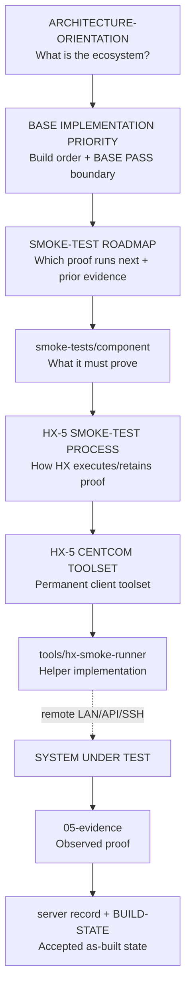

# Truth Order, Authority Layers, and Document Control

The HX ecosystem is operated by human and agentic readers who must always know **which source wins when two sources disagree**. This page records the three mechanisms that settle that question:

1. a **seven-level truth order** that ranks sources from explicit owner instruction down to general model knowledge;
2. a **layered authority model** for smoke testing where each layer answers exactly one question, and no layer silently replaces another;
3. a **document-control standard** that keeps exactly one current version of each authority in the active tree and archives everything superseded.

Together these are the conceptual backbone for deciding what to trust.

## 1. Seven-level truth order

`AGENTS.md` section 2 defines the precedence every agent applies when sources conflict, from highest to lowest:

| Level | Source | Role |
|---|---|---|
| 1 | Explicit current instruction from the infrastructure owner | Overrides everything below it |
| 2 | Current active control/architecture Markdown in `docs/` and the exact current component acceptance authority in `smoke-tests/` when testing | The active written authority for build and validation |
| 3 | Current live evidence from the server being worked on | Observed reality on the SUT |
| 4 | Current approved runbook/execution artifact | The sanctioned execution procedure |
| 5 | Governed HX wrapper skill plus current official vendor guidance | Product-specific expertise, loaded after HX context |
| 6 | Historical/archive material | Reference only |
| 7 | General model knowledge | Last resort |

### The contradiction rule

Truth order is not a license to keep trusting a document after reality contradicts it. The contract states explicitly:

> If current live evidence or current official vendor requirements contradict an active document, stop treating the document as sufficient proof and report the contradiction. Do not silently let a vendor skill redesign HX.

So level 2 (active documents) is authoritative *until* level 3 (live evidence) or vendor requirements contradict it — at which point the document is no longer sufficient proof and the contradiction must be reported rather than papered over. Owner instruction (level 1) remains the only thing that can settle such a contradiction.

### What must not be read as current authority

`archive/` and `human-html/` are excluded from normal context loading unless explicitly requested. Archive material sits at level 6 (historical reference); the human HTML mirror is a derived human view, never an authority. Agents must ignore both during normal context loading.

## 2. Layered authority model for smoke testing

`HX-SMOKE-TESTING-OPERATING-MODEL.md` defines a validation-layer architecture map in which **each authority answers one question**, and the layers stack in a fixed prerequisite order. The map is a validation-layer artifact: it does **not** define the HX ecosystem itself — ecosystem placement, server roles, and network architecture are owned by `ARCHITECTURE-ORIENTATION.md`, which sits above it.

### The one-question-per-layer table

| Authority | Question it answers |
|---|---|
| `ARCHITECTURE-ORIENTATION.md` | What is the HX ecosystem, how is it configured, and which server owns each capability? |
| `HX-ECO-SYSTEM-BASE-IMPLEMENTATION-PRIORITY.md` | What is built, in what dependency order, and what is the component's BASE PASS boundary? |
| `HX-ECO-SYSTEM-SMOKE-TEST-ROADMAP.md` | Which proof runs next, what prior PASS evidence is required, and what limited validation integration is permitted? |
| `smoke-tests/<component>-smoke-test.md` | What must this component prove and how is the known-answer test executed/cleaned up? |
| `HX-5-SMOKE-TEST-PROCESS-AND-PROCEDURES.md` | How does HX execute, clean up, and retain a smoke-test run? |
| `HX-5-CENTCOM-SMOKE-RUNNER-TOOLSET-AND-BOOTSTRAP.md` | What permanent client toolset and bootstrap are used on HX-5? |
| `tools/hx-smoke-runner/` | What repository-owned helper implementation performs the repeatable runner operations? |
| `docs/05-evidence/` | What observed proof supports the accepted state? |
| server record + `BUILD-STATE.md` | What is the current accepted as-built/closure state? |

### No layer silently replaces another

This is the core invariant of the layered model:

- The deployment roadmap is **not** the smoke roadmap.
- The smoke roadmap is **not** the component procedure.
- Validation evidence is **not** architecture authority.

The operating model states this plainly: *"No layer should silently replace another."* A downstream smoke test must reference the current prior PASS evidence it relies on, but HX uses **cumulative proof with minimal live coupling** — agents must not force unnecessary cross-service integration merely to make tests appear connected. The smoke roadmap also inherits the deployment roadmap and never authorizes testing a component before the SUT is installed and ready.

### Ecosystem-first precondition

Before designing or executing any smoke test, an agent must be able to state the component's assigned server and target IP, the server's role and current build state, the applicable LAN/domain/deployment baseline, the component's architectural layer and ownership boundary, required versus validation-only dependencies, applicable model/data placement rules, and the current dependency/build priority and BASE PASS boundary. If the agent cannot answer those foundational questions, it is not ready to execute validation — validation sits *on top of* the ecosystem, it does not define it.

## 3. Active-document rule (D-011)

Decision **D-011** and the Document Control Standard together establish that only the latest version of a document remains active. Superseded versions go under `archive/`.

### What an active document must be

- Exactly one current copy in the active tree, living under `docs/`.
- A **stable filename** — no version numbers, dates, `(1)`, `final-final`, or model-name prefixes in the filename.
- Version, date, and status carried **inside** the document (in frontmatter), not in the filename.
- No duplicate active copies with timestamped or `(1)`/`final-final` style prefixes.

### Authority of each tree

| Tree | Authority |
|---|---|
| `docs/**/*.md` | Authoritative current content (agent authority) |
| `human-html/**/*.html` | Derived human view — generated mirror, never hand-edited |
| `archive/**` | Historical only — not current authority |

Active Markdown is agent authority; human HTML is a generated mirror of that Markdown. The pairing rule asks that major planning, architecture, and standards documents carry one active Markdown source **and** one matching HTML human mirror; operational state files may remain Markdown-only where an HTML mirror adds little value.

### Document-control frontmatter vocabulary

Active documents carry a frontmatter block with human-readable control fields. The standard fields observed across the seed authorities are:

- `document` — human-readable title of the document.
- `status` — lifecycle state (e.g. `current`).
- `version` — semantic/document version when versioning is tracked.
- `date` — the date the current version was established.
- `scope` — one-line statement of what the document covers.
- `authority` — the source that authorizes the document (e.g. `HX-Eco-System clean rebuild`).

These are producer-defined control fields. OpenWiki-owned generated/verified/sources/timestamp fields are not authored by hand.

## 4. Supersession workflow

The Document Control Standard defines a six-step supersession procedure, and `tools/hx-doc/hx_doc_supersede.py` automates the mechanical parts of it in one command.

### Manual procedure

1. Create `archive/YYYY-MM-DD/<same-active-path>/`.
2. Move/copy the prior active Markdown there with a version suffix if useful.
3. Archive the matching prior HTML mirror.
4. Replace the active Markdown at the stable path.
5. Replace the human HTML mirror at the stable mirrored path.
6. Verify only one active version remains.

### Automated supersession via `hx-doc-supersede`

`tools/hx-doc/hx_doc_supersede.py` performs the archive half of the procedure and leaves the active file in place for editing. Given an active document path and a `--suffix`, it:

1. resolves the path relative to the repo root and **refuses** paths under `archive/` or `human-html/` (those are not active documents);
2. creates `archive/<today>/<same-parent-path>/`;
3. copies the current Markdown there as `<stem>-<suffix><ext>` (the suffix disambiguates same-day supersessions; it errors if the archived name already exists, forcing a distinct suffix);
4. locates and archives the matching generated HTML mirror under `human-html/` when one is already committed (mirrors `docs/` → `human-html/`, `skills/` → `human-html/skills/`, and `README.md` → `human-html/README.html`);
5. leaves the active file untouched and reminds the operator to edit it, then run `tools/hx-doc/hx-render-html` and `tools/hx-doc/hx-doc-check`, and to commit the edit and the archive copy together in one commit.

A `--dry-run` flag prints the planned archive paths without writing anything. The tool deliberately does **not** edit the active file or regenerate the mirror — it only archives the superseded copy, so the operator remains responsible for the replacement content and the regenerated mirror. This mirrors the manual rule's intent: archive the old, replace the active, re-render the mirror, verify one active version remains.

### Why the tool exists

The tool's docstring records the motivation directly: the six-step rule is correct, but doing it by hand caused churn (six commits spent archiving a single README, plus stray marker files created and deleted). The rule is fine; doing it by hand is where the churn comes from. The tool collapses the mechanical archive steps into one command while preserving the rule.

## 5. How the mechanisms fit together

The truth order, the layered authority model, and document control are one coherent system:

- **Document control** guarantees that when an agent reads "the current `DECISIONS.md`", there is exactly one such file and it is the latest — no stale duplicates compete for attention. This is what makes level 2 of the truth order unambiguous.
- **The layered authority model** guarantees that within level 2, each question has exactly one owner, so a reader never has to guess whether the smoke roadmap or the component procedure defines acceptance criteria. Each layer answers one question and no layer silently replaces another.
- **The truth order** then resolves any remaining conflict *across* levels — owner instruction over documents, documents over runbooks, live evidence triggering a stop-and-report when it contradicts a document, vendor skills loaded after HX context and never allowed to redesign HX.

The shared invariant across all three is that **authority is explicit and single-sourced**: one active version per document, one question per layer, one ranked order across all sources. When reality contradicts an authority, the response is never to silently pick a different source — it is to stop treating the contradicted document as sufficient proof and report the contradiction.
