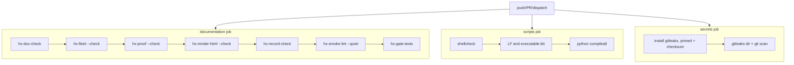

# CI, CodeRabbit Review, and Change Process

The HX Eco-System repository's stance is that **a written rule that nothing checks will drift**. This integration layer is the machinery that makes that real: every repository rule that matters is backed by either a CodeRabbit path instruction applied on review, a CI gate that exits non-zero, or a gate test that proves the gate can still fail. The recurring defect the layer exists to remove is the *check that cannot fail* — one that looks like coverage but catches nothing — and several shipped defects were exactly that. The page covers the change workflow an agent follows, the CodeRabbit configuration, the three GitHub Actions workflows, the gate-tests harness, and the OpenWiki automation that regenerates this wiki itself.

## The change process: everything goes through a pull request

`main` is not a working branch. Every change — including a one-line fix — goes through a pull request so CodeRabbit reviews it. Review is not optional, and it happens **before push, not after**. The canonical sequence, from AGENTS.md section 13:

```bash
git checkout -b <type>/<short-name>

# work, then regenerate anything derived and check it:
tools/hx-doc/hx-fleet && tools/hx-doc/hx-render-html && tools/hx-doc/hx-doc-check

# commit before pushing - git push sends commits, not working-tree edits:
git add -A
git status          # confirm the diff is what you mean to submit
git commit

# review locally before the push, not after it:
coderabbit review --agent

git push -u origin HEAD && gh pr create
```

### Why `coderabbit review --agent` runs before push

`coderabbit review --agent` before every push is **required, not a convenience**. Three properties of the hosted reviewer make it insufficient as the primary gate:

1. The hosted reviewer runs *after* the push, so a defect reaches the branch before it is seen.
2. It applies the configuration from the **base branch** rather than the branch under review — a change to `.coderabbit.yaml` on a feature branch does not take effect for that branch's own review until it reaches `main`.
3. On a public repository it can **refuse for the day once the review limit is reached**.

The command-line reviewer has none of those limits: it reads the working tree and the configuration as they are now. The first push of the day that skipped it shipped two defects — a duplicate `with:` key that stopped a workflow from starting at all, and a `path_filters` entry that turned the filter list into an allow list and would have excluded every file from review — both of which the CLI reviewer reported before they reached the branch. It runs from a CodeRabbit API key; `coderabbit auth status` reports whether one is configured.

### PR size and stacked PRs

A pull request stacked on another branch is reviewed too: `.coderabbit.yaml` matches every base branch, not just `main` (see below). Keep a pull request **under 100 changed files**; CodeRabbit skips anything larger, and a skipped review is the same as no review. Generated output and `archive/` are already filtered out of review, which is what usually pushes a change over the line.

When CodeRabbit raises something, the instruction is to fix it regardless of severity. If a finding is wrong, say why on the thread rather than ignoring it.

## CodeRabbit configuration (`.coderabbit.yaml`)

`.coderabbit.yaml` encodes repository rules as reviewer instructions so they hold on every change instead of only as long as someone remembers. Every path instruction below corresponds to a rule stated elsewhere in prose.

### Profile and review behaviour

The profile is **assertive** (`request_changes_workflow: false`), with high-level summary, changed-files summary, effort estimate, and collapsed walkthrough enabled, and poem and sequence diagrams disabled. `auto_review.enabled` is true with `drafts: false` and `auto_incremental_review: true`. Finishing touches (autofix and `fix-ci`) are enabled and written explicitly so turning one off is a recorded decision rather than a silent inheritance; `fix_ci` requires a Team plan and is offered-but-undeliverable on the free OSS tier.

### `base_branches: [".*"]` — stacked PRs are reviewed

`auto_review.base_branches` lists `.*`. This matters because the list is interpreted as *branches other than the default*: naming only `main` there added nothing and excluded everything else, so a pull request stacked on another branch was skipped with "auto reviews are disabled on base/target branches other than the default branch" — an unreviewed change, which is the one outcome the repository does not accept. The decision is made from the pull request's base branch, so the fix has to reach `main` to take effect; fixing it only on a stacked branch cannot rescue that branch's own review.

### `path_filters` — subtractive, never an allow list

The `path_filters` list uses `**` to keep the whole tree in scope and subtracts with `!`-prefixed entries:

- `!human-html/**` — generated HTML mirrors; a finding belongs in the Markdown source or the generator.
- `!archive/**` — superseded history; never current authority.
- `!openwiki/**` — written by the OpenWiki CLI and replaced wholesale on `--init`.
- `!docs/03-runbooks/common/hx-fleet-ips.env` — generated from `hx-fleet.tsv`.

This subtractive shape is deliberate because **a positive entry turns the list into an allow list**: CodeRabbit treats it as a sparse-checkout include set, so naming only the two TSV files left every other file ignored — the bug that shipped two defects. The two source-of-truth TSVs are re-included by name (`docs/00-control/hx-fleet.tsv`, `docs/00-control/hx-proof.tsv`) because CodeRabbit's own default filters exclude `**/*.tsv`, which silently kept both source-of-truth files out of every review; they are the last files that should go unreviewed.

### `path_instructions` — rules as reviewer findings

Each path block turns a written rule into something the reviewer flags:

| Path | Rule enforced |
|---|---|
| `docs/03-runbooks/**/*.sh` | `set -euo pipefail`; `hx_require_host` host guard first; quoted expansions; no hard-coded host/IP/version that belongs in `hx-base.env`; application software from PyPI/npm/GitHub release/source tarball/binary/Hugging Face only; flag apt-installed application software (Ubuntu archive permitted only for NVIDIA driver and build toolchains/library headers); **Snap is never permitted**; flag Docker/Podman/Kubernetes; tarball/binary downloads must verify a checksum; D-018's no-UFW / Ollama-on-0.0.0.0:11434 posture is decided — do not raise firewall/segmentation/TLS findings. |
| `tools/**` | Python 3 standard library only; flag any third-party import; a check that cannot fail is a defect; flag swallowed errors and drift comparisons against the wrong thing; shell wrappers must resolve a working Python 3. |
| `human-html/**` | Generated by `hx-render-html`; a change here without the matching Markdown source changing *is* the finding. |
| `docs/00-control/**` | Stable filenames (no version/date in name); superseded versions go under `archive/YYYY-MM-DD/`; flag as-built claims not backed by evidence and ratified decisions without an owner deciding. |
| `docs/02-server-records/*.md` | Provenance needs both a source URI and a full SHA-256; unknown values recorded as `UNRESOLVED`, never omitted; flag PASS/CLOSED not supported by recorded gates. |
| `smoke-tests/*.md` | Each needs a known answer, a cleanup step, and evidence retention; service health alone is never sufficient; must not redefine ecosystem placement, roles, integration, or network architecture. |
| `skills/**` | Registry lifecycle states from `SKILL-GOVERNANCE.md`; every approved skill needs a reviewed upstream commit and last-reviewed date; skills never contain credentials. |
| `.github/workflows/*.yml` | Flag unpinned third-party actions, secrets echoed into logs, and **any check that cannot fail** — "a workflow that always passes is worse than no workflow, because it looks like coverage." |

The enabled tool layer is shellcheck, ruff, markdownlint, yamllint, actionlint, gitleaks, and github-checks. `knowledge_base.learnings.scope` is `local`.

## The `hx-checks.yml` workflow — documentation and execution-artifact CI

`.github/workflows/hx-checks.yml` runs on push to `main`, on pull requests, and on manual dispatch. Its header states that *every check here corresponds to a defect actually found in this repository*. Permissions are `contents: read` only. All three jobs set `persist-credentials: false` on checkout because the default writes `GITHUB_TOKEN` into `.git/config` and these jobs then run repository-controlled scripts that need no authenticated git.


*The three independent jobs of hx-checks.yml; each exits non-zero on its own failure surface.*

### Documentation job

Runs on Python 3.12 and executes, in order: `hx-doc-check` (links resolve, registry vocabulary defined, control frontmatter complete, filenames stable, evidence committable); `hx-fleet --check` (fleet tables match `hx-fleet.tsv`); `hx-proof --check` (proof DAG valid and generated blocks current); `hx-render-html --check` (human-html mirrors match Markdown sources); `hx-record-check` (server records follow the template); `hx-smoke-lint --quiet` (smoke-test authorities complete); and finally `hx-gate-tests` — the meta-check that proves every gate above still fails on the case it guards.

### Scripts job

shellcheck (severity `warning`, shell `bash`) over `docs/03-runbooks/common/hx-base.env`, `hx-app-lib.sh`, `common/*.sh`, `HX-*/*.sh`, `tools/hx-smoke-runner/hx-smoke-*`, and `tools/hx-doc/hx-*`, with `.py` files filtered out because shellcheck cannot parse them. A separate step verifies shell scripts are LF (no CRLF) and executable. Python artifacts are compiled with `python3 -m compileall -q tools/`.

### Secrets job

Uses `fetch-depth: 0` so history is scanned. The gitleaks *action* requires a paid licence for organisation-owned repositories, so the workflow installs the **gitleaks binary** itself — pinned to version `8.30.1` with a SHA-256 verified against the published checksum (releases/latest would install whatever shipped that morning with no checksum, and this is the tool that decides whether a credential reached the repository). It then runs `gitleaks dir` (working tree) and `gitleaks git` (history), both with `--config .gitleaks.toml --redact --no-banner`.

All third-party actions are pinned to commit SHAs (`actions/checkout`, `actions/setup-python`).

## `hx-gate-tests` — a check that cannot fail is a defect

`tools/hx-doc/hx_gate_tests.py` is the harness that keeps the other gates honest. Its premise, stated in its docstring: every check here enforces a written rule, and a check that cannot fail looks like coverage and is not, so each gate gets one test that breaks the thing it guards and asserts a non-zero exit.

### How it runs

It runs against a **throwaway copy** of the repository, never the working tree. `fresh()` copies the source tree into a temporary directory (`ignore_patterns('.git')`) and runs `git init -q` there, because `hx_doc_check` runs `git check-ignore` against the repository root and outside a work tree that exits 128 — which it correctly treats as a failure, but which earlier tests never noticed because every test expected a non-zero exit anyway. Each test calls `fresh()` before mutating, so tests cannot affect each other. `edit(rel, fn)` rewrites one file through a function. The harness exits 1 if any test failed.

### What it proves

The tests deliberately break each gate on the specific case that gate guards and require non-zero exit (and, usually, a substring in the output):

- **hx-fleet**: an unclosed `HX-FLEET:TABLE` marker is drift; an unknown column is drift.
- **hx-record-check**: an option list in the State line is drift; a near-miss state (`NOT APPLICABLE` where `NOT STARTED` is required) is drift; a missing State line is drift.
- **hx-doc-check**: a link target outside the repository is broken; a unit reported as created (`hx_app_done hx-crawl4ai`) that no runbook actually creates fails; merely *naming* the unit path (or `rm`-ing it) without creating it still fails; a broken link **inside** `openwiki/` is *not* a finding (the skip must skip), but the same broken link outside a generated tree must still fail.
- **hx-upstream-drift**: unpaired Repository/SHA lines in `SKILL-REGISTRY.md` are refused.
- **hx-preflight**: an empty version pin fails instead of being skipped.
- **hx-new-server**: a misspelled flag (`--no-olama`) is refused with exit 2; a missing template placeholder is refused.
- **hx-proof**: a duplicate phase marker is drift; a dependency on an unknown step (`Z9`) is refused.
- **hx-render-html**: an edited source with a stale mirror fails.
- **hx-smoke-lint**: an authority with no known answer fails; one with no retention statement fails; a bare `## Evidence` heading does not satisfy the check; a negated sentence ("do not retain credentials") does not satisfy it (the check is anchored to the standard evidence bundle path, not a substring of "retain").
- **hx-version-pins**: the shipped numeric comparator (`vkey`) sorts `595.71.05` above `595.9.05`, which lexicographic sort would not.

### The generated-authority-block checks

A dedicated cluster of tests guards the OpenWiki-generated `<!-- OPENWIKI:START -->…<!-- OPENWIKI:END -->` block in `AGENTS.md`. OpenWiki's first run wrote "Treat source code and tests as authoritative" into that block, contradicting section 2's truth order. The block is rewritten on every scheduled run, so the rule needs a check, not a memory. The tests confirm that claiming source code/tests as authoritative is refused **in either word order, capitalised or lowercased, as noun or adjective, and even when `docs/` is named alongside** — while the correct negated wording ("Source code and tests are evidence, not authority. The control Markdown in docs/ is authoritative.") is accepted, a word merely containing "tests" ("attests") is not flagged, and a claim naming only `docs/` passes. This sentence-by-sentence anchoring exists because earlier pattern-matched corrections were each wrong in a different way.

### The five Snap/package-source checks (D-021)

D-021 resolved a contradiction: `.coderabbit.yaml` said "Snap is never permitted" while `hx-base.env` and `hx_version_pins.py` accepted the Ubuntu archive and Snap for drivers. The owner ratified the `.coderabbit.yaml` wording — **Snap is never permitted, for anything, including the NVIDIA driver**. The Ubuntu archive stays available for the driver, build toolchains, and library headers only. `hx_version_pins.py` reports a Snap pin as REVIEW regardless of kind. The gate-tests exercise the shipped `source_problem()` directly (without touching the network) with five checks:

1. A Snap **application** is refused (`never permitted`).
2. A Snap **driver** is refused too.
3. The Ubuntu archive is **allowed** for a driver.
4. The Ubuntu archive is **refused** for an application (`migrate`).
5. PyPI is accepted.

## The `hx-upstream-drift.yml` workflow — drift is information, not failure

`.github/workflows/hx-upstream-drift.yml` runs weekly (Mondays 06:17 UTC) and on manual dispatch. `skills/SKILL-REGISTRY.md` pins the exact upstream commit each governed skill was reviewed at; those pins were maintained entirely by memory, so this workflow reports when an upstream has moved so the owner can decide whether to re-review. Permissions are `contents: read`, `issues: write`.

### Control flow

1. `hx-preflight --quiet` — pinned artifacts are still fetchable.
2. A `drift` step writes a Markdown report combining `hx-upstream-drift --markdown` and `hx-version-pins --markdown` into `drift.md`, appends it to `$GITHUB_STEP_SUMMARY`, and sets `drifted=true` if either `--fail-on-drift` or `--fail-on-outdated` exits non-zero.
3. **Drift is information, not failure**: a drifted pin opens (or comments on) one issue titled "Version pins have drifted" rather than failing the job. A pin stays valid until the owner moves it.
4. **Unreachable upstreams are failure**: if `drift.md` contains "could not be reached", the step exits 1 with an error — "nothing was compared, and reporting that as a clean run is the check that cannot fail this repository keeps removing."
5. The issue step (only when `drifted == 'true'`) searches for an existing open issue with that title and comments on it, or creates one labelled `upstream-drift`.

## The `openwiki-update.yml` workflow and D-023

`.github/workflows/openwiki-update.yml` regenerates `openwiki/` from the code and opens a documentation pull request. It is governed by **D-023** (ratified 2026-09-11), recorded *before* the secrets exist. It runs weekly (Sunday 08:00 UTC) and on manual dispatch; every run is a paid model run, so it is not daily. Permissions are `contents: read`; a `concurrency` group `openwiki-update` with `cancel-in-progress: false` prevents two runs racing on the same `openwiki/update` branch.

### Why two secrets, and why not `GITHUB_TOKEN`

A pull request opened with `GITHUB_TOKEN` does not start `pull_request` workflows, so the checks in `hx-checks.yml` would never run on generated documentation — the weak option is also the broken one. D-023 accepts two Actions secrets on the public repository:

- `OPENWIKI_PR_TOKEN` — a fine-grained PAT or GitHub App token, scoped to this repository only, with **Contents: read+write** and **Pull requests: read+write**. The repository being public does not expose it, but a leak gives write access to something the world can already read — the accepted risk.
- `ANTHROPIC_API_KEY` — a model key; every scheduled run is billable.

### The preflight gate

Secrets presence is a **separate job** (`preflight`), not a first step, because the two downstream steps that open the PR carry `if: !cancelled()` — which is also true when an earlier step *failed*. As a step, a missing-secret refusal would skip itself and the job would open a PR anyway with an empty token. `needs: preflight` skips the whole job instead.

### The update job

- Checkout is pinned to `${{ github.event.repository.default_branch }}` with `fetch-depth: 0` and `persist-credentials: false`. Always documenting the default branch means generated docs describe `main`, never the ref a manual dispatch happened to pick. Full history is required because `openwiki --update` diffs `HEAD` against the commit it last documented; a shallow clone hides that commit and the run sees an empty change summary. (Note: `workflow_dispatch` runs *this file* from the chosen ref, so a branch can edit the steps below — who holds write access plus branch protection is the control, not a line in this file.)
- OpenWiki is installed **pinned**: `openwiki@0.5.1` plus `mermaid@11.16.0` and `jsdom@29.1.1` for strict Mermaid validation.
- `openwiki code --update --print` runs with `continue-on-error: true` and telemetry off (`OPENWIKI_TELEMETRY_DISABLED=1`, `OPENWIKI_PROVIDER=anthropic`, `OPENWIKI_MODEL_ID=claude-sonnet-5`). A partial run is still progress: finished pages are durable and become the baseline for the next run.
- Transient state `openwiki/.run.json` is removed, then `peter-evans/create-pull-request` (pinned) opens the PR with `token: OPENWIKI_PR_TOKEN`, `add-paths: openwiki` (and nothing else), branch `openwiki/update`. PRs are **not auto-merged** — a human reads the generated documentation first.
- A final step propagates OpenWiki failure (`exit 1` if `steps.openwiki.outcome == 'failure'`) *after* the PR exists.

All actions are pinned to commit SHAs. LangSmith tracing is removed — nothing about this repository is sent to a third-party trace store.

### Reversal

Delete the workflow file and revoke both secrets. Running `openwiki --update` by hand from inside Claude Code costs nothing, because the host integration uses the session's model instead of a key. That stays the fallback.

## GitHub Actions secret and variable registry

The repository keeps an approved registry at `docs/04-application-standards/GITHUB-ACTIONS-SECRET-AND-VARIABLE-REGISTRY.md`. It records the **names and intended use** of automation identifiers without storing values. `HXES_SECRET` (Actions secret) and `HXES_VARIABLE` (Actions variable) are reserved with handling rules fixed in advance so a value is never introduced ad hoc. Rules include: secret values never appear in Markdown, scripts, logs, or `.env` examples; a sensitive credential must not be duplicated into a plaintext variable; workflow files reference identifiers by name only; exposed credentials trigger rotation as the clean follow-up. The registry's current-status table tracks which workflows consume which secrets; `hx-checks.yml` and `hx-upstream-drift.yml` use `GITHUB_TOKEN` only, and `openwiki-update.yml` consumes `OPENWIKI_PR_TOKEN` and `ANTHROPIC_API_KEY`.

## Relationships to other pages

- The decisions these workflows enforce are catalogued in [/openwiki/concepts/decisions-and-rules.md](/openwiki/concepts/decisions-and-rules.md) (D-018, D-020, D-021, D-023 in particular).
- The hx-doc tooling each gate runs is documented in [/openwiki/operations/hx-doc-tooling.md](/openwiki/operations/hx-doc-tooling.md).
- The server build workflow that consumes these runbooks and smoke-test authorities is covered in [/openwiki/workflows/build-a-server.md](/openwiki/workflows/build-a-server.md).
- The OpenWiki regeneration flow, including the manual fallback, is described in [/openwiki/workflows/refresh-generated-docs.md](/openwiki/workflows/refresh-generated-docs.md).
