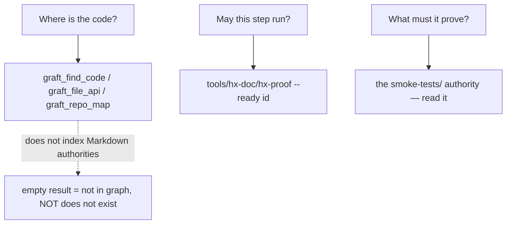

# Graft Code-Graph Integration

Graft (NanoNets context-graph-engine) is the in-session code graph for the HX
Eco-System repository. It is registered as an MCP server in `.mcp.json`, so a
session opened in this repo gets six code-graph tools natively without shelling
out. Its job is to answer "where is the code and what does it touch" for the
**executable surface** — the scripts that get run repeatedly during builds and
smoke tests — not to be a search index over the whole repository.

This page documents the boundary between what graft owns and what it does not,
the patch that makes shell files enter the graph at all, the multi-install
pitfall that patch creates, the deep-mode option that has not yet been run, and
the question→source routing rule that prevents an empty graft result from being
misread as "does not exist."

## Registration

`.mcp.json` registers a single MCP server under the key `graft`, launched via
`npx -y @nanonets/graft@0.18.0 mcp`:

```json
{
  "mcpServers": {
    "graft": {
      "command": "npx",
      "args": ["-y", "@nanonets/graft@0.18.0", "mcp"]
    }
  }
}
```

A session in this repo therefore has `graft_find_code`, `graft_find_all`,
`graft_trace_calls`, `graft_file_api`, `graft_repo_map`, and
`graft_check_freshness` available as native tools. Prefer these over `grep` or
whole-file reads: one graft call typically replaces several file reads, and the
measured savings on this repository are significant (see
[Token savings](#token-savings)).

## What graft indexes

The executable surface that is operated repeatedly:

- **57 `.sh` runbook blocks and helpers** under `docs/03-runbooks/` — the
  install/upgrade/validate scripts invoked during a build day.
- **13 `.py` tool bodies** under `tools/hx-doc/` — the consistency-checking and
  scaffolding tools (`hx-fleet`, `hx-proof`, `hx-render-html`, etc.).
- **2 `.env` files** — notably `docs/03-runbooks/common/hx-base.env`, which
  holds `hx_require_host`, `hx_ip_for`, and the fleet version pins, and is
  bash-flavoured rather than inert configuration.

The `.env` inclusion is deliberate: `hx-base.env` is executable bash that is
sourced by runbook blocks, so excluding it would hide the host-guard helpers
and pin values from the graph.

## What graft does NOT index

Graft indexes by file extension. Anything without one, plus all Markdown, is
absent from the graph:

- **The Markdown authorities** — `smoke-tests/*.md`, the roadmaps, the control
  docs, the server records. These are read directly, never queried through
  graft. An empty graft result for something described in Markdown says nothing
  about whether it exists.
- **17 extensionless scripts** — every `tools/hx-doc/hx-*` wrapper plus the
  four `hx-smoke-runner` scripts. The wrappers are a few lines that resolve a
  Python 3 and `exec` the indexed `.py` body beside them, so the substance is
  still in the graph under the `.py` file. The four smoke-runner scripts are
  **not** indexed and are the ones used most during a smoke run, so they must
  be read directly.

This boundary is the reason the question→source routing rule below exists: the
three classes of question a build-day agent asks are answered by three
different sources, and graft owns only one of them.

## The bash-registration patch

Out of the box, graft skips every `.sh` file. It ships `tree-sitter-bash.wasm`
and its grammar manifest registers the language as `"bash"`, but graft's own
language table in `dist/graph/generic.js` has **no bash entry**, so `.sh` files
are never parsed. `tools/hx-doc/hx-graft-bash` is a one-line local patch that
adds the missing entry:

```text
{ name: "bash", exts: [".sh", ".bash", ".env"], wasm: "bash" }
```

It inserts this after the existing `zig` entry in the language table, backing
up the shipped file to `*.pre-hx-bash` first. The script is idempotent (a
second run reports `already registered`) and refuses to guess if the upstream
anchor has moved: if the expected `{ name: "zig", ... }` string is not found it
stops loudly, telling the operator to patch by hand or check whether upstream
now registers bash itself. A `--revert` mode restores the shipped file from the
backup.

Because this is a local patch to a third-party package, **`graft upgrade` or
any reinstall wipes it.** Re-run `tools/hx-doc/hx-graft-bash` after every
upgrade, then `graft build --no-reuse`.

## Two installs, one patch

A workstation commonly has **two** graft installs — a native one and one inside
WSL — and whichever is on `PATH` answers a query. The MCP server launches the
host's graft. If only one install carries the bash registration, the graph on
disk still lists shell symbols (the cards were built by the patched install)
while live queries come back blind to shell, which reads as a graft bug rather
than a half-applied patch.

The remedy is to patch **every** install, pointing `GRAFT_ROOT` at each:

```bash
tools/hx-doc/hx-graft-bash                                   # the one on PATH
GRAFT_ROOT="$APPDATA/npm/node_modules/@nanonets/graft" \
  tools/hx-doc/hx-graft-bash                                 # a second install
```

Run once per install, and again after any `graft upgrade`.

## Deep mode on HX-2

`graft build --deep` adds concept nodes and a per-symbol summary on top of the
structural graph. It needs a model, and graft speaks any OpenAI-compatible
endpoint, so it can run against the fleet's own inference with nothing leaving
the LAN:

```bash
GRAFT_PROVIDER=openai \
GRAFT_BASE_URL=http://192.168.50.202:11434/v1 \
GRAFT_MODEL=qwen-x:qwen3.8-27b-q6_k \
GRAFT_API_KEY=unused \
graft build --deep
```

`192.168.50.202` is HX-2, running the Qwen-X model. **This has not yet been
run** — it needs the LAN reachable — so treat deep mode as untested until it
has been exercised and its output checked.

### `graft brain` — not pursued

`graft brain` mines rules from a repository's history, but it requires
`brain connect <brainId>:<token>` against a hosted service with no local mode.
That means an external account and sending repository analysis off-site, which
conflicts with the fleet's self-hosted posture. It was therefore not pursued;
it remains an owner decision if that posture ever changes.

## Question → source routing

During a build day or smoke run, three distinct questions arise, and each has a
different source of truth. Knowing which is which prevents reading the wrong
tool's silence as a negative answer:



*Where the code is* → graft. *Whether a proof step may run* →
`tools/hx-doc/hx-proof --ready <id>`, which checks the proof DAG in
`docs/00-control/hx-proof.tsv` and reports `READY` or lists the prior steps
that must close first; `hx-smoke-promote` enforces the same chain at promotion
time. *What a step must prove* → the exact `smoke-tests/*.md` authority, read
directly.

Graft does not index the smoke authorities, the roadmap, or the control
documents. **An empty graft result means "not in the graph," never "does not
exist."** The Markdown authority may still describe it in full.

## The shell call-edge limit

`graft_trace_calls` on a shell function returns nothing — not because nothing
calls the function, but because the bash parser **records shell definitions but
builds no call edges.** An empty `trace_calls` result for a shell symbol is a
parser limit, not a measurement of blast radius.

Before changing a function in `docs/03-runbooks/common/`, grep for its name
across the runbook tree to find its callers. `graft_trace_calls` is reliable
only for Python symbols (the `.py` tool bodies), where the parser does build
call edges.

## Token savings

Measured on this repository and recorded in `tools/hx-doc/README.md`:

- A `graft_file_api` call on `hx-app-lib.sh` returned all six helpers for **88
  tokens**, against **942** to read the file whole — a 91% saving.
- A `graft_find_code` query saved **~7,500 tokens** on a single call versus the
  file reads it replaced.

These are the reason the MCP tools are preferred over `grep` and whole-file
reads for code questions: the graph returns the relevant slice, not the file.

## Related pages

- [/openwiki/operations/hx-doc-tooling.md](/openwiki/operations/hx-doc-tooling.md) — the thirteen hx-doc consistency tools, of which `hx-graft-bash` is one.
- [/openwiki/operations/runbook-blocks-and-pins.md](/openwiki/operations/runbook-blocks-and-pins.md) — the `.sh` runbook blocks and `.env` pin files that form the bulk of graft's indexed surface.
- [/openwiki/workflows/build-a-server.md](/openwiki/workflows/build-a-server.md) — the build-day flow in which graft answers "where is the code."
- [/openwiki/workflows/run-a-smoke-test.md](/openwiki/workflows/run-a-smoke-test.md) — the smoke-run flow in which `hx-proof --ready` gates graft's code answers.
