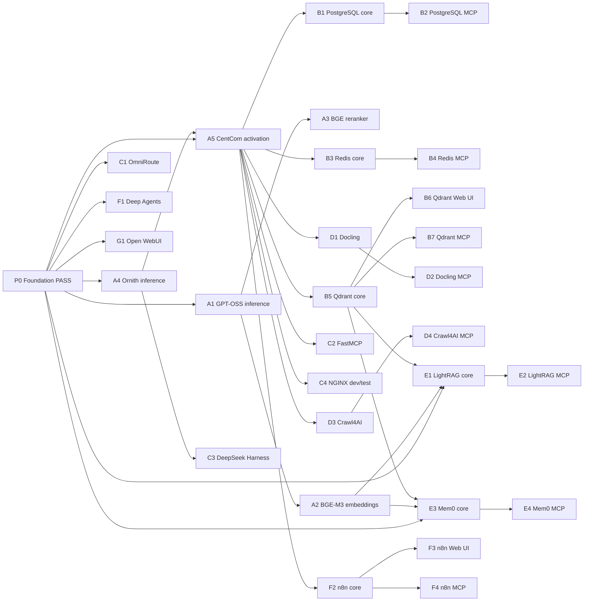
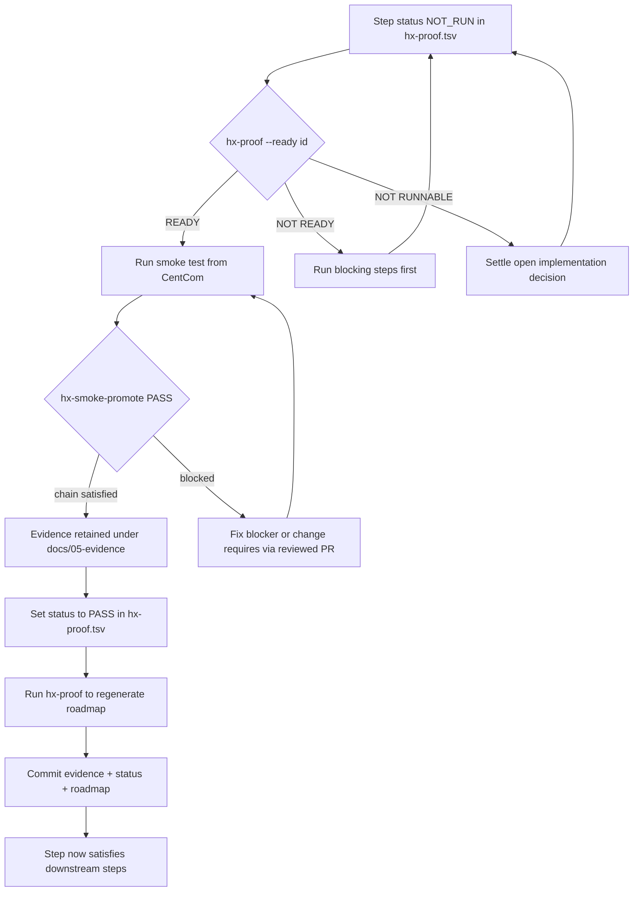

# Proof Chain and Smoke Eligibility

The HX eco-system proves its components one smoke step at a time, and the
**order those steps may run** is not a free choice: each step declares which
earlier proof it depends on, and promotion refuses to accept a PASS until that
prior proof has actually passed and been cited. The dependency structure is
owned by a single TSV, generated into the smoke-test roadmap, and enforced by
two independent tools. This page explains that chain, how to query it, and how
promotion enforces it.

> This page is **context, not authority**. The authority is
> `docs/00-control/hx-proof.tsv` and the generated sections of the
> smoke-test roadmap. If the two ever disagree, the TSV and the tooling win.

## 1. The source of the chain — `hx-proof.tsv`

`docs/00-control/hx-proof.tsv` is the single source for the smoke-test
dependency chain. It is a tab-separated table with one row per smoke step and
these columns:

| Column | Meaning |
|---|---|
| `id` | Short step id, e.g. `P0`, `A1`, `B2`, `E1`, `G1` |
| `phase` | The phase the step belongs to (`0`, `A`–`G`) |
| `sut` | The system under test host (`hx-4`, `hx-9`, …) or `-` |
| `component` | Human-readable name of what is being proven |
| `authority` | The smoke-test authority file (`smoke-tests/*.md`) that defines the exact executable proof |
| `requires` | Comma-separated step ids this step depends on, or `NONE` |
| `integration` | The *temporary* live integration this step is permitted (or `NONE`) |
| `status` | Current proof state: `NOT_RUN`, `PASS`, `FAIL`, or `NOT_EXECUTABLE` |

It holds the **30 smoke steps** across phases P0 (foundation, already `PASS`)
through G (Open WebUI). P0 is the cornerstone; every other step is currently
`NOT_RUN` until proven. The `requires` column is what turns the table into a
directed acyclic graph: `B2 requires B1`, `E1 requires B5,A2,P0`, and so on.

The TSV replaced two hand-maintained artefacts — a per-phase table and a
mermaid diagram — that could disagree with each other and with reality. The
hand-drawn DAG carried only 19 nodes (the foundation plus 18 of the 29
component steps), so 11 steps were missing from the picture, including every
MCP companion gate, both Web UI gates, and the reranker. The TSV is now the
source; the tables and the diagram are generated from it.

## 2. The phase grouping

The 30 steps are grouped into phases that mirror the deployment roadmap's build
order, but each phase is a *proof* grouping, not a deployment instruction:

| Phase | Scope | Steps |
|---|---|---|
| **P0** | Foundation PASS (HX-1, HX-2, HX-3) | `P0` |
| **A** | HX-4/5 inference, embeddings, reranker, CentCom activation | `A1`–`A5` |
| **B** | HX-9/10 state and retrieval substrate (PostgreSQL, Redis, Qdrant) | `B1`–`B7` |
| **C** | HX-6/15/5/7 routing, MCP development, harness, NGINX | `C1`–`C4` |
| **D** | HX-16/17 knowledge acquisition (Docling, Crawl4AI) | `D1`–`D4` |
| **E** | HX-11/13 RAG and memory (LightRAG, Mem0) | `E1`–`E4` |
| **F** | HX-12/14 agents and workflow (Deep Agents, n8n) | `F1`–`F4` |
| **G** | HX-8 Open WebUI | `G1` |

A key structural fact: **MCP companion gates and Web UI gates are separate
steps per parent**, not folded into the parent core test. So Qdrant has three
rows — `B5` core, `B6` Web UI, `B7` MCP — and each is its own proof with its
own authority (`native-web-ui-smoke-test.md` for UI gates,
`mcp-companion-smoke-test.md` for MCP gates). A companion PASS cannot
substitute for a failed parent core smoke test; the parent must pass first.

## 3. The dependency DAG

`requires` defines the directed acyclic graph. Every step appears; every edge
is one declared prerequisite.

*The full 30-step proof DAG generated from `hx-proof.tsv`. The companion gates
(B6/B7, D2/D4, E2/E4, F3/F4) and the reranker (A3) that the old hand-drawn
diagram omitted are all present here.*

A few edges worth noting:

- **A5 is the CentCom pivot.** `A5` requires both `A4` (Ornith inference) and
  `P0`. After A5 passes, every component smoke test that exposes a
  remote/native-client/API/UI surface runs from HX-5 CentCom rather than the
  operator station. That is why `B1`–`B5`, `C2`, `C4`, `D1`, `D3`, `F2` all
  require `A5`.
- **E1 and E3 are the genuinely multi-rooted steps.** `E1` (LightRAG core)
  requires `B5,A2,P0`: the accepted Qdrant store, the accepted embedding model,
  and the foundation. `E3` (Mem0 core) requires the same triple. These are the
  only steps with three prerequisites, because RAG and memory genuinely rest on
  vector store + embeddings + base model together.
- **Some steps depend only on P0.** `C1` (OmniRoute), `F1` (Deep Agents), and
  `G1` (Open WebUI) require only the foundation, because their own contracts
  can be proven with a temporary direct model connection and no prior component
  proof.

## 4. Cumulative proof with minimal live coupling

The DAG is deliberately **not** "every test calls every component tested before
it." That would create excessive coupling and make failures hard to diagnose.
The HX rule, stated in the roadmap, is:

> A downstream smoke test reuses prior **PASS evidence** whenever that earlier
> capability is a real prerequisite, and creates only the smallest live
> temporary integration necessary to prove its own primary contract.

Concretely:

- **Prior PASS evidence is cumulative.** A downstream step cites the retained
  evidence of each prerequisite (see §6); it does not re-run that prerequisite.
- **Live integration is minimal.** Each step's `integration` column states the
  *temporary* coupling it is allowed. `B2` PostgreSQL MCP requires `B1` only —
  the parent PostgreSQL service. `E1` LightRAG requires `B5+A2+P0` and uses the
  accepted Qdrant/embedding/LLM path with a synthetic document that is deleted
  afterward.
- **Temporary smoke wiring is removed before closure.** The roadmap explicitly
  forbids keeping temporary validation routes, collections, keys, workflows,
  connections, or test projects after proof unless explicitly approved. A
  smoke dependency does **not** automatically become production architecture.
- **A downstream PASS must identify the upstream proof it relied on.** That is
  the `prior_pass_evidence` manifest field, checked at promotion time.

So the DAG encodes *proof* dependencies, not *runtime* dependencies. LightRAG
will in production depend on Docling/Crawl4AI ingestion, but Docling PASS is
**not forced into the LightRAG base smoke test** — direct synthetic text
ingestion isolates LightRAG's own contract. Cross-service ingestion belongs to
later integration validation unless an owner explicitly promotes that bridge
into BASE PASS.

## 5. Querying readiness — `hx-proof`

The `tools/hx-doc/hx-proof` wrapper resolves a Python 3 and runs
`hx_proof.py`, which reads the TSV and offers three operations.

### `hx-proof --list` — every step and what it waits on

Prints one line per step with a readiness mark (`PASS`, `READY`, `blocked`, or
`n/a`), the SUT, the component, and the ids it is still waiting on. A summary
line names the steps runnable now. This is the survey view: "what can I do
today?"

### `hx-proof --check` — CI mode

Validates the TSV as a sound DAG and confirms every generated block in the
smoke-test roadmap is current with the TSV. It fails loudly on:

- a dangling `requires` (names a step that does not exist),
- a cycle in the dependency graph,
- a missing authority file,
- an unknown SUT host (the `sut` must be a host in `hx-fleet.tsv`),
- an unrecognised `status`,
- a blank or duplicate `id`,
- a missing, extra, or duplicated `<!-- HX-PROOF:TABLE -->` / `<!-- HX-PROOF:DAG -->`
  marker in the roadmap.

If any generated block has drifted from the TSV, it reports `STALE` and exits 1
with the instruction to run `hx-proof` and commit. This is the check that runs
in CI on every pull request, so the roadmap and the TSV can never silently
diverge.

### `hx-proof` (no flags) — regenerate

Regenerates every marked block in the roadmap from the TSV: one phase table per
phase and one mermaid DAG. Run it after editing `hx-proof.tsv`, then commit the
roadmap alongside the TSV change.

### `hx-proof --ready <id>` — the eligibility gate

**Before running a step, ask `hx-proof --ready <id>`.** This is the operational
entrance to the chain. The tool prints the step's SUT, authority, and current
status, then one of three outcomes:

- **`READY — every required prior proof has passed.`** (exit 0) — go. Every
  named prerequisite has `status = PASS` and the step itself is `NOT_RUN`.
- **`NOT READY — these must pass first:`** followed by the blocking step ids and
  their statuses (exit 1) — the remedy is to **run those steps**, not to change
  any pin or edit any status. Do not promote a step whose readiness check says
  NOT READY.
- **`NOT RUNNABLE — status is NOT_EXECUTABLE; an implementation decision is
  still open. Dependencies are not the blocker.`** (exit 1) — the step is
  blocked by an open implementation decision, not by its dependencies. Settle
  the decision and change the status in the TSV first.

A step that has **already passed** reports `ALREADY PASSED — this proof is
closed. There is nothing to run.` (exit 1) and refuses to re-run, so an
accidental second run cannot overwrite accepted evidence.

Readiness is computed purely from the TSV's current `status` values. Nothing is
pinned elsewhere; there is no separate "eligible" flag. A step becomes eligible
only because every step in its `requires` list has been flipped to `PASS` in the
TSV (and the change re-rendered with `hx-proof`).

## 6. Promotion enforcement — `hx-smoke-promote`

`tools/hx-smoke-runner/hx-smoke-promote` is the gate that actually retains a
smoke run's evidence into the repository. It reads the **same** `hx-proof.tsv`,
and for a `PASS` it refuses to proceed unless the proof chain is satisfied.
There is **no bypass flag**: if a dependency genuinely does not apply, the
correct action is to change `requires` in the TSV through a reviewed pull
request, not to force promotion.

### What promotion checks for a PASS

For a `PASS`, before any evidence is copied into
`docs/05-evidence/<host>/<component>/<run-id>`, the script verifies:

1. **Run integrity.** `evidence/result.txt` has `FUNCTIONAL=PASS`, and
   `cleanup/cleanup.txt` has `CLEANUP=PASS` or `CLEANUP=NOT_APPLICABLE`. A
   cleanup failure keeps the run failed even when the functional action
   succeeded.
2. **Manifest proof fields are recorded.** `prior_pass_evidence` and
   `limited_integration_plan` must each be present on **one line** and not be
   `TO_RECORD`. (A value indented over several lines reads as empty, and a bare
   list of paths is refused because it cannot say which path proves which
   dependency.) Use `NONE` only when genuinely no prior proof is required.
3. **`proof_step` is bound to the run.** A manifest with no `proof_step` used
   to skip the whole chain; that hole is closed — a PASS requires `proof_step`
   while `hx-proof.tsv` exists, and it must have been set by `hx-smoke-new`.
4. **The step belongs to this run's host and authority.** The script re-binds
   the `proof_step` to the manifest's `sut_host` and `smoke_test_file` against
   the TSV, so a hand-edited manifest cannot name a valid step that belongs to
   another host and another authority and get that step's dependencies enforced
   instead.
5. **The step itself is not `NOT_EXECUTABLE`.** A run cannot be retained as PASS
   for a step that is not runnable at all — settle the open implementation
   decision first.
6. **Every declared dependency has passed.** For each id in the step's
   `requires`, its `status` in the TSV must be `PASS`. If any is not, promotion
   fails with the exact blocking step and the suggestion to run
   `hx-proof --ready <step>`.
7. **Each dependency is cited in `prior_pass_evidence`.** For each required id,
   the manifest's `prior_pass_evidence` line must contain a
   `<step-id> -> <evidence>` entry with a non-empty evidence path. The parser
   splits on `;` and matches the left side of `->` to the dependency id. If the
   entry is missing, promotion names the expected form
   (`<dep> -> docs/05-evidence/<host>/<component>/<run-id>`).

Only when all of these pass does the script write the retained evidence bundle
and print `NEXT=set <step> status to PASS in hx-proof.tsv, then run
hx-proof`. That is the human step that actually advances the chain: promotion
does **not** edit the TSV. The operator sets the status, regenerates the
roadmap, and commits the evidence plus the status change together in a reviewed
change.

### Host gate

Promotion also enforces *where* it runs: it refuses unless the host is `hx-5`
(CentCom) or a host explicitly authorised via `HX_SMOKE_ALLOW_HOST`. Before
CentCom exists — roadmap steps A1–A4 — an operator station may be authorised by
exporting `HX_SMOKE_ALLOW_HOST="$(hostname -s)"`. The station used is recorded
in each run manifest.

## 7. Lifecycle: how a step goes from NOT_RUN to PASS

*The lifecycle of one proof step, from NOT_RUN through the readiness gate, the
smoke run, the promotion gate, and the TSV status update that unblocks its
dependents.*

The invariant the whole chain protects is: **a step's `status` in the TSV is
PASS only because a promoted, retained evidence bundle exists for it, and every
one of its declared prerequisites was PASS and cited at the moment of
promotion.** There is no path that sets `PASS` without that.

## 8. Invalidation and the evergreen roadmap

A PASS is not permanent if its substrate changes. The roadmap lists material
changes that can invalidate downstream reliance on an old PASS:

- embedding model/revision/dimension changes,
- Qdrant upgrade/configuration change affecting vector behaviour,
- model alias/revision change used by a downstream application,
- major API or MCP contract change,
- SUT rebuild or data-path/configuration replacement.

When a prerequisite changes materially, downstream tests that cited its old
evidence must revalidate before relying on it again. Re-running a prerequisite
creates a **new** evidence reference; downstream tests should cite the current
accepted proof, not an archive document.

The roadmap is explicitly **evergreen**: update it (and the TSV) when owner
decisions or actual component dependencies change, and do not silently infer
new permanent architecture from a smoke-test dependency. The TSV is the
deliberate, reviewed place to change `requires` — never a side channel.

## 9. What the chain does not authorize

Because proof dependencies are not runtime architecture, the chain does not
authorize:

- running a smoke test before the deployment roadmap has installed the SUT,
- permanent cross-service integration,
- production data ingestion,
- keeping temporary validation wiring after proof,
- treating FastMCP as a prerequisite for product-specific MCP servers (MCP
  companion tests use the CentCom MCP client, not HX-15),
- requiring HX-7 NGINX for UI companion tests (they use the application's
  direct LAN endpoint unless NGINX itself is the SUT).

If in doubt, the TSV and the generated roadmap are the authority; this page only
explains them.
