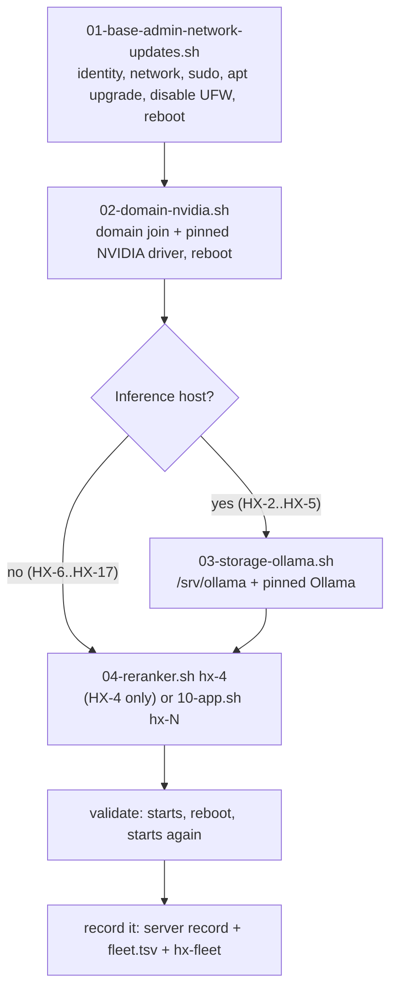
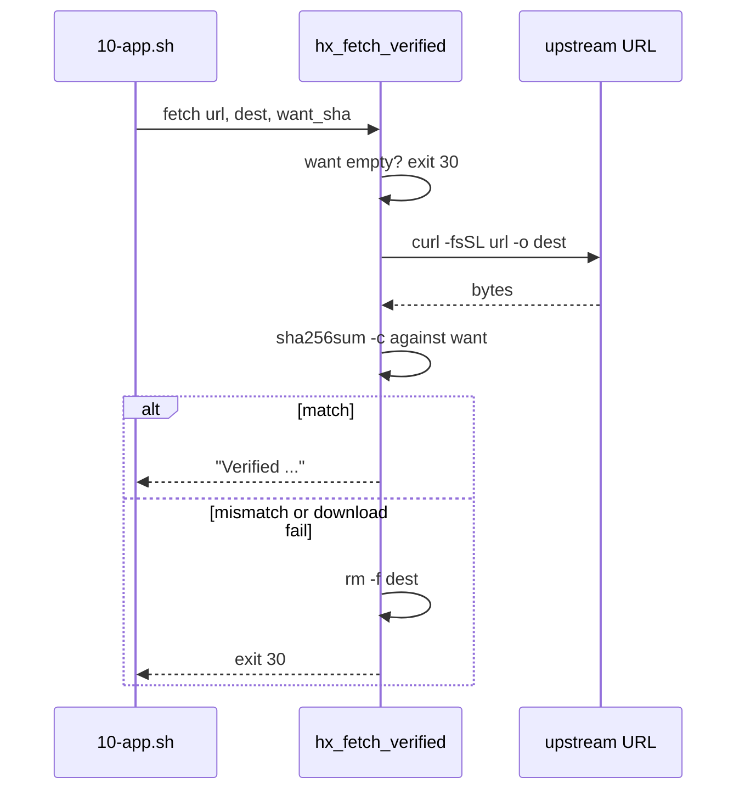

# Runbook Blocks, Pins, and Install Helpers

The HX fleet is not installed with configuration management. It is installed by a
set of ordinary shell scripts under `docs/03-runbooks/` that a human runs, by
name, against one host at a time. Every block is a single source of truth for one
thing that must happen on one machine, and every block refuses to run on the
wrong machine before it touches anything. This page documents the execution
system itself: the block taxonomy, the pin file that makes builds reproducible,
the shared helpers every application block composes, the verified-fetch
enforcement that closes the "download whatever the server sent" gap, the systemd
unit pattern, and the package-source policy that governs where software may come
from.

Changing a pin does not retro-change a closed server record. A closed server is a
historical statement of what was installed; upgrades are a separate operation
with their own block and their own record update.

## The shape of every server

All servers follow the same sequence. Two reboots establish identity and GPU,
then inference hosts get Ollama, then the application installs, then validation
confirms the service starts and survives a reboot.



The build order is dependency-driven and is not reordered without a reason.
Block 3 (`03-storage-ollama.sh`) is inference hosts only; HX-6 through HX-17 skip
it. HX-4 additionally runs `04-reranker.sh` because it hosts the shared
retrieval-plane reranker.

Each block is invoked with the host name and sources `hx-base.env`, which sources
`hx-fleet-ips.env`:

```bash
cd ~/src/HX-Eco-System/docs/03-runbooks
./common/01-base-admin-network-updates.sh hx-4
```

## Block taxonomy

The `common/` directory holds blocks numbered by phase. The number encodes both
ordering and scope.

| Block | Phase | Scope | Reboots |
|---|---|---|---|
| `01-base-admin-network-updates.sh` | base | identity, network, sudo, apt upgrade, disable UFW | yes |
| `02-domain-nvidia.sh` | base | domain join + NVIDIA driver | yes |
| `03-storage-ollama.sh` | base | inference hosts only: `/srv/ollama` + pinned Ollama | no |
| `04-reranker.sh` | base | HX-4 BGE reranker via infinity-emb | no |
| `10-<app>.sh` | application | one per-application install, one host | no |
| `90-ollama-upgrade.sh` | upgrade | closed-server Ollama upgrade to the fleet pin | no |

### `01-base-admin-network-updates.sh`

Establishes the machine's identity and network before anything is installed. It
sources the pin file, calls `hx_require_host`, then asserts the host's IP, the
default gateway, and the HX-1 DNS resolver match the fleet baseline — each guard
exits with a distinct code (`11` IP, `12` gateway, `13` DNS) so a failure names
itself. It installs the `hxsa` passwordless-sudoers fragment via `visudo -cf` and
verifies `sudo -n true` actually took effect before continuing.

Per decision D-018 the HX LAN is a trusted lab segment and hosts run with no
local firewall, so the block explicitly disables UFW and firewalld rather than
leaving them to default-on. It runs `apt update && apt upgrade -y`, reports any
failed units, and reboots. The reboot is the end of the block.

### `02-domain-nvidia.sh`

Joins the host to the Active Directory domain (`hx.local.arpa`) via `realmd`,
verifies a test domain user resolves, then installs the **pinned** NVIDIA driver
from the Ubuntu archive — the one place the archive is permitted for application
software, because the driver must match the running kernel ABI. The package is
`nvidia-driver-${HX_NVIDIA_BRANCH}-server-open` pinned to
`HX_NVIDIA_PKG_VERSION` together with `linux-headers-$(uname -r)`. Clearing the
pin in `hx-base.env` falls back to the current archive version, which must then
be recorded in the server record. The block reboots.

### `03-storage-ollama.sh` (inference hosts only)

Verifies the domain/GPU/storage preconditions (`realm list`, `nvidia-smi`, a
mounted and **empty** `/srv/ollama`), then installs the pinned Ollama via
`hx_ollama_install`. It refuses to continue if `/srv/ollama` is not mounted
(exit 20) or is not empty (exit 21), and refuses if `HX_OLLAMA_VERSION` is unset
(exit 30) — an unpinned install "installed whatever was current that day, which
is not a baseline a server record can state."

After install it writes the server-specific systemd drop-in
`/etc/systemd/system/ollama.service.d/storage.conf` that sets
`OLLAMA_MODELS=/srv/ollama/models`, `OLLAMA_HOST=0.0.0.0:11434`, and
`OLLAMA_NO_CLOUD=1`, then restarts and enables `ollama`. It confirms the
installed version matches the pin (exit 22 on mismatch) and probes both the
loopback and the LAN IP endpoint.

### `04-reranker.sh` (HX-4 only)

Installs the HX shared reranker. The model is pinned to an immutable commit
revision so a later upstream edit cannot silently change the model under a
stable name. The runtime is `infinity-emb` from PyPI (with the `torch,server`
extras), chosen because it serves rerankers natively over HTTP with no container
and no service code to write — Ollama does not serve cross-encoder rerankers.

The block builds the venv under `/srv/reranker/venv`, writes the
`hx-reranker.service` unit (Type=simple, `TimeoutStartSec=900` because first
start downloads the model), enables it, and polls `/health` for up to 90 cycles
of 10 seconds. It closes by telling the operator to record both the runtime
package provenance and every model artifact pulled at the pinned revision, with
unknown values written `UNRESOLVED`.

### `10-<app>.sh` (per-application install)

One block per fleet application. Each sources `hx-base.env` and `hx-app-lib.sh`,
calls `hx_require_host`, then composes the shared helpers to build the
application. Blocks that install a daemon end with `hx_app_done <unit> ...`;
blocks that install a library or CLI pass `NONE` and a reboot-check command
instead. Several blocks append an operator-action or operator-decision `NOTE`
that must be resolved before the server can close.

### `90-ollama-upgrade.sh` (closed-server Ollama upgrade)

Upgrades Ollama in place to the fleet pin on a **closed** inference server
(HX-2, HX-3). It records the before-version, short-circuits if already at the
pin, lists models present, calls `hx_ollama_install`, restarts `ollama`, and
confirms the after-version matches the pin. It is safe to re-run: the install
replaces the binary and leaves the storage drop-in and `/srv/ollama` alone, so
models are not re-downloaded.

## The pin file: `hx-base.env`

`docs/03-runbooks/common/hx-base.env` is the **single pin file**. It is a sourced
shell file — not a YAML config — so every value is a shell variable a block can
read directly. Its header states the governing invariant: "One place to change a
version for every server not yet built... Changing a pin here does not
retro-change a closed server record."

The file sources `hx-fleet-ips.env` (generated from `hx-fleet.tsv` by
`tools/hx-doc/hx-fleet`; do not edit by hand) and then defines, in order:

**Foundation and LAN baseline.** `HX_DC_IP`, `HX_GATEWAY`, `HX_DOMAIN`,
`HX_DOMAIN_TEST_USER`. The `HX_LAN_CIDR` (`192.168.50.0/24`) is the single
source for anything that scopes LAN access (e.g. PostgreSQL `pg_hba.conf`).

**Ollama.** `HX_OLLAMA_VERSION` (the fleet target; HX-2/HX-3 closed on 0.33.3 and
are upgraded to this by `90-ollama-upgrade.sh`) and `HX_OLLAMA_ARCHIVE_SHA256`
from upstream's own published `sha256sum.txt`.

**NVIDIA driver.** `HX_NVIDIA_BRANCH` and `HX_NVIDIA_PKG_VERSION` — the one
Ubuntu-archive application allowance.

**HX-4 shared retrieval plane.** Reranker model (`HX_RERANKER_MODEL` =
`BAAI/bge-reranker-v2-m3`), immutable revision, runtime (`infinity-emb`), runtime
version, extras, port (7997), bind host (0.0.0.0), venv and home paths.

**Fleet application pins.** One version (and, where the artifact is checksummable,
a SHA-256) per application:

| Host | Application | Pin | Source |
|---|---|---|---|
| HX-6 | OmniRoute | 3.8.50 | npm |
| HX-7 | NGINX | 1.30.4 (+SHA) | nginx.org source tarball |
| HX-8 | Open WebUI | 0.11.3 | PyPI |
| HX-9 | PostgreSQL | 18.6 (+SHA) | postgresql.org source tarball |
| HX-9 | Redis | 8.10.1 (+SHA) | download.redis.io tarball |
| HX-10 | Qdrant | 1.19.1 (+SHA) | GitHub release binary |
| HX-11 | LightRAG | 1.5.7 | PyPI (`lightrag-hku[api]`) |
| HX-12 | Deep Agents | 0.7.13 | PyPI |
| HX-13 | Mem0 | 2.0.20 | PyPI (`mem0ai`) |
| HX-14 | Node.js | 24.21.0 | nodejs.org binary tarball |
| HX-14 | n8n | 2.38.6 | npm |
| HX-15 | FastMCP | 4.0.3 | PyPI |
| HX-16 | Docling | 2.126.0 | PyPI |
| HX-16 | Granite-Docling | 258M (model+revision) | Hugging Face |
| HX-17 | Crawl4AI | 0.9.3 | PyPI |
| HX-17 | Playwright | 1.62.0 | PyPI (resolves its own Chromium) |

Service ports are pinned alongside: OmniRoute 20128, Open WebUI 8081, Qdrant
6333, LightRAG 9621, n8n 5678, FastMCP 8000 — all bind `0.0.0.0`, matching the
Ollama and reranker posture.

A SHA-256 is pinned only when the artifact has a stable, checksummable URL. PyPI
and npm packages are pinned by version spec alone (the package index is the
source of truth). GitHub tag archives are explicitly *not* pinned, because
GitHub builds them on request and their bytes are not guaranteed stable; the
Redis block uses the `download.redis.io` tarball instead, and Qdrant uses the
prebuilt release binary. NGINX (signed with PGP, no checksum file) and Node.js
(verified against the upstream `SHASUMS256.txt`) are handled per-block.

## Host-gating

`hx_require_host` is defined in `hx-base.env` and is the first thing every block
calls. It compares `hostname -s` to the expected host and exits **10** on
mismatch before any work begins:

```bash
hx_require_host() {
  local expected="$1"
  local actual; actual="$(hostname -s)"
  [ "$actual" = "$expected" ] || {
    echo "STOP: this block is for $expected but this host is $actual" >&2
    exit 10
  }
  HX_HOST="$expected"
  HX_IP="$(hx_ip_for "$expected")" || { ...; exit 10; }
  ...
}
```

On success it sets two globals every later step reads: `HX_HOST` (the short name)
and `HX_IP` (resolved from `hx-fleet-ips.env`, which itself is generated from
`hx-fleet.tsv`). A mistyped server name stops the build rather than damaging a
neighbour. The IP lookup is a second guard: an unknown host has no IP recorded
and also exits 10.

## Shared helpers: `hx-app-lib.sh`

`hx-app-lib.sh` is sourced by the `10-*.sh` blocks (and by `04-reranker.sh`
indirectly via its own venv logic). It is not executable on its own. Its header
states the operating validation definition: "does the service start, and does it
survive a reboot. Nothing else is checked." Each helper does exactly one thing a
block composes.

`hx_app_user <user> <home>` creates a dedicated system user (`--system`,
`--shell /usr/sbin/nologin`) and its home directory, idempotently, and chowns
the home to it.

`hx_app_venv <user> <venv-path> <pip-spec> [extra pip args...]` installs
`python3-venv` (a language runtime, not application software), builds the venv as
the service user, upgrades pip, and installs one pinned spec — e.g.
`"open-webui==${HX_OPEN_WEBUI_VERSION}"` or
`"crawl4ai==${HX_CRAWL4AI_VERSION}" "playwright==${HX_PLAYWRIGHT_VERSION}"`.

`hx_app_unit <name> <description> <user> <workdir> <exec-line> [env "K=V" ...]`
writes the canonical systemd unit (see below), runs `daemon-reload`, and
`enable --now`s it.

`hx_app_validate <unit> [port] [health-path]` waits up to 60 cycles of 5 seconds
for the TCP port to answer an HTTP request, then confirms `systemctl is-active`
and `is-enabled`, and lists the listening socket. When no port is given it
performs only the systemctl checks.

`hx_app_done <unit|NONE> <host> <what> [url | reboot-check]` prints the closing
note every block ends with. Pass `NONE` for a library or CLI that has no daemon:
the fourth argument becomes the **required** check to run after a reboot (a
plain `systemctl is-active` against a unit that does not exist can only fail, so
`NONE` exists to stop blocks from instructing that). With a real unit name the
fourth argument is the optional endpoint URL and the reboot check is
`systemctl is-active <unit>`.

`hx_node_install <version>` installs Node.js from the official nodejs.org binary
tarball under `/usr/local` — not Snap, not the Ubuntu archive, not NodeSource. It
is idempotent (returns early if `node --version` already matches), downloads the
tarball and `SHASUMS256.txt`, verifies the tarball against the upstream sums
file, extracts with `--strip-components=1`, and prints the resolved versions.

## Verified-fetch and checksum enforcement

`hx_fetch_verified <url> <dest> <want-sha256>` is the shared helper that closes
a gap the repository's own `.coderabbit.yaml` flagged: only `10-postgresql.sh`
verified a downloaded tarball, and "everything else took whatever the server
sent on the day, and a release asset can be replaced in place." It downloads
with `curl`, then refuses the artifact unless its SHA-256 matches the pin,
exiting **30** on a missing pin, a download failure, or a checksum mismatch —
and it removes the failed artifact so a later step cannot pick it up.



`hx_ollama_install <version> <sha>` installs Ollama from a verified release
archive with rollback. The vendor installer cannot be given a local file — it
streams the archive straight into `sudo tar -x` as root with no checksum — so
this helper does what `install.sh` does, but from an archive checked against
upstream's own `sha256sum.txt`. Crucially, it **keeps the previous install until
the new one is in place**: it renames the existing `/usr/local/lib/ollama` to
`ollama.previous`, extracts into a fresh directory, and only removes
`.previous` on success. If extraction fails (decompression, I/O, or disk space),
it restores the previous install and exits 30. The vendor installer deletes
first; that window leaves an inference server with no Ollama and nothing to go
back to, and a rename costs no extra space.

The PostgreSQL block verifies its tarball directly (`sha256sum -c` against
`HX_POSTGRES_SHA256`, exit 30 on mismatch) before building from source — it was
the original checksum-verifying block and retains its own inline check rather
than calling `hx_fetch_verified`.

## Systemd unit pattern

`hx_app_unit` writes the canonical fleet unit. The shared shape is:

```ini
[Unit]
Description=...
After=network-online.target
Wants=network-online.target

[Service]
Type=simple
User=<app>
Group=<app>
WorkingDirectory=<home>
Environment="K=V"
...
ExecStart=...
Restart=on-failure
RestartSec=5
TimeoutStartSec=600

[Install]
WantedBy=multi-user.target
```

Services bind `0.0.0.0` (decision D-018, the trusted-LAN posture), confirmed by
`hx_app_validate` listing the listening socket. Two application blocks deviate
from the `Type=simple` default by writing their own unit inline rather than via
`hx_app_unit`:

- **PostgreSQL** (`hx-postgresql.service`) is `Type=notify` — the only notify
  unit in the fleet — because Postgres signals readiness via sd_notify. It sets
  `KillSignal=SIGINT` (the safe Postgres shutdown signal), `ExecReload=/bin/kill
  -HUP $MAINPID`, and `TimeoutSec=300`.
- **NGINX** (`hx-nginx.service`) is `Type=forking` with a `PIDFile` and
  `ExecStartPre=nginx -t`, because NGINX forks on start.

The base Ollama unit written by `hx_ollama_install` is byte-for-byte the vendor
installer's unit (`Restart=always`, `WantedBy=default.target`); server-specific
settings stay in the drop-in so the unit the fleet runs does not change with
this helper.

## Package-source policy

The policy is stated in `hx-base.env` and enforced block-by-block: applications
come from PyPI, a GitHub release, a direct binary, or Hugging Face. The Ubuntu
archive is for the **NVIDIA driver, build toolchains, and library headers only**.
Snap is never permitted (decision D-021).

The "toolchain, not application software" distinction is explicit in the blocks:
`apt install build-essential`, `python3-venv`, `pkg-config`, `libreadline-dev`,
`zlib1g-dev`, `libicu-dev`, `libssl-dev`, `libpcre2-dev`, and `zstd` are all
annotated as tooling/headers, and `zstd` is required only because the Ollama
release archive is `.tar.zst` with no `.tgz` for that version. Each application
itself is built from its upstream source or installed from its language package
index — PostgreSQL, Redis, and NGINX are built natively from upstream source
tarballs; Qdrant is the prebuilt release binary; the PyPI applications install
into per-app venvs; OmniRoute and n8n install via npm onto the verified Node.

## Per-block specifics

**PostgreSQL (`10-postgresql.sh`, HX-9).** Builds from the official
postgresql.org source tarball — an owner decision (source build, not the PGDG
repository). The block installs the toolchain, verifies the tarball against
`HX_POSTGRES_SHA256`, runs `./configure --prefix=/srv/postgresql --with-openssl
--with-icu`, `make -j$(nproc)`, `sudo make install`. It creates the `postgres`
system user, runs `initdb` (UTF8, C.UTF-8) if no cluster exists, sets
`listen_addresses = '*'` and **confirms** the value is active (sed reports success
even on no match), and appends a `pg_hba.conf` rule
`host all all ${HX_LAN_CIDR} scram-sha-256` — guarding against matching a
commented-out line, not just the text anywhere. The unit is `Type=notify`. The
block **prints** the instruction to set the postgres role password out-of-band
(`\password postgres`) and explicitly tells the operator not to put that password
in the repository. HX-9 is a shared host: PostgreSQL and Redis each close
separately.

**Redis (`10-redis.sh`, HX-9).** Built from the `download.redis.io` release
tarball (not the GitHub tag archive) via `hx_fetch_verified`, plain `make`,
`hx_app_unit hx-redis` with `bind 0.0.0.0`, `appendonly yes`.

**Qdrant (`10-qdrant.sh`, HX-10).** Prebuilt binary from the GitHub release,
verified, installed under `/srv/qdrant/bin`, config pins `host: 0.0.0.0` and the
service port. Appends the D-005 reminder: never mix embeddings from different
model identities in one collection.

**OmniRoute (`10-omniroute.sh`, HX-6).** Installs verified Node, then
`omniroute@${HX_OMNIROUTE_VERSION}` via npm globally, resolves the actual binary
path with `command -v` (refusing exit 30 if missing — a previous `|| true` hid a
failed install), and writes the unit with `HOST=0.0.0.0`. The closing NOTE
requires the D-010 operator action: build explicit provider and model allowlists
before the server can close, because "discovery is not approval."

**NGINX (`10-nginx.sh`, HX-7).** Upstream stable source, built natively with
`--with-http_ssl_module --with-http_v2_module`, `Type=forking` unit. Per D-004
it is dev/test UI rendering only — not the ecosystem front door.

**Open WebUI (`10-open-webui.sh`, HX-8).** PyPI venv, `WEBUI_AUTH=False` for the
base build. Closing NOTE requires D-008: temporarily point at one proven Ollama
endpoint, send one prompt, capture evidence, then remove the connection.

**LightRAG (`10-lightrag.sh`, HX-11).** PyPI (`lightrag-hku[api]`), API server
unit. The NOTE requires setting embedding and LLM bindings in the unit
environment before the smoke test: HX-4 for BGE-M3 and one approved HX Ollama
endpoint.

**n8n (`10-n8n.sh`, HX-14).** npm on verified Node, unit with
`N8N_DIAGNOSTICS_ENABLED=false`. NOTE: moving its SQLite data to HX-9 PostgreSQL
is integration-phase work, not base build.

**FastMCP (`10-fastmcp.sh`, HX-15).** PyPI venv, `NONE` done — a development
host for MCP servers, not a single service. The smoke test creates a disposable
test server, proves tool discovery and one tool call, then removes it.

**Docling (`10-docling.sh`, HX-16).** PyPI plus the Granite-Docling model
pre-fetched from Hugging Face at the pinned revision (D-006, CPU-first).
`NONE` done; the companion Docling MCP is the service that gets a unit.

**Crawl4AI (`10-crawl4ai.sh`, HX-17).** PyPI with pinned Playwright, whose own
Chromium is installed via `playwright install`. The block **confirms the pin
took** (exit 30 if pip resolved a different Playwright) and runs `crawl4ai-doctor`
without `|| true` so it can actually fail. `NONE` done.

**Deep Agents (`10-deep-agents.sh`, HX-12).** PyPI venv, proves the package
imports and `create_deep_agent` resolves. `NONE` done. NOTE: D-013 — if the
chosen model cannot call tools reliably, stop and record
`MODEL/HARNESS COMPATIBILITY NOT ESTABLISHED`.

**Mem0 (`10-mem0.sh`, HX-13).** PyPI venv (`mem0ai`), then **stops** with
`exit 3` and an operator-decision NOTE: Mem0 is a library, and whether it runs
inside the Mem0 MCP server or behind a small local FastAPI service is not yet
decided — the registry records the MCP implementation as not yet selected, so it
is not decided by implication. The block refuses to report a `hx-mem0` unit that
nothing creates.

## Lifecycle and failure semantics

The block system is deliberately fail-fast and fail-loud. Every block runs under
`set -euo pipefail`. Guards exit with distinct, documented codes so a failure
names itself rather than producing a generic non-zero:

| Code | Meaning |
|---|---|
| 2 | wrong number of arguments |
| 10 | wrong host, or no IP recorded for the host |
| 11/12/13 | IP / gateway / DNS mismatch (block 01) |
| 14 | NOPASSWD sudo did not take effect |
| 15 | domain user resolution failed |
| 20/21 | `/srv/ollama` not mounted / not empty |
| 22 | installed Ollama version does not match the pin |
| 30 | missing SHA pin, download failure, or checksum mismatch |
| 3 | operator decision required before close (Mem0) |

A checksum mismatch is destructive by design: the failed artifact is removed so
no later step can use it. The Ollama installer's rollback restores the previous
install on extraction failure. Several guards defend against sed/reporting
false-success: PostgreSQL confirms `listen_addresses` is an active value and
guards the `pg_hba` rule against matching a comment, and `hx_fetch_verified`
checks the actual hash rather than trusting `sha256sum -c`'s exit alone (it
echoes expected vs. actual on mismatch).

## Validation and recording

Validation is two questions, everywhere: does it start, and does it survive a
reboot. `hx_app_validate` answers the first; the operator reboots and re-checks
to answer the second. For libraries and CLIs (`NONE`), the block prints the
exact check to run after the reboot, and that command *is* the
reboot-persistence check.

Every block closes by pointing the operator at the recording step: fill
`docs/02-server-records/<HOST>.md`, set state and gate in `hx-fleet.tsv`, run
`tools/hx-doc/hx-fleet` to regenerate tables. The record needs the **source URI
and the full SHA-256** of anything downloaded — a hash alone does not establish
origin, and an origin alone does not establish what is running. An unknown value
is written `UNRESOLVED`, never left blank.
