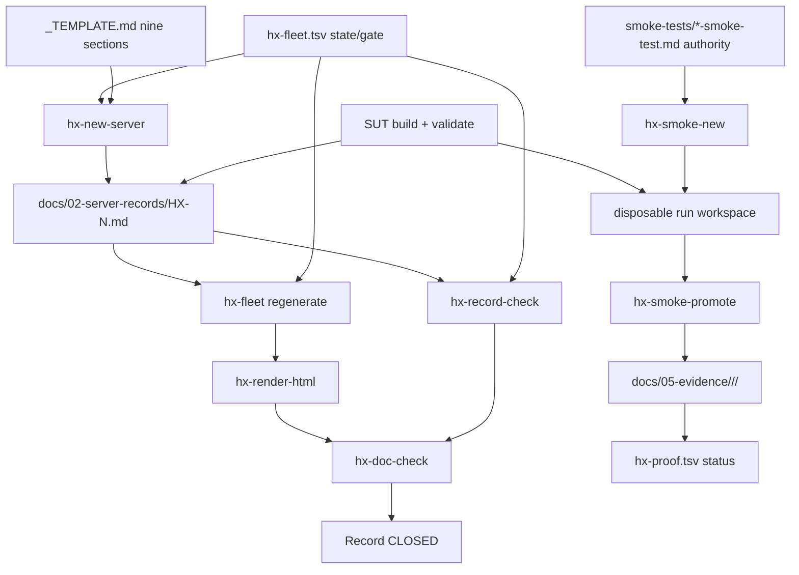

# Server Records and Evidence Retention

The HX fleet is 17 hosts. Each one gets a single Markdown **server record** that
captures its as-built identity, its gates, the exact provenance of anything it
downloaded, and its functional proof. That record is the closure artefact for the
host: when the record is complete and `hx-fleet.tsv` agrees, the server's gate is
`CLOSED`. For components proven *after* the foundation (HX-4 onward), the proof
itself is retained as a separate **evidence bundle** under `docs/05-evidence/`,
promoted by the CentCom smoke runner. The two systems — record and retained
evidence — share one set of invariants.

> This page is **context, not authority**. The authorities are the server records
> themselves, `docs/02-server-records/_TEMPLATE.md`, and
> `docs/05-evidence/README.md`. If a tool and this page disagree, the tool wins.
> For the enforcement layer that runs these gates in CI, see
> [Documentation Gates](/openwiki/operations/doc-gates.md); for the proof DAG and
> promotion enforcement, see [Proof Chain and Smoke Eligibility](/openwiki/operations/proof-chain.md).

## 1. The server record pattern

Every host has one file under `docs/02-server-records/HX-N.md`, scaffolded from
`docs/02-server-records/_TEMPLATE.md`. There is deliberately **not** one wiki
page per host; this page covers the pattern for all 17. The template defines nine
required sections:

1. **Identity and Network** — hostname, IP, gateway, DNS, domain join, SSSD,
   domain user resolution; ends with a **Domain join gate: PASS/FAIL**.
2. **Operating System** — distribution/release, kernel, firmware, sudo policy.
3. **GPU Configuration** — driver package *and exact version*, GPU models and
   count, `nvidia-smi` proof; ends with a **GPU gate: PASS/FAIL**.
4. **Storage Layout** — devices, filesystems, mount points, the dedicated
   application path; ends with a **Storage gate: PASS/FAIL**.
5. **Runtime** — package source, *exact installed version*, service unit,
   systemd overrides, listener address and port.
6. **Model / Application Provenance** — the five mandatory provenance fields
   (see [§2](#2-provenance-both-uri-and-sha-256)).
7. **Functional Validation** — known-answer CLI proof, HTTP/API proof, LAN proof,
   reboot persistence, each with the *exact command and the exact response*.
8. **Final State** — a gate table summarising every row above.
9. **Evidence References** — either a retained bundle path under
   `docs/05-evidence/<server>/<component>/<run-id>/`, or an explicit statement
   that the proof is recorded inline in section 7.

Every section must be filled. The template's standing instruction is: *delete a
section only when it genuinely does not apply, and say why in one line rather than
removing it silently.* A section that does not apply is declared with a single
`**Not applicable:**` line naming the exempted sections and giving a reason — this
is what `hx-record-check` reads to exempt them.

### UNRESOLVED, never blank

An unknown value is written `UNRESOLVED`, never left blank. A missing field cannot
be told apart from a forgotten one, so the blank is forbidden. This applies most
visibly to the provenance fields: HX-2's record carries an open
`Source URI: UNRESOLVED — see provenance gap below` for the Qwen-X GGUF blob,
with a blockquote explaining the gap and what is needed to close it. The gap is a
recorded, visible defect — not an absence.

## 2. Provenance: both URI and SHA-256

Section 6 requires **five** provenance fields for every server that hosts a model
or a downloaded artifact:

```text
HX alias:              <ollama name or service identifier>
Upstream identity:     <official model/product name and version>
Source URI:            <exact hf.co/... repo:file, package URL, or registry ref>
Artifact SHA-256:      <full 64-character hash of the downloaded artifact>
Import method:         <pull | GGUF import | package install | build from source>
```

The reason both **Source URI** and **Artifact SHA-256** are required, stated in the
template itself, is that public model registries carry modified community rebuilds
under names close to the official ones: the hash proves *what is running*, and the
URI proves *where it came from*. Neither field alone establishes provenance. HX-3's
record makes this concrete: its primary Coder-X model is a `bartowski` community
requant of `zai-org/GLM-4.7-Flash`, not weights published by zai-org — recorded as
a deliberate decision, not an assumption, with both the `hf.co/bartowski/...` URI
and the full `9e0156...` SHA-256.

When the artifact was imported rather than pulled (e.g. a local GGUF import via a
Modelfile), the record also carries the Modelfile or build definition verbatim,
including any `TEMPLATE`, `PARAMETER`, or stop-token settings — or an explicit
statement that none were set and the chat template therefore comes from the GGUF
metadata.

## 3. Scaffold: `hx-new-server`

`tools/hx-doc/hx-new-server` scaffolds everything a server needs before its build
starts, from `docs/00-control/hx-fleet.tsv` and the record template:

```bash
tools/hx-doc/hx-new-server hx-9              # scaffold HX-9
tools/hx-doc/hx-new-server hx-9 --no-ollama  # skip the Ollama block (non-inference host)
tools/hx-doc/hx-new-server hx-9 --force      # overwrite existing files
```

It creates the runbook wrappers (`01-base-admin-network-updates.sh`,
`02-domain-nvidia.sh`, and `03-storage-ollama.sh` for inference hosts only), the
runbook `README.md`, and the server record `docs/02-server-records/HX-N.md`. Use
`--no-ollama` for any host that is not an inference server (HX-6 through HX-17).
Existing files are **never overwritten without `--force`**.

The scaffolder is defensive by construction. It rejects an unknown `--` option
(exit 2) — a misspelled flag like `--no-olama` once scaffolded the Ollama block
anyway and `--fore` overwrote nothing while reporting success. It refuses a host
not in the TSV. And it validates the record **before** writing anything: each
template placeholder must match exactly once, so a template edit cannot ship a
record still reading `HX-N` and `192.168.50.2NN`. The record is built and checked
first, so a template defect cannot leave wrappers on disk with no record beside
them.

## 4. The record-check gate: `hx-record-check`

`tools/hx-doc/hx-record-check` turns the template from advice into a gate. It
scans every `*.md` in `docs/02-server-records/` (skipping `_TEMPLATE.md`) and
reports three kinds of finding per record:

| Finding | Meaning |
|---|---|
| `MISSING` | A required section the template defines is absent (modulo a `**Not applicable:**` exemption). |
| `UNRESOLVED` | A field explicitly recorded as not yet known — a recorded gap, not an error. |
| `DRIFT` | The record's `**Build state:**` disagrees with `docs/00-control/hx-fleet.tsv`, the record is not in the TSV, or the State line is missing. |

Sections are matched loosely on key words so a record can word its own heading
naturally, and a record may exempt sections with a single
`**Not applicable:** <sections> — <reason>` line. The state comparison is
whole-value and normalised: the old first-word match let `NOT STARTED` be
satisfied by `NOT APPLICABLE`, and `IN PROGRESS` by `INSTALLED`. HX-1 through
HX-3 closed before the scaffold existed and state their state and gate on one line
as `PASS / CLOSED`; the check compares the state part only (the gate has its own
check).

By default `UNRESOLVED` does not fail the build — it is a recorded gap. `--strict`
fails on `UNRESOLVED` as well, used to close gaps while the server is still
reachable rather than letting them fade into a file nobody re-reads. The tool runs
in CI on every pull request, so an incomplete or drifting record is a failing
change.

## 5. Record closure (RUN-SHEET step 6)

A server's record is closed at the end of its build day. The exact sequence, from
`docs/03-runbooks/RUN-SHEET.md` Step 6, is:

```bash
$EDITOR docs/02-server-records/HX-4.md      # fill every section
$EDITOR docs/00-control/hx-fleet.tsv        # state -> PASS, gate -> CLOSED
tools/hx-doc/hx-fleet                       # regenerate the tables
tools/hx-doc/hx-render-html
tools/hx-doc/hx-doc-check && tools/hx-doc/hx-record-check
git add -A && git commit
```

The record needs the **source URI and the full SHA-256** of anything downloaded.
An unknown value is written `UNRESOLVED`, never left blank. Editing
`hx-fleet.tsv` (state → `PASS`, gate → `CLOSED`) and running `hx-fleet` is what
propagates the new state into every generated fleet table and the runbook IP map;
`hx-render-html` keeps the HTML mirror in step; `hx-doc-check && hx-record-check`
are the final gates before commit.

## 6. The two evidence models

HX has two evidence shapes. Both are current. Which one applies depends on *when
the proof was taken*, not on preference.

### Inline record evidence — HX-1, HX-2, HX-3

HX-1, HX-2, and HX-3 closed **before the CentCom runner existed**. Their proof is
recorded inside the relevant server record under section 7 (Functional
Validation) as exact commands and exact responses — the CLI known-answer, the
HTTP/API response, the LAN `/api/version` reply, and the post-reboot service/model
state. This is accepted evidence. `hx-smoke-promote` accepts an accepted server
record as `prior_pass_evidence` for exactly this reason, so a downstream step may
cite `docs/02-server-records/HX-2.md` (for example) where a run-bundle step would
cite a bundle path. These records are **not** retrofitted into run bundles.

### Run-bundle evidence — HX-4 onward

Everything from HX-4 onward is proven by the CentCom smoke runner and retained as a
bundle. A run is created by `hx-smoke-new`, executed against the SUT from HX-5,
and promoted by `hx-smoke-promote`. The retained bundle lives under:

```text
docs/05-evidence/<server>/<component>/<run-id>/
├── manifest.md
├── result.txt
├── cleanup.txt
└── supporting captures as required
```

`hx-smoke-promote` copies only the normalised bundle (manifest, result, cleanup,
selected supporting captures) to that path, stamps the final status and UTC end,
and writes a `README.md` summarising the run — but it **does not auto-commit**. An
operator reviews and commits the promoted evidence explicitly, so an execution
helper cannot become an unreviewed Git authority.

### Running a bundle before CentCom exists

Smoke-roadmap steps A1–A4 prove HX-4 and HX-5 **before** CentCom is activated at
A5, so there is no HX-5 station yet. The tooling runs from the operator station
instead, authorised explicitly:

```bash
export HX_SMOKE_ALLOW_HOST="$(hostname -s)"
export HX_ECO_REPO=~/src/HX-Eco-System
hx-smoke-new hx-4 ollama-inference ollama-inference-smoke-test.md 192.168.50.204
```

The station actually used is written to `runner_host` in the manifest, so a
pre-CentCom run is distinguishable from a CentCom run in the retained evidence.
After A5 passes, HX-5 is the station and these variables are unset in the shell
that ran the pre-CentCom steps, so a later run cannot pick up an authorisation
that no longer applies. See the [smoke-test execution](/openwiki/workflows/smoke-test-execution.md)
page for the pre-CentCom run-authorisation procedure and the
[proof chain](/openwiki/operations/proof-chain.md) page for promotion enforcement.

## 7. The standard retained bundle

Every retained run must identify, in its manifest or result:

- **runner host** (HX-5 CentCom, or the authorised pre-CentCom station);
- **system under test** (SUT host/IP);
- **component/version or revision**;
- **smoke-test authority file** (the `smoke-tests/*.md` that defined the proof);
- **repository commit** used for the run;
- **known-answer input**;
- **PASS/FAIL determination**;
- **cleanup result and cleanup verification**;
- **reboot-persistence result** when applicable.

For a `PASS`, `hx-smoke-promote` additionally requires the two proof-chain
manifest fields to be resolved: `prior_pass_evidence` (one
`<step-id> -> <evidence path or accepted server record>` entry per required
dependency, separated by `;`, or `NONE`) and `limited_integration_plan` (the
temporary live coupling used, or `NONE`). It also requires
`component_version_or_revision`, `transport_or_endpoint`, and `sut_ip` to be
recorded rather than left as `TO_RECORD`.

### Standard naming

```text
YYYYMMDDTHHMMSSZ_<server>_<component>_<gate>_<description>.<ext>
```

```text
20260909T193000Z_hx-9_postgresql_smoke_result.txt
20260909T193015Z_hx-9_postgresql_cleanup_result.txt
20260910T201100Z_hx-10_qdrant_ui_live-state.png
```

The run ID itself (`hx-smoke-new`) is `YYYYMMDDTHHMMSSZ_<sut>_<component>`, so a
retained bundle directory is self-identifying.

## 8. Retention invariants

Three invariants govern retained evidence. They appear in
`docs/05-evidence/README.md` and are enforced by tooling and procedure.

**1. Failed evidence is not overwritten by a later PASS.** A retry gets a **new run
ID** (a new timestamp), so the failed run's bundle is preserved alongside the
succeeding one. The failed trail is retained when it explains a correction or an
architecture decision; the server record summarises the final accepted state, but
the evidence trail keeps the materially relevant failed runs.

**2. Secret values must not appear in retained evidence.** Retained scripts,
manifests, and console output must not contain actual passwords, PATs, API keys,
private keys, bearer tokens, or other credentials. `hx-smoke-promote` screens the
promotion set for obvious credential patterns and refuses promotion on a match; if
command output accidentally includes a credential, it is redacted **before**
promotion while preserving the functional result. Smoke tests may reference
credential *names*, paths, or environment-variable identifiers, but never the
values.

**3. Evidence supports current state but does not override explicit owner
decisions.** Evidence proves observed behaviour; it does not independently override
an explicit current owner decision or current active authority. A PASS is also not
permanent if its substrate changes materially — an embedding model/revision change,
a Qdrant upgrade affecting vector behaviour, a model alias change, a major API/MCP
contract change, or a SUT rebuild can invalidate downstream reliance on an old PASS,
and the downstream test must revalidate before citing it again.

A corollary enforced at the gate level: `.gitignore` must not swallow retained
evidence. `hx-doc-check` runs `git check-ignore` against a probe evidence path and
fails if the path would be silently dropped, so retained evidence logs stay
committable.

## 9. How the pieces fit



*The record path (left) closes a server's gate; the run-bundle path (right)
retains component proof and advances the proof DAG. Inline-record hosts (HX-1/2/3)
sit on the left path only; their section 7 is the retained proof.*

## 10. Related

- [Documentation Gates](/openwiki/operations/doc-gates.md) — the `tools/hx-doc/`
  enforcement layer, including the full `hx-record-check` and `hx-doc-check`
  behaviour and the `hx-gate-tests` meta-gate that breaks each checker on purpose.
- [Proof Chain and Smoke Eligibility](/openwiki/operations/proof-chain.md) — the
  `hx-proof.tsv` DAG, `hx-proof --ready`, and how `hx-smoke-promote` enforces
  cumulative proof with no bypass.
- [Build Day Flow](/openwiki/workflows/build-day-flow.md) — the runbook block
  sequence that produces the as-built state a record captures.
- [Smoke-Test Execution](/openwiki/workflows/smoke-test-execution.md) — the
  pre-CentCom run-authorisation procedure and the per-component execution
  lifecycle.
