# HX-5 CentCom Smoke Runner

The `tools/hx-smoke-runner/` package is the **repository-owned execution station** for HX Eco-System component smoke tests. It is a *validation layer*: it runs known-answer tests against a system under test (SUT), records proof, and promotes reviewed evidence. It does not define server roles, network design, model placement, or permanent integration — those belong to the architecture documents. The runner is intentionally small: it does not deploy applications, alter ownership, create permanent integration, infer dependencies the roadmap does not declare, or auto-commit evidence.

The runner is the operational arm of the smoke-test operating model. Its authority hierarchy, in read order, is: architecture orientation, base implementation priority, the ordered smoke-test roadmap, the component `smoke-tests/<component>.md` authority, the HX-5 process/procedures standard, the HX-5 CentCom toolset/bootstrap standard, and finally `tools/hx-smoke-runner/AGENTS.md` (the scoped AI operating contract). No layer silently replaces another; the runner enforces the roadmap's proof dependencies but never invents them.

> **Current status.** The runner tooling and repository authorities are defined, but HX-5 is `NOT STARTED`. The CentCom runner is **planned, not yet live** until HX-5 is built and the A5 activation-gate evidence is captured. Until then, smoke-roadmap steps A1–A4 (which prove HX-4 and HX-5 themselves) run from an operator station authorized with `HX_SMOKE_ALLOW_HOST` rather than from CentCom.

## Standard command flow

A run follows a fixed lifecycle: read ecosystem authority, verify deployment readiness, resolve prior PASS evidence, plan limited integration, create the run, prove reachability, execute the known-answer test, capture the result, clean up and verify cleanup, determine status, prove reboot persistence, promote evidence, review and commit, then remove the disposable run. The helpers support this lifecycle with deterministic commands:

```bash
hx-smoke-doctor
RUN_DIR="$(hx-smoke-new <sut-host> <component> <smoke-test-file> [sut-ip] [proof-step])"
cd "$RUN_DIR"
# edit manifest.md: prior_pass_evidence and limited_integration_plan
# execute the copied procedure; capture evidence; normalize result.txt and cleanup.txt
hx-smoke-promote "$RUN_DIR" PASS
```

For UI proof:

```bash
hx-smoke-ui-capture \
  "http://<sut-ip>:<port>/" \
  "<expected live text>" \
  "$RUN_DIR/evidence/supporting/ui-live-state.png"
```

The diagram below traces a run from creation through the promotion gates to retained evidence.

```mermaid
flowchart TD
    doc["hx-smoke-doctor: verify toolchain + headless Chromium"] --> new["hx-smoke-new: validate args + resolve proof step"]
    new --> bind["bind step to SUT + authority in hx-proof.tsv"]
    bind --> commit["require committed, clean smoke-test authority"]
    commit --> ws["create RUN_DIR under HX_SMOKE_ROOT"]
    ws --> manifest["record manifest: run_id, sha256, commit, step, operator, runner_host"]
    manifest --> fill["operator fills prior_pass_evidence + limited_integration_plan"]
    fill --> exec["execute copied procedure + capture evidence"]
    exec --> norm["normalize result.txt FUNCTIONAL and cleanup.txt CLEANUP"]
    norm --> ui["optional: hx-smoke-ui-capture expects live-state text"]
    norm --> promote["hx-smoke-promote RUN_DIR PASS"]
    ui --> promote
    promote --> gate1["runner-host gate + run-dir inside HX_SMOKE_ROOT"]
    gate1 --> gate2["manifest + result.txt + cleanup.txt present"]
    gate2 --> gate3["authority hash matches recorded smoke_test_sha256"]
    gate3 --> gate4["FUNCTIONAL=PASS and CLEANUP=PASS or NOT_APPLICABLE"]
    gate4 --> gate5["prior_pass_evidence + limited_integration_plan recorded"]
    gate5 --> gate6["proof_step present and bound to SUT + authority"]
    gate6 --> gate7["step not NOT_EXECUTABLE"]
    gate7 --> gate8["every required prior step is PASS and cited"]
    gate8 --> secret["screen promotion set for obvious credentials"]
    secret --> dest["copy bundle to docs/05-evidence/SUT/component/run-id"]
    dest --> review["review explicitly; never auto-commit"]
```



*Figure: run creation, the promotion gate chain, and the evidence destination.*

## Environment and the runner-host gate

Every helper carries an identical runner-host gate as its first action. The standard station is **HX-5 CentCom** (decision D-014). Before CentCom is activated at smoke-roadmap step A5, there is no HX-5 station, so an operator station may be authorized explicitly by exporting `HX_SMOKE_ALLOW_HOST=<hostname -s>`. The gate refuses execution unless `hostname -s` equals `hx-5` or the authorized host, and the station actually used is recorded as `runner_host` in the run manifest so a pre-CentCom run is distinguishable from a CentCom run in retained evidence.

The environment variables:

| Variable | Default | Role |
|---|---|---|
| `HX_ECO_REPO` | `$HOME/src/HX-Eco-System` | Already-authenticated checkout of `HX-Infratstructure/HX-Eco-System`; must be a git checkout. The bootstrap never embeds a PAT. |
| `HX_SMOKE_ROOT` | `$HOME/hx-smoke-runs` | Disposable run workspaces; not repository authority. Promoted bundles must live under it. |
| `HX_SMOKE_VENV` | `$HOME/.venvs/hx-smoke-runner` | Isolated Python runner environment (FastMCP + Playwright). |
| `HX_SMOKE_ALLOW_HOST` | (none) | Pre-CentCom operator-station authorization. Set to `hostname -s` for A1–A4; clear it after A5 so a later run cannot inherit stale authorization. |
| `HX_SMOKE_PROBE_OLLAMA_URL` / `HX_SMOKE_PROBE_MODEL` | `http://192.168.50.202:11434` / `qwen-x:qwen3.8-27b-q6_k` | Override the remote known-good probe used by `hx-smoke-doctor --remote`. Non-secret. |

After A5 passes, HX-5 is the station and `HX_SMOKE_ALLOW_HOST` should be unset so a later run cannot pick up an authorization that no longer applies.

## hx-smoke-doctor — environment readiness

`hx-smoke-doctor` validates that the runner toolchain is ready **before** a run. It enforces the runner-host gate, then checks that each required client utility is present: `psql`, `redis-cli`, `curl`, `jq`, `git`, `ssh`, and `python3`. It verifies the dedicated runner venv exists and, using that venv's Python, confirms `fastmcp` and `playwright` are importable and that headless **Chromium actually launches** — it sets content containing `HX-CENTCOM-BROWSER-PASS` and asserts the text is visible, so a browser stack that loads but cannot render is caught as a failure.

With `--remote`, the doctor additionally performs an **activation probe**: a known-answer call to an already-PASS remote inference endpoint (default HX-2 Ollama) that must reply exactly `HX-CENTCOM-RUNNER-PASS`. This proves the runner can reach and exercise a live model, not just that packages are installed. Passing the doctor — including `--remote` — is the activation gate that marks the CentCom smoke-runner capability active; it does **not** mark HX-5 DeepSeek Harness PASS, which remains a later workload gate.

The doctor reports `HX_CENTCOM_SMOKE_RUNNER=PASS` only when every check passes, otherwise it prints `FAIL` and exits non-zero.

## hx-smoke-new — run creation and proof-step binding

`hx-smoke-new` creates a disposable, timestamped run workspace and binds it to a proof-DAG step. Its signature is:

```
hx-smoke-new <sut-host> <component> <smoke-test-file> [sut-ip] [proof-step]
```

It validates its arguments strictly: `sut-host` must match `^hx-[0-9]+$`; `component` must be a lowercase slug `[a-z0-9][a-z0-9._-]*`; `smoke-test-file` must be a simple `.md` filename; `sut-ip` and `proof-step` are optional.

### Authority integrity

The smoke-test file must resolve to `$HX_ECO_REPO/smoke-tests/<file>` and `HX_ECO_REPO` must be a git checkout. `hx-smoke-new` refuses to start from an untracked or locally modified authority:

- the file must be committed/tracked (`git ls-files --error-unmatch`);
- it must have **no uncommitted working-tree changes** (`git diff --quiet`);
- it must have **no staged-but-uncommitted changes** (`git diff --cached --quiet`).

This prevents an agent from quietly changing acceptance criteria during a run.

### Proof-step resolution and binding

The proof step (e.g. `B1`, `D3`) is the run's identity in the cumulative-proof DAG. `hx-smoke-new` resolves it from `docs/00-control/hx-proof.tsv`:

- If `proof-step` is omitted, it looks for rows where the SUT host and authority (`smoke-tests/<file>`) match exactly. **Exactly one** match derives the step automatically; **zero** matches error out; **multiple** matches (several steps share one companion authority, e.g. `mcp-companion-smoke-test.md`) require the id to be passed explicitly as the fifth argument.
- Whether derived or explicit, the step is **bound** to the run: `hx-smoke-new` verifies the id exists in `hx-proof.tsv` and that its row belongs to this SUT host and this authority. An explicit id for another host or another authority is refused, because `hx-smoke-promote` would otherwise enforce that wrong step's dependency set. If `hx-proof.tsv` does not exist, the step falls back to `NONE`.

### Workspace and manifest

The run ID is `<UTC>_<sut-host>_<component>` and the run directory is `$HX_SMOKE_ROOT/<run-id>`. `hx-smoke-new` creates it with `umask 077` and the subdirectories `procedure`, `runner`, `fixtures`, `raw`, `evidence/supporting`, and `cleanup`. It copies the authority into `procedure/` and records a manifest with frontmatter:

```text
run_id, utc_start, utc_end, status (IN_PROGRESS),
operator, runner_host, sut_host, sut_ip, component,
proof_step, component_version_or_revision (TO_RECORD),
smoke_test_file, smoke_test_repo_commit (HEAD SHA), smoke_test_sha256,
transport_or_endpoint (TO_RECORD), known_answer,
prior_pass_evidence (TO_RECORD), limited_integration_plan (TO_RECORD),
validation_only_dependencies, cleanup_objects_expected
```

It also seeds `evidence/result.txt` (`FUNCTIONAL=IN_PROGRESS`) and `cleanup/cleanup.txt` (`CLEANUP=IN_PROGRESS`). The operator must fill `prior_pass_evidence` and `limited_integration_plan` before promotion, using the smoke roadmap to determine what upstream proof is required; `NONE` is valid when a dependency genuinely does not apply.

The proof-chain contract: use `NONE` for a genuinely inapplicable field; for dependent tests record the exact current retained evidence path(s) or accepted server record(s) the roadmap requires, written as `<step-id> -> <evidence>` entries. Do not use archive material as current proof, and if a dependency changed materially after its recorded PASS, revalidate it before relying on that evidence downstream.

## hx-smoke-ui-capture — UI proof

`hx-smoke-ui-capture` (a bash wrapper that `exec`s the venv Python against `hx-smoke-ui-capture.py`) captures deterministic direct-LAN UI evidence using Playwright-managed headless Chromium. Its arguments are `url`, `expect` (visible text that proves live application/backend state), `output` (PNG/WebP path), and an optional `--timeout-ms` (default 30000).

The helper navigates to the URL, **waits for the expected text to become visible** before taking a full-page screenshot, then writes a `.meta.txt` sidecar recording UTC, runner, final URL, page title, expected visible text, and `UI_CAPTURE=PASS`. A screenshot taken without the expected live-state marker present is **not** a functional UI PASS — a page title, HTTP 200, or generic login page alone is insufficient when the component requires proof of live backend state.

Rules: use the application's direct LAN UI (do not insert HX-7 NGINX unless NGINX is the SUT); do not persist browser profiles, cookies, or auth state as evidence; do not put credentials on command lines retained as evidence. If a UI cannot be safely automated generically, capture the visual proof from the operator workstation and place only the resulting non-secret evidence in the HX-5 run bundle.

## hx-smoke-promote — promotion gates

`hx-smoke-promote <run-dir> <PASS|FAIL|NOT_EXECUTABLE>` is the gatekeeper that validates a run and promotes reviewed evidence. It never auto-commits. The status vocabulary is exactly `PASS`, `FAIL`, `NOT_EXECUTABLE`; the helper translates `NOT_EXECUTABLE` in narrative evidence as `NOT EXECUTABLE — PREREQUISITE OR OWNER DECISION REQUIRED`.

### Common gates (all statuses)

1. **Runner-host gate** — `hx-5` or `HX_SMOKE_ALLOW_HOST`, identical to the other helpers.
2. **Run directory inside `HX_SMOKE_ROOT`** — refuses a path outside it.
3. **Required files present** — `manifest.md`, `evidence/result.txt`, and `cleanup/cleanup.txt` must all exist; `HX_ECO_REPO` must be a git checkout.
4. **Manifest identity** — `run_id`, `sut_host`, and `component` must be present and non-empty.
5. **Authority-drift detection** — re-hashes the procedure copy in `procedure/` and refuses promotion if it does not match the `smoke_test_sha256` recorded by `hx-smoke-new`. Acceptance criteria must not change inside a run: if the authority drifted, the run is rejected with "Correct the authority in a reviewed repository change, then start a new run ID." This closes in-run authority drift — the correct authority must be fixed in a separate committed change, then a new run id created.

### PASS-specific gates

For `PASS`, promotion additionally requires:

6. **`FUNCTIONAL=PASS`** in `result.txt`.
7. **`CLEANUP=PASS` or `CLEANUP=NOT_APPLICABLE`** in `cleanup.txt`. A functional success with failed or unverified cleanup is not a complete PASS.
8. **`prior_pass_evidence` recorded** — non-empty and not the `TO_RECORD` placeholder (`NONE` is valid).
9. **`limited_integration_plan` recorded** — non-empty and not `TO_RECORD` (`NONE` is valid).
10. **`proof_step` present and bound** — when `hx-proof.tsv` exists, the manifest must name a proof step (not `NONE`). The step must exist in the TSV and its row must belong to this SUT host and authority. `hx-smoke-promote` re-binds the step itself rather than trusting the manifest field, so a hand-edited or legacy manifest naming a valid-but-wrong step is refused.
11. **Step not `NOT_EXECUTABLE`** — a step whose status in `hx-proof.tsv` is `NOT_EXECUTABLE` cannot hold a PASS, because an implementation decision is still open. The run is rejected with instructions to settle the decision and update the TSV.
12. **Every required prior step has `PASS` status and is cited** — for each step in the step's `requires` column, the dependency's status in `hx-proof.tsv` must be `PASS`, and `prior_pass_evidence` must contain a matching `<dep> -> <evidence>` entry. A bare list of paths is refused, because a path alone does not say which dependency it proves. This replaces the old honour-system check, which only verified `prior_pass_evidence` was non-empty and never verified the cited proof had actually passed. The script prints `Prior proof satisfied: <step> requires <deps>, all PASS and cited` when the chain closes.
13. **Component identity fields recorded** — `component_version_or_revision`, `transport_or_endpoint`, and `sut_ip` must each be recorded (not `TO_RECORD`), so every retained run identifies the component version, the SUT, and the transport used.

### Secret screening and promotion

After the status-specific gates pass, the helper scans `manifest.md`, the `evidence/` tree, and the `cleanup/` tree (excluding images) for obvious credential patterns — GitHub tokens, private keys, `Authorization: Bearer/Basic`, AWS keys, Slack tokens, `sk-` keys, and `PASSWORD/SECRET/API_KEY/TOKEN` assignments — and refuses promotion if any are found.

It then stamps the final status and UTC end time into the manifest and `result.txt`, and copies the normalized bundle — `manifest.md`, `result.txt`, `cleanup.txt`, and any `evidence/supporting/*` captures — to:

```text
docs/05-evidence/<sut>/<component>/<run-id>/
```

It refuses to overwrite an existing destination. A generated `README.md` summarizes the run, the final status, prior PASS evidence, and the limited-integration plan, and notes that the bundle was promoted from HX-5 CentCom and must be reviewed before committing. The script prints `PROMOTED=<dest>` and, for a PASS with a real proof step, advises setting that step's status to `PASS` in `hx-proof.tsv` and running `tools/hx-doc/hx-proof`.

## The proof DAG and cumulative proof

The cumulative-proof rule (decision D-016) says a downstream PASS rests on earlier accepted proof. The proof DAG lives in `docs/00-control/hx-proof.tsv`, with columns `id, phase, sut, component, authority, requires, integration, status`. Each step declares which earlier steps it needs before it may run. The TSV is the single source; `tools/hx-doc/hx-proof` regenerates the roadmap's phase tables and mermaid DAG from it and validates it (missing authorities, unknown SUT hosts, bad statuses, and cycles all fail loudly).

`hx-proof --ready <id>` reports whether a step can run yet: a `NOT_EXECUTABLE` step is reported `NOT RUNNABLE`; an already-`PASS` step is `ALREADY PASSED`; otherwise `READY` if every required prior proof has passed, or `NOT READY` listing the dependencies that must pass first. `hx-smoke-promote`'s gate #12 enforces the same logic at promotion time — and additionally requires each dependency to be explicitly cited in `prior_pass_evidence`.

The two enforcement points close the old honour-system gap: previously `hx-smoke-promote` checked only that `prior_pass_evidence` was non-empty, never that the cited proof had passed, and a manifest with no `proof_step` skipped the whole chain. Now a PASS cannot be promoted unless its proof step is bound to the run, runnable, and has every required prior step at `PASS` and cited.

The foundation step `P0` is already `PASS` (HX-1/HX-2/HX-3 cornerstone evidence recorded inline in server records). Everything from HX-4 onward uses run-bundle evidence created by `hx-smoke-new` and promoted by `hx-smoke-promote`. `hx-smoke-promote` accepts an accepted server record as `prior_pass_evidence`, which is why the inline-record evidence for HX-1–HX-3 can be cited by later steps.

## Disposable-workspace model and boundaries

Each run is a disposable workspace under `HX_SMOKE_ROOT`, isolated by `umask 077`. The SUT owns only its installed application, approved configuration, real interfaces, and temporary `hx_smoke_*` application state explicitly required by the test. General test harness code, Python environments, fixtures, logs, and retained evidence do **not** belong on the SUT — they stay on HX-5. The agent execution contract requires remote-first testing (LAN/API/protocol endpoints, native clients like `psql`/`redis-cli`, MCP client calls, direct-LAN browser proof), with SSH on the SUT as an exception only when local execution is intrinsic to the component.

Cleanup and cleanup verification are part of PASS. Use only synthetic/disposable test data and clearly smoke-namespaced server-side objects. If cleanup would risk deleting non-smoke data, stop and report. Preserve evidence from a materially useful failed run before remediation; retries receive new run IDs.

The runner deliberately does not: deploy applications, change ecosystem ownership or server placement, alter network architecture, create permanent integration, infer dependencies not in the roadmap/procedure, replace component-specific smoke tests, install a container runtime, store credentials in the repository, or auto-commit evidence.

## Status vocabulary and stop conditions

Use only `PASS`, `FAIL`, `NOT_EXECUTABLE`. `NOT_EXECUTABLE` is appropriate when a required implementation decision or prerequisite proof is genuinely not established — it is not a substitute for a failing result.

Stop and report instead of improvising when: ecosystem architecture/ownership for the SUT is unclear; the roadmap requires prior PASS evidence that does not exist or is stale; live behavior contradicts the architecture, server record, or smoke-test authority; the required model/checkpoint/runtime is still TBD; a test would require permanent integration not yet approved; a general harness would need to be copied onto the SUT; cleanup would risk deleting non-smoke data; a required credential is unavailable; or a workaround would change network/security/storage architecture.

## AI-centric maintenance rule

When a helper's behavior changes, the scoped `AGENTS.md`/`README` must be updated if agent behavior changes; shell scripts must be syntax-checked and Python helpers compile-checked; the CLI must be kept stable where possible; the toolset standard (`HX-5-CENTCOM-SMOKE-RUNNER-TOOLSET-AND-BOOTSTRAP.md`) must be updated when packages, paths, or gates change; the architecture operating model (`HX-SMOKE-TESTING-OPERATING-MODEL.md`) must be updated only when the subsystem boundary/authority model changes; the smoke-test roadmap must be updated when proof dependencies or permitted limited integrations change; and a second competing runner implementation must never be created outside this directory. The repository is incomplete if an AI agent must reconstruct material operating rules from conversation history rather than the repository itself.

## Related pages

- `/openwiki/operations/hx-doc-tooling.md` — the `hx-doc` tooling that generates and validates `hx-proof.tsv` and the proof DAG.
- `/openwiki/testing/proof-dag-and-evidence.md` — the cumulative-proof DAG and evidence model.
- `/openwiki/testing/smoke-test-authorities.md` — the component `smoke-tests/*.md` acceptance procedures.
- `/openwiki/workflows/run-a-smoke-test.md` — the end-to-end run workflow.
