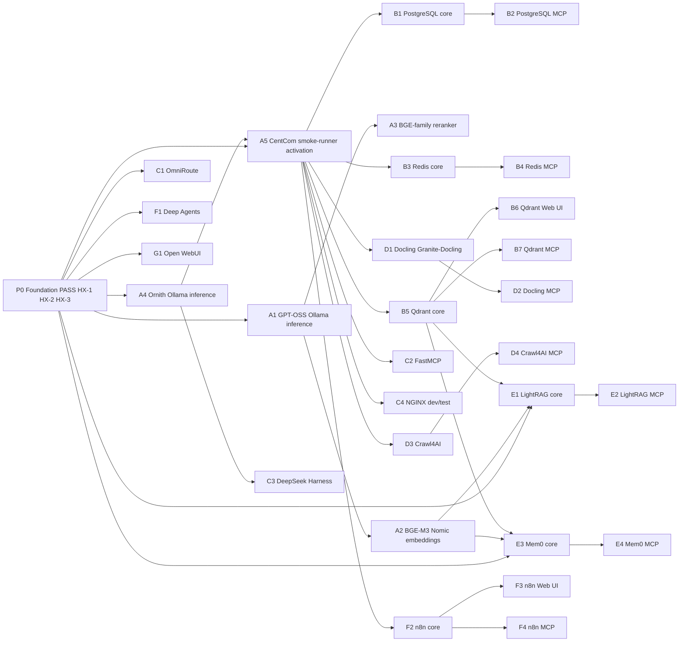

# Proof DAG, Cumulative Evidence, and Closure Gates

The HX Eco-System separates *what is built* (the base implementation roadmap) from *what is proven* (the smoke-test roadmap). This page documents the validation model that sits on top of the ecosystem: the **proof dependency graph** recorded in `docs/00-control/hx-proof.tsv`, the phases and dependency types that graph encodes, the **cumulative-proof-minimal-coupling** rule (decision D-016) that governs how a downstream test reuses upstream PASS evidence, the two retained **evidence shapes**, the exact `prior_pass_evidence` citation format the tools enforce, the staleness/revalidation rule, and the **closure gates** a component must clear before it may be recorded as BASE PASS / CLOSED. The runner helpers (`hx-smoke-new`, `hx-smoke-promote`, `hx-smoke-doctor`) and the generator/validator `tools/hx-doc/hx_proof.py` enforce this model rather than trust operators to follow it.

## 1. The proof DAG as the single source

The dependency structure the smoke programme runs on is a directed acyclic graph of proof steps. It used to live in two hand-maintained places — a per-phase Markdown table and a Mermaid diagram — that could disagree, and nothing checked one against the other. The hand-drawn DAG carried only 19 of the 30 nodes, dropping every MCP companion gate, both Web UI gates, and the reranker.

The source is now `docs/00-control/hx-proof.tsv`. `tools/hx-doc/hx_proof.py` regenerates the per-phase tables and the DAG diagram in `docs/00-control/HX-ECO-SYSTEM-SMOKE-TEST-ROADMAP.md` from that TSV (the same way `hx-fleet` generates fleet tables). A `--check` mode exits non-zero if a generated block is stale, which is the CI gate.

### hx-proof.tsv schema

The TSV has one header row and one row per proof step, tab-delimited:

| Column | Meaning |
|---|---|
| `id` | Short step identifier (`P0`, `A1`…`G1`). Blank or duplicate ids are refused — either silently dropped a step from the generated tables and DAG while validation still reported success. |
| `phase` | Phase the step belongs to: `0`, `A`, `B`, `C`, `D`, `E`, `F`, or `G`. |
| `sut` | System-under-test host id from `hx-fleet.tsv` (e.g. `hx-4`), or `-` for the foundation step. A SUT not present in the fleet inventory is a validation error. |
| `component` | Human-readable component name (`PostgreSQL core`, `Qdrant MCP`, …). |
| `authority` | Path to the executable smoke-test acceptance file under `smoke-tests/` (or a control doc for the foundation/CentCom steps). A missing authority file is a validation error. |
| `requires` | Comma-separated prior step ids this step depends on, or `NONE`/`-`/blank for none. Every named dependency must exist as a step; the validator detects cycles by depth-first colouring. |
| `integration` | The *only* limited live integration permitted for this step (e.g. `Parent Qdrant service only`), or `NONE`/`-`/blank. |
| `status` | `PASS`, `NOT_RUN`, `FAIL`, or `NOT_EXECUTABLE`. Any other value is a validation error. |

The generator refuses to run if validation finds a missing column, a blank/duplicate id, an unknown dependency, an unreadable fleet inventory, an authority file that does not exist, a SUT not in the fleet, an unrecognized status, or a cycle. These checks exist precisely because the hand-maintained version could violate each one silently.

### Readiness vs. enforcement

`hx_proof.py` exposes three operational modes on top of generation:

- `hx-proof` (no args) — regenerate every marked block in the roadmap.
- `hx-proof --check` — CI mode: exit 1 if any generated block has drifted from the TSV, if a marker is missing or duplicated, or if a table marker exists for a phase with no steps. A deleted or duplicated marker is itself reported as drift, because comparing content alone could not detect a silently lost or doubled table.
- `hx-proof --ready <id>` — can this step run now? Reports `READY` only when every required prior step is `PASS` and the step itself is not `NOT_EXECUTABLE` or already `PASS`. A closed proof reports `ALREADY PASSED` rather than `READY`, so a re-run cannot overwrite accepted evidence.
- `hx-proof --list` — one line per step with a `PASS`/`READY`/`blocked`/`n/a` mark and what it waits on.

`hx-smoke-promote` independently re-derives the dependency set from the TSV at promotion time (see §6), so `--ready` and the promote gate agree.

## 2. The proof DAG

The graph below is generated from `hx-proof.tsv`. Every edge is a `requires` entry: a downstream step may only be promoted to PASS once every step pointing into it is itself `PASS` and has been cited in the run's `prior_pass_evidence`.



The proof DAG: every smoke-test step and its `requires` edges, generated from `hx-proof.tsv`. A step may only reach PASS once all steps pointing into it are PASS and cited.

### Phase summary

| Phase | Steps | Exit criterion |
|---|---|---|
| **P0** — Foundation | `P0` | Foundation and at least one known-good HX model endpoint exist (HX-1/HX-2/HX-3 already closed). |
| **A** — Inference and CentCom activation | `A1`–`A5` | CentCom is an evidence-proven remote smoke-test station; HX has accepted generative plus retrieval-inference endpoints. |
| **B** — State and retrieval substrate | `B1`–`B7` | Relational (PostgreSQL), transient (Redis), and vector (Qdrant) state are independently proven, each with its MCP/UI companion gate. |
| **C** — Routing, MCP development, control | `C1`–`C4` | OmniRoute, FastMCP, DeepSeek Harness, and dev/test NGINX are proven without creating permanent integration architecture. |
| **D** — Knowledge acquisition | `D1`–`D4` | Docling and Crawl4AI convert documents/acquire web content independently (no permanent RAG ingestion pipeline yet). |
| **E** — RAG and memory | `E1`–`E4` | LightRAG and Mem0 primary contracts are proven against the previously accepted Qdrant/embedding/LLM substrate. |
| **F** — Agent and workflow consumers | `F1`–`F4` | Deep Agents and n8n are proven without requiring production memory, RAG, or external workflow integrations. |
| **G** — User interaction | `G1` | Open WebUI proves a real model interaction; a rendered page without a model response is not PASS. |

The DAG deliberately does **not** force every test to call every earlier component. `E1` (LightRAG) and `E3` (Mem0) cite `B5`+`A2`+`P0` because they genuinely need Qdrant, embeddings, and an LLM; `F1` (Deep Agents) cites only `P0` and stays standalone for fault isolation. Standalone proof remains standalone when that gives better fault isolation.

## 3. The five dependency types

The smoke roadmap classifies every `requires` edge into one of five types. The type determines whether the dependency is satisfied by citing evidence alone or whether a temporary live integration is also permitted.

| Type | Meaning | Example in the DAG |
|---|---|---|
| **Foundation prerequisite** | Required ecosystem state already established outside any component smoke test. | `P0` (HX-1/HX-2/HX-3 domain/DNS/model foundation) is required by `A1`, `A4`, `A5`, `C1`, `E1`, `E3`, `F1`, `G1`. |
| **Prior smoke PASS** | An earlier component proof must already be accepted before this step runs. | `A1` required by `A2`/`A3`; `B5` required by `E1`/`E3`; `A5` required by `B1`/`B3`/`B5`/`C2`/`C4`/`D1`/`D3`/`F2`. |
| **Limited validation integration** | A temporary live connection is required to prove the component's primary function, and is removed afterward. | `C1` OmniRoute temporarily routes to one proven model; `C4` NGINX proxies one temporary HX-5 upstream; `E1`/`E3` use a disposable Qdrant collection. |
| **Companion gate** | The parent component must pass first, then the assigned UI/MCP proof. | `B5`→`B6`/`B7` (Qdrant core→Web UI/MCP); `D1`→`D2`; `F2`→`F3`/`F4`. |
| **No component dependency** | The test intentionally stays standalone for fault isolation. | `B1` PostgreSQL create/write/read/drop; `B3` Redis PING/SET/GET/DELETE; `F1` Deep Agents. |

A dependency type is not a license to keep temporary wiring. Limited validation integration is allowed only when the dependency has already passed its own gate, is required by the roadmap/current accepted configuration, is necessary to prove the component's primary function, uses synthetic disposable data, clearly identifies validation-only objects, and removes temporary wiring/state afterward (or has explicit owner approval to retain it).

## 4. Cumulative proof with minimal live coupling (D-016)

Decision D-016 governs the whole proof chain. The goal is **not** to force every smoke test to call every component tested before it — that would create unnecessary coupling and make failures harder to diagnose. The rule is:

> A downstream smoke test reuses prior **PASS evidence** whenever that earlier capability is a real prerequisite, and creates only the smallest live temporary integration necessary to prove its own primary contract.

Concretely:

- prior PASS evidence is cumulative — once accepted, it is cited rather than re-derived;
- live validation integration is minimal — only what the step's `integration` column permits;
- temporary validation wiring is removed after proof;
- a smoke dependency does **not** automatically become production architecture;
- a downstream PASS must identify the upstream proof it relied on (the `prior_pass_evidence` manifest field).

The companion-gate specialization: when a component has an assigned Web UI or product-specific MCP server, the chain is parent core PASS → companion UI/MCP PASS → reboot persistence → component BASE PASS. MCP companion tests use the CentCom MCP client and do **not** depend on the HX-15 FastMCP server; UI companion tests use the application's direct LAN endpoint and do **not** require HX-7 NGINX unless NGINX itself is the SUT. A companion PASS can never substitute for a failed parent core smoke test.

## 5. The two evidence shapes

HX has two retained evidence shapes. Both are current; use the one that matches when the proof was taken. Do not retrofit one into the other.

**Inline record evidence — HX-1, HX-2, HX-3.** These servers closed before the CentCom runner existed. Their proof is recorded inside the relevant server record under `docs/02-server-records/` as exact commands and exact responses. `hx-smoke-promote` accepts an accepted server record as `prior_pass_evidence` for exactly this reason. The foundation step `P0` is proven this way, which is why downstream steps cite `P0 -> docs/02-server-records/HX-2.md` (or the relevant record) rather than a run bundle.

**Run-bundle evidence — everything from HX-4 onward.** Created by `hx-smoke-new`, promoted by `hx-smoke-promote`, and retained under:

```text
docs/05-evidence/<sut>/<component>/<run-id>/
├── manifest.md
├── result.txt
├── cleanup.txt
└── supporting captures as required
```

Every retained run must identify: runner host; system under test; component/version or revision; smoke-test authority file; repository commit used; known-answer input; PASS/FAIL determination; cleanup result and cleanup verification; and reboot-persistence result when applicable. Failed evidence is not overwritten by a later PASS — a retry receives a new run id. Secrets must not appear in retained evidence; if command output accidentally includes a credential, redact it before promotion while preserving the functional result.

### Pre-CentCom runs (A1–A4)

Steps A1–A4 prove HX-4 and HX-5 *before* CentCom is activated at A5, so there is no HX-5 station yet. The runner tools run from the operator station by authorising it explicitly:

```bash
export HX_SMOKE_ALLOW_HOST="$(hostname -s)"
export HX_ECO_REPO=~/src/HX-Eco-System
hx-smoke-new hx-4 ollama-inference ollama-inference-smoke-test.md 192.168.50.204
```

The station actually used is written to `runner_host` in the manifest, so a pre-CentCom run is distinguishable from a CentCom run in the retained evidence. After A5 passes, HX-5 is the station and these variables are unset so a later run cannot pick up an authorisation that no longer applies.

## 6. prior_pass_evidence format and enforcement

Every run created by `hx-smoke-new` carries two manifest fields that encode the proof chain:

```text
prior_pass_evidence
limited_integration_plan
```

`prior_pass_evidence` format:

- use `NONE` when no earlier component proof is required;
- otherwise record **one entry for each step in the `requires` column**, written as
  `<step-id> -> <evidence path or accepted server record>` and separated by `;`;
- the evidence is the exact retained run-bundle path (`docs/05-evidence/<sut>/<component>/<run-id>`) or the current accepted server record (`docs/02-server-records/HX-2.md`);
- use only current PASS/CLOSED evidence — never an archive document as current proof;
- the value **must be a single line**. `hx-smoke-promote` reads only the inline value via `sed`, so a value indented over several lines reads as empty and the promotion is refused;
- a **bare list of paths is refused**: a path alone does not say which dependency it proves, so nothing can be checked.

Example for step `E1` (LightRAG), whose `requires` is `B5,A2,P0`:

```text
prior_pass_evidence: B5 -> docs/05-evidence/hx-10/qdrant/<run-id>; A2 -> docs/05-evidence/hx-4/embedding-models/<run-id>; P0 -> docs/02-server-records/HX-2.md
limited_integration_plan: HX-10 Qdrant + HX-4 BGE-M3 + one approved HX LLM; synthetic data only; remove LightRAG smoke document/state after proof
```

### How hx-smoke-promote enforces the chain

`hx-smoke-promote <run-dir> <PASS|FAIL|NOT_EXECUTABLE>` is the only sanctioned promotion path. For a `PASS` it requires, and verifies:

1. `evidence/result.txt` has `FUNCTIONAL=PASS` (service health alone is never a functional PASS).
2. `cleanup/cleanup.txt` has `CLEANUP=PASS` or `CLEANUP=NOT_APPLICABLE` — a functional success with failed or unverified cleanup is not a complete PASS.
3. `prior_pass_evidence` and `limited_integration_plan` are recorded (use `NONE` only when genuinely not applicable).
4. `proof_step` is present in the manifest and **bound** to the run: the script re-checks that the step id belongs to this run's `sut_host` and `smoke_test_file` in `hx-proof.tsv`. A hand-edited or legacy manifest naming another host's step is refused.
5. The step is not `NOT_EXECUTABLE` in the TSV — an open implementation decision blocks PASS regardless of dependencies.
6. For every step in the step's `requires` column, the TSV status is `PASS` **and** `prior_pass_evidence` contains a `<dep> -> <evidence>` entry for it. A missing or malformed entry is refused with the expected form.
7. `component_version_or_revision`, `transport_or_endpoint`, and `sut_ip` are recorded (use `NONE` only when genuinely not applicable).
8. The smoke-test authority copy in the run directory still matches the SHA-256 recorded by `hx-smoke-new` — the acceptance criteria must not change inside a run.
9. A credential redaction scan rejects obvious secrets (GitHub PATs, private keys, bearer tokens, AWS keys, Slack tokens, `sk-` keys, `PASSWORD=`/`TOKEN=` assignments) before the bundle is retained.

Promotion refuses to auto-commit: it writes the bundle to `docs/05-evidence/<sut>/<component>/<run-id>/` and tells the operator to review, commit explicitly, then set the step status to `PASS` in `hx-proof.tsv` and re-run `hx-proof`.

## 7. Staleness and revalidation

A downstream test may rely only on **current** proof. If a materially relevant dependency changed after its PASS, the prior proof may be stale and must be revalidated before being relied on downstream. Material changes include:

- model alias/revision/dimension changes;
- embedding/reranker model or dimension changes;
- Qdrant/database/vector-store upgrade or configuration changes affecting behavior;
- major API or MCP contract changes;
- routing behavior changes;
- SUT rebuild or persistent data/configuration replacement.

Re-running a prerequisite creates a new evidence reference; downstream tests must cite the current accepted proof, not the old run id. A failed prerequisite prevents a downstream PASS outright; a required prerequisite that has never been proven makes the downstream test `NOT EXECUTABLE — PREREQUISITE OR OWNER DECISION REQUIRED` (not a substitute for a failing result).

## 8. Closure gates

A component reaches BASE PASS / CLOSED only when all of the following gates clear. Service health alone is never a functional PASS.

```text
SUT service/base health
        AND
required prior PASS evidence resolved and cited
        AND
known-answer component smoke test PASS
        AND
assigned MCP/UI companion gate where applicable
        AND
cleanup PASS or NOT_APPLICABLE
        AND
cleanup verification
        AND
reboot-persistence proof (separate, minimum post-reboot proof)
        AND
server record updated
        AND
BUILD-STATE updated
        =
BASE PASS / CLOSED
```

The gates in detail:

- **Functional known-answer PASS.** The smoke test proves the component's primary contract with an expected result. Process/service health is necessary but not sufficient. For UI proof, a screenshot without the expected live-state marker is not a functional PASS.
- **Cleanup.** `CLEANUP=PASS` or `CLEANUP=NOT_APPLICABLE`. A test that functionally succeeds but leaves validation-only state behind is not complete. Temporary `hx_smoke_*` state, routes, collections, keys, workflows, and connections are removed unless explicitly approved to remain.
- **Cleanup verification.** Teardown is verified, not just attempted. The retained `cleanup.txt` records both.
- **Reboot-persistence proof.** This is a **separate** gate, performed after the functional test passes and cleanup completes: reboot the SUT as required by the base-build runbook, confirm the service returns active/enabled, confirm required storage/configuration persists, and execute the **minimum** post-reboot functional proof defined for that component. Do not automatically rerun a large destructive or expensive test when a shorter persistence proof is sufficient.
- **Server record.** The relevant record under `docs/02-server-records/` is updated to reflect the accepted as-built/closure state.
- **BUILD-STATE.** `docs/00-control/BUILD-STATE.md` is updated to reflect the new accepted state.
- **hx-proof.tsv.** The step's `status` is set to `PASS` and `hx-proof` is re-run so the generated tables and DAG stay current.

The status vocabulary is intentionally small: `PASS`, `FAIL`, and `NOT_EXECUTABLE`. `NOT_EXECUTABLE` is appropriate when a required implementation decision or prerequisite proof is genuinely not established — it is not a substitute for a failing result.

## 9. The run lifecycle

The standard run lifecycle, supported by the runner helpers but not replacing operator judgment, roadmap authority, or the component procedure:

```text
READ ECOSYSTEM AUTHORITY
  -> VERIFY DEPLOYMENT READINESS
  -> RESOLVE PRIOR PASS EVIDENCE
  -> PLAN LIMITED INTEGRATION
  -> CREATE RUN (hx-smoke-new)
  -> PROVE REACHABILITY
  -> EXECUTE KNOWN-ANSWER TEST
  -> CAPTURE RESULT
  -> CLEAN UP
  -> VERIFY CLEANUP
  -> DETERMINE STATUS
  -> REBOOT-PERSISTENCE PROOF
  -> PROMOTE EVIDENCE (hx-smoke-promote)
  -> REVIEW / COMMIT
  -> REMOVE DISPOSABLE RUN
```

`hx-smoke-new` creates the disposable run directory under `$HX_SMOKE_ROOT`, copies the smoke-test authority into `procedure/` (with its SHA-256 recorded), seeds `manifest.md`, `evidence/result.txt` (`FUNCTIONAL=IN_PROGRESS`), and `cleanup/cleanup.txt` (`CLEANUP=IN_PROGRESS`). It refuses to run outside HX-5 unless `HX_SMOKE_ALLOW_HOST` authorizes the station, refuses an uncommitted or modified smoke-test authority, and derives (or requires an explicit) `proof_step` from `hx-proof.tsv` — binding the step to the run so promotion enforces the correct dependency set.

`hx-smoke-doctor` is the readiness probe run before a session: it checks the client toolset (`psql`, `redis-cli`, `curl`, `jq`, `git`, `ssh`, `python3`), the smoke venv, FastMCP/Playwright import, and a headless Chromium launch. With `--remote` it additionally probes a known-good HX-2 Ollama endpoint with a known-answer call, which is the same probe used in the CentCom activation gate (A5).

`hx-smoke-ui-capture` produces a browser screenshot that must contain an expected live-state marker; a screenshot without that marker is not a functional UI PASS.

## 10. What this model deliberately does not become

The smoke-testing system is a validation layer on top of the ecosystem architecture. It does not create: a container platform; a second deployment plane; a permanent cross-service integration mesh; a general reverse-proxy requirement; new firewall/TLS/DNS/network architecture; production test data; automatic evidence commits without review; permission to modify unrelated SUT state; or a replacement for ecosystem architecture or component-specific acceptance criteria. A smoke-test dependency never becomes production architecture by default, and an operator must never infer permanent architecture from temporary smoke-test wiring. If a test would require any of these, the correct response is to stop and request an owner decision, not to improvise.
