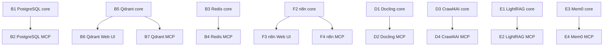

# Component Smoke-Test Authorities

Each component in the HX smoke roadmap is accepted through a **smoke-test authority**: a markdown file under `smoke-tests/` that states what to run and what the correct answer is. The roadmap in `docs/00-control/hx-proof.tsv` wires those authorities to roadmap steps (A1, B1, F2, …) and records their status. This page documents the shared shape all nineteen authorities share, the lint that enforces it, the known-answer model they are built on, and the two reusable shared authorities (`mcp-companion-smoke-test.md` and `native-web-ui-smoke-test.md`) that several companion gates reuse.

## The authority set

There are nineteen `*-smoke-test.md` files under `smoke-tests/`. They cover the full smoke roadmap: `ollama-inference`, `embedding-models`, `reranker`, `postgresql`, `redis`, `qdrant`, `mcp-companion` (reusable), `native-web-ui` (reusable), `omniroute`, `fastmcp`, `deepseek-harness`, `nginx`, `docling`, `crawl4ai`, `lightrag`, `mem0`, `deep-agents`, `n8n`, and `open-webui`. The two reusable authorities are not tied to one product; every other authority is the primary contract for exactly one component.

`tools/hx-doc/hx_smoke_lint.py` checks the whole directory at once. It globs `smoke-tests/*-smoke-test.md`, so a twentieth authority that ships incomplete would be caught the same way an existing one would. The lint exists precisely because the NGINX authority originally shipped without any mention of evidence and nothing noticed.

## Required section structure

`hx-smoke-lint` requires six canonical sections, matched case-insensitively against `#`–`###` headings:

| Section | Heading the lint accepts |
|---|---|
| Title & Purpose | `title` or `purpose` |
| Prerequisites | `prerequisite` |
| Test Steps | `test steps` or `procedure` |
| Sample Data | `sample data` or `fixture` |
| Expected Output | `expected output` or `expected result` |
| Cleanup / Teardown | `cleanup` or `teardown` |

Every authority carries these six. The product authorities number them `## 1. Title & Purpose` through `## 6. Cleanup / Teardown`; the reusable companions use the same six headings. After the six, each authority adds a trailing `## Evidence` section describing how the run is retained through the standard bundle in `docs/05-evidence/README.md`.

Beyond the sections, the lint checks two pieces of *content*:

- **known answer** — the body must contain a known-answer phrase (`known.answer`, `reply with exactly`, `exactly:`, or `expected output`). The NGINX omission taught the project that "service health is not a smoke test"; the lint now rejects an authority that only proves the process is up.
- **evidence retention** — the body must mention the standard bundle path `docs/05-evidence`. The match is anchored to that literal path because a bare word like "evidence" or "retain" can be satisfied by a warning ("do not retain credentials") and is therefore untrustworthy.

The PASS/FAIL verdict itself is *not* checked by the lint. The verdict is recorded by the runner in `evidence/result.txt`, not restated in the authority.

## The known-answer model

Every smoke test proves the component's **primary contract** with an expected result, not just that the process is healthy. Each authority declares a known-answer contract before the test runs:

- a deterministic input or synthetic payload, usually a smoke token like `HX-POSTGRES-SMOKE-9271`, `HX-LIGHTRAG-SMOKE-9271`, or `HX-REDIS-SMOKE-9271`;
- the operation the test performs against it;
- the exact value that must come back.

A run only counts as PASS when the expected marker is produced. The Qdrant authority, for example, writes three 4-dimensional vectors, queries with `[1, 0, 0, 0]`, and asserts the top result is point `1` with payload label `alpha`, printing `QDRANT_SMOKE_PASS top_id=1 label=alpha`. Process health alone (an HTTP `200`, a `PONG`, a loaded page) is never sufficient.

The test data is **synthetic and disposable**, and live objects are **smoke-namespaced** (`hx_smoke_*`, `hx:smoke:*`, `HX-*-SMOKE-9271`, `hx_mem0_smoke`). No production data is touched. The known-answer PASS marker convention is per-component: `QDRANT_SMOKE_PASS`, `POSTGRES_SMOKE_PASS`, `REDIS_SMOKE_PASS`, `LIGHTRAG_SMOKE_PASS`, `MCP_COMPANION_SMOKE_PASS`, `NATIVE_WEB_UI_SMOKE_PASS`, etc. Each run records the marker, the version, the endpoint, the known-answer token as written and read back, and the cleanup result into the evidence bundle.

## Cleanup is part of PASS

Cleanup and cleanup verification are part of the PASS, not an afterthought. A run that proves the contract but leaves its temporary object behind is not a PASS.

- Tests delete their temporary collections, keys, routes, workspaces, and memories in `finally` blocks so cleanup runs even when an assertion fails.
- After deletion, the test **asserts the temp object is gone**: the Qdrant script re-`GET /collections` and asserts `hx_smoke_qdrant` is absent, then prints `QDRANT_SMOKE_CLEANUP_PASS`; the Redis script `EXISTS` checks the key and prints `REDIS_SMOKE_CLEANUP_PASS`; the LightRAG script polls until both the document id is no longer listed **and** the smoke token is no longer retrievable, printing `LIGHTRAG_SMOKE_CLEANUP_PASS` only when both hold.
- Cleanup must target **only** the smoke object. Authorities forbid global operations: the Redis authority forbids `FLUSHDB`/`FLUSHALL`; the LightRAG authority forbids any global clear; the Mem0 authority forbids a global Mem0 reset and forbids deleting non-smoke Qdrant collections.
- Acceptance is not removal. The LightRAG authority is explicit about this: the delete API may return `202` (request taken) and leave the document indexed, and a leftover smoke document sits in a retrieval index later tests read from. Cleanup-verification polling exists precisely to turn a `202` into a proven-absent state.
- If the script is interrupted before cleanup, each authority gives a **manual cleanup command**. The Qdrant authority provides a `curl -X DELETE` fallback; the Redis authority provides `redis-cli ... DEL "hx:smoke:redis:9271"`; LightRAG directs the operator to the recorded `track_id`. PostgreSQL needs no manual command because its temp table is session-scoped and disappears when the session ends.

The cleanup proof is retained alongside the PASS marker in the evidence bundle (`cleanup.txt`).

## The companion-gate pattern

A product that has a core function plus a Web UI and/or an MCP server is accepted through **separate gates** that close in order: the core smoke passes first, then the UI gate and the MCP gate close against the already-proven core. The roadmap encodes this as a dependency chain in `hx-proof.tsv`:



*The companion-gate dependency chains: a core smoke must pass before its UI or MCP companion gate can run.*

Examples: PostgreSQL core (B1) → PostgreSQL MCP (B2); Qdrant core (B5) → Qdrant Web UI (B6) and Qdrant MCP (B7); n8n core (F2) → n8n Web UI (F3) and n8n MCP (F4). The same pattern applies to Redis (B3/B4), Docling (D1/D2), Crawl4AI (D3/D4), LightRAG (E1/E2), and Mem0 (E3/E4).

The companion gates are deliberately separate from the core. Each core authority states its own scope and points the companion off to the shared authority — for example, the Qdrant authority's Scope line reads "Qdrant core function only. Qdrant Web UI and Qdrant MCP remain separate companion gates."

Because several steps (B2, B4, B7, D2, D4, E2, E4, F4) all reuse the same `mcp-companion-smoke-test.md` file, the proof step must be **passed explicitly to `hx-smoke-new`** so the runner records the correct product/component context for each one rather than treating the shared file as a single step.

## The reusable shared authorities

Two authorities are not tied to one product and are parameterized so a single file validates many companion gates.

### MCP companion authority

`mcp-companion-smoke-test.md` validates *any* product MCP server. It proves four things in order:

1. the server is reachable by a real client;
2. it advertises its tools (the required tool is present in `list_tools()`);
3. it executes one safe tool;
4. it returns the known expected value.

It is parameterized by four environment variables:

```bash
export MCP_SOURCE="http://<mcp-host>:<port>/mcp"
export MCP_TOOL="<safe-tool-name>"
export MCP_ARGS_JSON='{}'
export MCP_EXPECT="<known-expected-text>"
```

The reference client is **FastMCP `Client`** in `mode="auto"`, which handles protocol negotiation automatically so the test does not hard-code a legacy `initialize` handshake. The script asserts the tool is advertised, calls it, and checks `MCP_EXPECT` against the serialized result (falling back to `result.content` text). A passing run prints:

```text
MCP_COMPANION_SMOKE_PASS protocol=<negotiated-version> tool=<safe-tool-name>
```

Tool discovery alone is explicitly not sufficient — the test must exercise a real tool call. The selected tool must be **benign/read-only or smoke-namespaced**; if it creates a smoke object, that object is removed through the parent application's normal cleanup method. The authority forbids creating permanent agent/client registrations — MCP registration with DeepSeek Harness, Deep Agents, Open WebUI, n8n, or other consumers remains integration-phase work, not smoke-test scope.

### Native Web UI authority

`native-web-ui-smoke-test.md` validates a native Web UI against expected **live-state text**. It proves the UI is not merely serving a page but is connected to the accepted backend and reads live application state. The proof is one of:

- a disposable `HX-UI-SMOKE-9271` object created through the parent's normal API/test flow and displayed; or
- an application version/health/object listing that proves the UI reads the backend.

A **screenshot without the expected marker is not a PASS**. The UI must load the direct native LAN URL, render the correct application identity, retrieve live backend state, and keep the live-state proof valid after a refresh. The expected output is:

```text
NATIVE_WEB_UI_SMOKE_PASS app=<application> url=<direct-native-url> live_state=<verified-item>
```

Scope is companion-UI proof only. Open WebUI and n8n have their own functional smoke tests; NGINX is not part of this path. No NGINX route, external proxy, production data, or container is required, and the authority explicitly leaves no temporary NGINX/proxy route behind.

## Constraints carried into every smoke test

Every authority repeats the same set of constraints, which together keep smoke tests from becoming architecture creep:

- **No containers.** No Docker, Podman, Kubernetes, or temporary container is required or permitted.
- **No production data.** Only synthetic/disposable, smoke-namespaced data is used.
- **Remote-first execution from HX-5.** HX-5 CentCom is the standard remote smoke-test execution station after its activation gate (A5); before A5, the operator station is authorized explicitly via `HX_SMOKE_ALLOW_HOST`.
- **Approved SSH only when local execution is intrinsic.** Tests that must run a local helper (e.g., NGINX needs a temporary private-IP upstream on a separate runner, DeepSeek Harness generates a local disposable project) use an approved host, not arbitrary remote access.
- **No architecture creep.** No permanent routes, firewalls, TLS, DNS, service accounts, containers, or cross-service wiring are created. The NGINX authority, which is the most network-adjacent, explicitly forbids firewall/network-policy changes and uses throwaway ports `18080`/`18017`. OmniRoute and Open WebUI create one temporary route/connection and remove it afterward. LightRAG and Mem0 reuse the *already-accepted* Qdrant and embedding endpoints rather than creating parallel instances.

These constraints are why cleanup verification matters: a smoke test that left a route, collection, or registration behind would silently introduce exactly the architecture creep the constraints forbid.

## Evidence retention

Each run is retained through the standard bundle described in `docs/05-evidence/README.md`:

```text
docs/05-evidence/<server>/<component>/<run-id>/
├── manifest.md
├── result.txt
├── cleanup.txt
└── supporting captures as required
```

The bundle must identify the runner host, system under test, component/version, smoke-test authority file, repository commit, known-answer input, PASS/FAIL determination, cleanup result and cleanup verification, and reboot-persistence result when applicable. Failed evidence is not overwritten by a later PASS — a retry receives a new run id. Secret values must not appear in retained evidence; connection endpoints are recorded as host/port only where a URL could carry a password (Redis, Qdrant API key).
