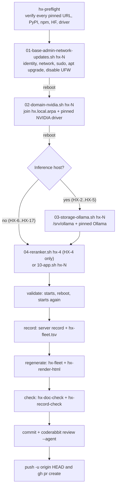

# Workflow — Build a Server

The HX Eco-System is rebuilt one server at a time (KISS): build it, validate it,
record it, then move on. This page is the end-to-end control flow an agent
follows on a build day, from a preflight that costs thirty seconds on a laptop to
the push that opens the reviewed pull request. It assumes the fleet-wide
machinery — the block taxonomy, the `hx-base.env` pin file, host-gating,
verified-fetch, and the systemd unit pattern — already documented in
[/openwiki/operations/runbook-blocks-and-pins.md](../operations/runbook-blocks-and-pins.md)
and the change/review machinery in
[/openwiki/integrations/ci-and-review.md](../integrations/ci-and-review.md).

The governing build rule is strictly serial:

```text
one server
→ verify base state
→ install assigned workload
→ prove primary function
→ reboot
→ record evidence
→ close PASS
→ move to next server
```

A server is not `PASS / CLOSED` until its workload, functional, cleanup, and
reboot-persistence gates are satisfied **and** its server record is updated.

## The build-day flow

Every server has the same shape: two reboots establish identity and GPU, the
inference hosts get Ollama, then the application installs, then validation
confirms the service starts and survives a reboot, then the result is recorded,
regenerated, checked, committed, reviewed, and pushed.



The build-day flow: preflight confirms every pinned artifact is still fetchable before a machine is touched; the common base blocks establish identity, network, sudo, domain, GPU, and (inference hosts only) Ollama; the application block installs the workload; validation confirms the service starts and survives a reboot; recording writes provenance and state; regeneration and checking keep derived artifacts current; the change is committed, reviewed locally with CodeRabbit before the push, and pushed as a pull request.

## 0. Before you touch a machine: preflight

From anywhere, including a laptop, before build day:

```bash
cd ~/src/HX-Eco-System
git pull
tools/hx-doc/hx-preflight
```

`hx_preflight.py` reads every pin from `docs/03-runbooks/common/hx-base.env` and
asks — without downloading anything — whether each pinned artifact is still
there. It takes roughly thirty seconds and checks five categories:

- **Direct download URLs** the blocks fetch (Ollama install script, PostgreSQL /
  Redis / NGINX / Qdrant source tarballs and binaries, the Node.js binary and
  its `SHASUMS256.txt`), via `HEAD` (falling back to a one-byte ranged `GET` for
  CDNs that refuse `HEAD`).
- **Pinned PyPI versions** (open-webui, lightrag-hku, mem0ai, docling, crawl4ai,
  deepagents, fastmcp, the reranker runtime) — that the version exists and is
  not **yanked**. It also reads `tools/hx-smoke-runner/requirements.txt` so any
  runner dependency pin is checked too.
- **Pinned npm versions** (omniroute, n8n) against the npm registry.
- **Hugging Face model revisions** (the BGE reranker and Granite-Docling) via
  the `huggingface.co/api/models/.../revision/...` endpoint.
- **The NVIDIA driver** (`nvidia-driver-${HX_NVIDIA_BRANCH}-server-open` pinned
  to `HX_NVIDIA_PKG_VERSION`) is still published for `noble/amd64` in the
  Launchpad archive.

Expect `all clear`. Any `FAIL` means the pin in `hx-base.env` must be fixed
before starting: a dead link found here costs a minute; found mid-build it costs
the morning. An empty `hx-base.env` (every pin missing) is also caught and
reported as `FAIL` — the guard is on the input, not the output.

## 1–4. The common base blocks and the application block

Call each block with the host name, or run the per-server wrapper from the
host's own runbook directory. Both do the same thing — the wrapper is a few
lines that `exec` the common block with the right host:

```bash
cd ~/src/HX-Eco-System/docs/03-runbooks
./common/01-base-admin-network-updates.sh hx-4

# or, equivalently:
cd ~/src/HX-Eco-System/docs/03-runbooks/HX-4
./01-base-admin-network-updates.sh
```

Every block takes exactly one argument and calls `hx_require_host` first.
`hx_require_host` compares `hostname -s` to the expected host and **exits 10**
on mismatch before any work begins, then resolves `HX_HOST` and `HX_IP` from the
generated `hx-fleet-ips.env`. A mistyped server name stops the build rather than
damaging a neighbour; an unknown host has no IP recorded and also exits 10.

| Step | Block | Reboots | Roughly |
|---|---|---|---|
| 1 | `common/01-base-admin-network-updates.sh` | yes | 10-20 min |
| 2 | `common/02-domain-nvidia.sh` | yes | 10-15 min |
| 3 | `common/03-storage-ollama.sh` (inference hosts only) | no | 5 min |
| 4 | the application block (`04-reranker.sh hx-4` on HX-4, else `10-*.sh hx-N`) | no | varies |

### Block 01 — base, admin, network, updates

Sources `hx-base.env`, calls `hx_require_host`, then asserts the host's IP
(exit 11), the default gateway (exit 12), and the HX-1 DNS resolver (exit 13)
match the fleet baseline before installing the `hxsa` passwordless-sudoers
fragment via `visudo -cf` and verifying `sudo -n true` actually took effect
(exit 14). Per decision D-018 the HX LAN is a trusted lab segment, so the block
explicitly disables UFW and firewalld rather than leaving them default-on. It
runs `apt update && apt upgrade -y`, reports any failed units, and **reboots** —
the reboot is the end of the block.

### Block 02 — domain + NVIDIA

Joins the host to the Active Directory domain (`hx.local.arpa`) via `realmd`,
verifies a test domain user resolves (exit 15 on failure), then installs the
**pinned** NVIDIA driver from the Ubuntu archive — the one place the archive is
permitted for application software, because the driver must match the running
kernel ABI. The package is `nvidia-driver-${HX_NVIDIA_BRANCH}-server-open`
pinned to `HX_NVIDIA_PKG_VERSION` together with `linux-headers-$(uname -r)`.
Clearing the pin in `hx-base.env` falls back to the current archive version,
which must then be recorded in the server record. The block **reboots**.

### Block 03 — storage + Ollama (inference hosts only)

Skipped on HX-6 through HX-17. It verifies the domain/GPU/storage preconditions
(`realm list`, `nvidia-smi`, a mounted **and empty** `/srv/ollama` — exits 20 /
21 otherwise), refuses an unpinned install (exit 30), then installs the pinned
Ollama via `hx_ollama_install` (which verifies the release archive against
upstream's own `sha256sum.txt`, keeps the previous install until the new one is
in place, and rolls back on extraction failure). It writes the
`/etc/systemd/system/ollama.service.d/storage.conf` drop-in, restarts and
enables `ollama`, confirms the installed version matches the pin (exit 22 on
mismatch), and probes both loopback and LAN endpoints.

### Block 04 — reranker (HX-4 only)

HX-4 additionally runs `04-reranker.sh` because it hosts the shared
embedding/reranking plane. The reranker model is pinned to an immutable commit
revision so a later upstream edit cannot silently change the model under a
stable name; the runtime is `infinity-emb` from PyPI. The block builds the venv
under `/srv/reranker/venv`, writes `hx-reranker.service` with
`TimeoutStartSec=900` because first start downloads the model, enables it, and
polls `/health` for up to 90 cycles of 10 seconds.

### The application block — `10-*.sh`

One block per fleet application. Each sources `hx-base.env` and `hx-app-lib.sh`,
calls `hx_require_host`, then composes the shared helpers (`hx_app_user`,
`hx_app_venv`, `hx_app_unit`, `hx_app_validate`, `hx_app_done`, and
`hx_node_install`) to build the application. Blocks that install a daemon end
with `hx_app_done <unit> ...`; blocks that install a library or CLI pass `NONE`
and a reboot-check command instead. Several blocks append an operator-action or
operator-decision `NOTE` that must be resolved before the server can close. See
[/openwiki/operations/runbook-blocks-and-pins.md](../operations/runbook-blocks-and-pins.md)
for the per-block specifics and the per-application pins.

## 5. Validation: does it start, and does it survive a reboot?

Validation is two questions, everywhere — **does the service start, and does it
survive a reboot. Nothing more.** `hx_app_validate` answers the first (it waits
up to 60 cycles of 5 seconds for the TCP port to answer, then confirms
`systemctl is-active` and `is-enabled`); the operator reboots and re-checks to
answer the second. The block prints the unit name, or — when the component is a
library or CLI with no unit — the exact check to run instead. Use what it
printed:

```bash
UNIT=hx-qdrant            # whatever the block reported for this server
systemctl is-active "$UNIT" && systemctl is-enabled "$UNIT"
sudo reboot
# once it is back:
systemctl is-active "$UNIT"
```

Crawl4AI, Deep Agents, Docling, FastMCP, and Mem0 are libraries or CLIs with no
unit. For those the block prints the check command to run after the reboot, and
that command **is** the reboot-persistence check — a plain
`systemctl is-active` against a unit that does not exist can only fail, so
`hx_app_done NONE` exists to stop blocks from instructing that.

## 6. Record it

```bash
$EDITOR docs/02-server-records/HX-4.md      # fill every section
$EDITOR docs/00-control/hx-fleet.tsv        # state -> PASS, gate -> CLOSED
tools/hx-doc/hx-fleet                       # regenerate the tables
tools/hx-doc/hx-render-html
tools/hx-doc/hx-doc-check && tools/hx-doc/hx-record-check
```

The server record (`docs/02-server-records/HX-N.md`) is the as-built statement.
Fill every section; `tools/hx-doc/hx-record-check` reports what is still open.
Section 6 (Model / Application Provenance) requires **both** a source URI and a
full SHA-256 for every downloaded artifact — a hash alone does not establish
origin, and an origin alone does not establish what is running, because public
model registries carry modified community rebuilds under names close to the
official ones. An unknown value is written `UNRESOLVED`, never left blank,
because a missing field cannot be told apart from a forgotten one.

Then edit `docs/00-control/hx-fleet.tsv`: set `state` → `PASS` and `gate` →
`CLOSED` for that row, and run `tools/hx-doc/hx-fleet` to regenerate every
marked fleet table and the runbook IP map from the TSV (never hand-edit the
generated tables or `hx-fleet-ips.env`). Run `tools/hx-doc/hx-render-html` so
every `human-html/` mirror matches its Markdown source, then `hx-doc-check`
(links resolve, vocabulary is defined, control frontmatter is complete,
filenames are stable, evidence is committable) and `hx-record-check`.

## Commit, review, push — everything goes through a pull request

`main` is not a working branch. Every change, including a one-line fix, goes
through a pull request so CodeRabbit reviews it. Review is not optional. The
canonical sequence, from AGENTS.md section 13:

```bash
git checkout -b <type>/<short-name>

# work, then regenerate anything derived and check it:
tools/hx-doc/hx-fleet && tools/hx-doc/hx-render-html && tools/hx-doc/hx-doc-check

# commit before pushing - git push sends commits, not working-tree edits:
git add -A
git status          # confirm the diff is what you mean to submit
git commit

# review locally before the push, not after it:
coderabbit review --agent

git push -u origin HEAD && gh pr create
```

`coderabbit review --agent` before every push is **required, not a
convenience**. The hosted reviewer runs *after* the push, applies the
configuration from the base branch rather than the branch under review, and on a
public repository can refuse for the day once the review limit is reached. The
command-line reviewer has none of those limits: it reads the working tree and the
configuration as they are now. The first push of the day that skipped it shipped
two defects — a duplicate `with:` key that stopped a workflow from starting at
all, and a `path_filters` entry that turned the filter list into an allow list
that would have excluded every file from review — both of which the CLI reviewer
reported before they reached the branch.

Keep a pull request **under 100 changed files**. CodeRabbit skips anything
larger, and a skipped review is the same as no review. Generated output and
`archive/` are already filtered out of review in `.coderabbit.yaml`, which is
what usually pushes a change over the line. When CodeRabbit raises something, fix
it regardless of severity; if a finding is wrong, say why on the thread rather
than ignoring it.

## Build order

The order is dependency-driven and is not reordered without a reason. It is the
authority of `docs/00-control/HX-ECO-SYSTEM-BASE-IMPLEMENTATION-PRIORITY.md`;
the fleet TSV records the resulting `state`/`gate`, it does not itself encode
the ordering.

| # | Host | Application | Block |
|---:|---|---|---|
| 1 | HX-4 | Meta-X: GPT-OSS 20B, BGE-M3, Nomic, reranker | `common/04-reranker.sh hx-4` |
| 2 | HX-5 | CentCom / Ornith inference | base blocks only |
| 3 | HX-9 | PostgreSQL 18.6 | `common/10-postgresql.sh hx-9` |
| 4 | HX-9 | Redis 8.10.1 | `common/10-redis.sh hx-9` |
| 5 | HX-10 | Qdrant 1.19.1 | `common/10-qdrant.sh hx-10` |
| 6 | HX-6 | OmniRoute 3.8.50 | `common/10-omniroute.sh hx-6` |
| 7 | HX-15 | FastMCP 4.0.3 | `common/10-fastmcp.sh hx-15` |
| 8 | HX-5 | DeepSeek Harness | see the HX-5 runbook |
| 9 | HX-7 | NGINX 1.30.4 | `common/10-nginx.sh hx-7` |
| 10 | HX-16 | Docling 2.126.0 + Granite-Docling | `common/10-docling.sh hx-16` |
| 11 | HX-17 | Crawl4AI 0.9.3 | `common/10-crawl4ai.sh hx-17` |
| 12 | HX-11 | LightRAG 1.5.7 | `common/10-lightrag.sh hx-11` |
| 13 | HX-13 | Mem0 2.0.20 | `common/10-mem0.sh hx-13` |
| 14 | HX-12 | Deep Agents 0.7.13 | `common/10-deep-agents.sh hx-12` |
| 15 | HX-14 | n8n 2.38.6 | `common/10-n8n.sh hx-14` |
| 16 | HX-8 | Open WebUI 0.11.3 | `common/10-open-webui.sh hx-8` |

In short: HX-4 → HX-5 → HX-9 PostgreSQL → HX-9 Redis → HX-10 Qdrant → HX-6 →
HX-15 → HX-5 DeepSeek Harness → HX-7 → HX-16 → HX-17 → HX-11 → HX-13 → HX-12 →
HX-14 → HX-8.

### Things that will stop you

These are the build-day gotchas — each is a recorded constraint that blocks
closure until it is resolved.

- **HX-4 reranker.** First start downloads the model, so allow a few minutes
  before the health check answers. The block already waits (`TimeoutStartSec=900`
  and a 90-cycle health poll).
- **HX-6 OmniRoute.** The product discovers hundreds of providers by default.
  Before HX-6 closes, build the explicit provider allowlist **and** the explicit
  model allowlist (D-010). Discovery is not approval — that is the reason this
  server exists.
- **HX-9.** Two applications on one host (PostgreSQL and Redis); they close
  separately. PostgreSQL builds from source, so allow time for `make`. Set the
  postgres role password before anything connects over the LAN, and **do not put
  that password in the repository** — the block prints the `\password postgres`
  instruction explicitly.
- **HX-11 LightRAG.** Set the embedding and LLM bindings in the unit environment
  before the smoke test: HX-4 for BGE-M3, and one approved HX Ollama endpoint.
- **HX-12, HX-15, HX-16, HX-17.** These install libraries or CLIs, not services.
  The base install proves the runtime (`hx_app_done NONE` with a reboot-check
  command). The thing that gets a unit is the companion MCP server, which is a
  separate gate.
- **HX-13 Mem0.** Mem0 is a library, not a daemon. It has no unit until you
  decide whether it runs inside the assigned MCP server or behind a small local
  service; that decision is not yet made, and the block stops with `exit 3`
  rather than reporting a `hx-mem0` unit that nothing creates.

### Separate from the build order

The two closed inference servers (HX-2, HX-3) move to the fleet Ollama pin with
`common/90-ollama-upgrade.sh`. Run on each host:

```bash
./docs/03-runbooks/common/90-ollama-upgrade.sh hx-2
./docs/03-runbooks/common/90-ollama-upgrade.sh hx-3
```

Models are not re-downloaded — the helper replaces the binary and leaves the
storage drop-in and `/srv/ollama` alone. Update the Ollama version in each record
after.

## End of day

```bash
tools/hx-doc/hx-doc-check
tools/hx-doc/hx-record-check
tools/hx-doc/hx-fleet --check
tools/hx-doc/hx-proof --check
git status
```

These five checks are the enforcement layer that turns the written rules into
failures that break loudly; treat a failure as a real defect, not as noise to
work around. `hx-doc-check` enforces links, vocabulary, control frontmatter,
stable filenames, and committable evidence; `hx-record-check` enforces that
server records carry every required section with open gaps visible;
`hx-fleet --check` exits 1 if any generated fleet table is stale against the
TSV; `hx-proof --check` validates the proof DAG and its generated blocks;
`git status` confirms the working tree is clean. Anything a server needs that is
not yet decided goes in that server's record as `UNRESOLVED`, not in someone's
memory.

## Related pages

- [/openwiki/architecture/server-fleet-and-states.md](../architecture/server-fleet-and-states.md) — the 17-server fleet map, `hx-fleet.tsv` as the single source, and the `PASS / CLOSED` progression.
- [/openwiki/operations/runbook-blocks-and-pins.md](../operations/runbook-blocks-and-pins.md) — the block execution system, the pin file, host-gating, verified-fetch, the systemd unit pattern, and the per-block specifics.
- [/openwiki/integrations/ci-and-review.md](../integrations/ci-and-review.md) — the PR-only change rule, CodeRabbit CLI review before push, `.coderabbit.yaml`, and the GitHub Actions CI workflows.
