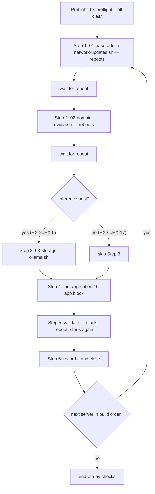

# Build-Day Flow

> This page is **context, not authority**. `docs/03-runbooks/RUN-SHEET.md` is the
> authority for the build day: the exact commands, the build order, and the
> per-host stops. Where this page and the run sheet disagree, the run sheet wins
> and this page is a defect to fix.

The build day is one server at a time, in a dependency-driven order, each one
following the same six-step shape from preflight through a closed server record.
Nothing is left to memory: every command is exact, every downloaded artifact is
recorded with its source URI and full SHA-256, and anything not yet decided is
written `UNRESOLVED`, never blank.

This page walks the flow the way an operator lives it:

1. [Preflight before you touch a machine](#1-preflight-before-you-touch-a-machine)
2. [The six-step shape of every server](#2-the-six-step-shape-of-every-server)
3. [Validation — starts, reboot, starts again](#3-validation--starts-reboot-starts-again)
4. [Record it and close through review](#4-record-it-and-close-through-review)
5. [Build order](#5-build-order)
6. [The two Ollama fleet-pin upgrades](#6-the-two-ollama-fleet-pin-upgrades)
7. [Two records to backfill before smoke](#7-two-records-to-backfill-before-smoke)
8. [What stops you, per host](#8-what-stops-you-per-host)
9. [At the end of the day](#9-at-the-end-of-the-day)

## 1. Preflight before you touch a machine

Before any host is touched, from anywhere — including a laptop — pull and run
the preflight gate:

```bash
cd ~/src/HX-Eco-System
git pull
tools/hx-doc/hx-preflight
```

Expect `all clear`. A dead pin found here costs a minute; the same dead pin
found mid-build costs the morning. If anything `FAILS`, fix the pin in
`docs/03-runbooks/common/hx-base.env` *before* starting — do not start a build
against a broken baseline.

`hx-preflight` checks downloads, PyPI, npm, Hugging Face, and apt pins. It
cannot resolve an Ollama model tag; the model blocks prove those themselves
through known-answer tests and `hx_require_pinned_ref` (see
[What stops you, per host](#8-what-stops-you-per-host)).

## 2. The six-step shape of every server

Every server has the same shape. Two reboots are unavoidable, then the
application, then validation and the record.



The six steps, with their blocks and reboot behavior:

| Step | Block | Reboots | Roughly |
|---|---|---|---|
| 1 | `common/01-base-admin-network-updates.sh` | yes | 10-20 min |
| 2 | `common/02-domain-nvidia.sh` | yes | 10-15 min |
| 3 | `common/03-storage-ollama.sh` | no | 5 min |
| 4 | the application block (`10-<app>.sh`, or the HX-4 model/reranker blocks) | no | varies |
| 5 | validate: starts, then reboot, then starts | yes | 5 min |
| 6 | record it | no | 5 min |

**Step 1** validates identity, the expected IP and gateway, the HX-1 DNS
resolver, SSH; writes the `hxsa` NOPASSWD sudo policy; disables local firewall
(owner decision D-018 — the HX LAN is a trusted lab segment); runs `apt update`
+ `apt upgrade`; then reboots. It stops on a missing IP/gateway/DNS match
rather than proceeding against a wrong network identity.

**Step 2** joins `hx.local.arpa`, validates SSSD and domain-user resolution,
installs the pinned `nvidia-driver-595-server-open`, then reboots.

**Step 3** re-validates domain/GPU/storage, requires an *inspected* empty
`/srv/ollama` mount, installs the pinned Ollama, writes the systemd override
(`OLLAMA_MODELS=/srv/ollama/models`, `OLLAMA_HOST=0.0.0.0:11434`), and proves
the LAN listener and `/api/version`. **Step 3 is inference hosts only. Skip it
on HX-6 through HX-17.**

Every block calls `hx_require_host` first and refuses (exit 10) to run on any
host other than the one named — the guard against running HX-4's block on HX-5.
Call a block with the host name from anywhere, or run the thin wrapper from the
server's own runbook directory; both do the same thing:

```bash
cd ~/src/HX-Eco-System/docs/03-runbooks
./common/01-base-admin-network-updates.sh hx-4

# or, equivalently:
cd ~/src/HX-Eco-System/docs/03-runbooks/HX-4
./01-base-admin-network-updates.sh
```

## 3. Validation — starts, reboot, starts again

Validation is two questions everywhere: **does it start, and does it survive a
reboot.** Nothing more.

The block prints the unit name, or — when the component is a library or CLI with
no unit — the command to run instead. Use what it printed:

```bash
UNIT=hx-qdrant            # whatever the block reported for this server
systemctl is-active "$UNIT" && systemctl is-enabled "$UNIT"
sudo reboot
# once it is back:
systemctl is-active "$UNIT"
```

Crawl4AI, Deep Agents, Docling, FastMCP and Mem0 are libraries or CLIs with no
unit. For those the block prints the check to run, and that command *is* the
reboot-persistence check.

Once the smoke phase starts, confirm a proof step may run at all before running
it:

```bash
tools/hx-doc/hx-proof --ready B2
```

`READY — every required prior proof has passed.` means go. `NOT READY — these
must pass first:` lists the steps that must close first, and the remedy is to
run those, not to change any pin. A step whose own status is `NOT_EXECUTABLE`
reports `NOT RUNNABLE`: an implementation decision is still open, and
dependencies are not the blocker. `hx-smoke-promote` enforces the same chain at
promotion time, so a PASS is refused when a required prior step has not passed
and been cited. The smoke-test authority lives under `smoke-tests/`; see
[Smoke Test Execution](/openwiki/workflows/smoke-test-execution.md).

## 4. Record it and close through review

Step 6 is the record, and it is not optional:

```bash
$EDITOR docs/02-server-records/HX-4.md      # fill every section
$EDITOR docs/00-control/hx-fleet.tsv        # state -> PASS, gate -> CLOSED
tools/hx-doc/hx-fleet                       # regenerate the tables
tools/hx-doc/hx-render-html
tools/hx-doc/hx-doc-check && tools/hx-doc/hx-record-check
git add -A && git commit
coderabbit review --agent                   # review before the push, not after
git push
```

The record needs the **source URI and the full SHA-256** of anything
downloaded. A hash alone does not establish origin, and an origin alone does
not establish what is running. An unknown value is written `UNRESOLVED`, never
left blank.

The sequence matters and is fixed: edit the server record (every section),
update the fleet TSV (state → `PASS`, gate → `CLOSED`), regenerate the fleet
tables and HTML mirrors, run `hx-doc-check` and `hx-record-check`, commit,
review with `coderabbit review --agent` *before* the push, then push. This is
the same change-and-review workflow that governs every change — see
[Change and Review Workflow](/openwiki/operations/change-and-review-workflow.md).
Review before push is load-bearing, not a convenience.

`hx-record-check` is the gate that answers "is this server's record complete?"
See [Documentation Gates](/openwiki/operations/doc-gates.md) for what each gate
checks and refuses, and [Server Records and Evidence](/openwiki/operations/server-records-and-evidence.md)
for the evidence standard.

## 5. Build order

Dependency-driven. Do not reorder without a reason. HX-4 is first (the shared
embedding/reranker plane that downstream RAG and smoke tests cite as prior PASS
evidence); HX-8 Open WebUI is last (a consumer that proves one temporary
conversation against an already-proven model and then removes it).

| # | Host | Application | Block |
|---:|---|---|---|
| 1 | HX-4 | Meta-X: GPT-OSS 20B, BGE-M3, Nomic, reranker | `common/04-reranker.sh hx-4` (plus the 05/06 model blocks) |
| 2 | HX-5 | CentCom / Ornith inference | base blocks only |
| 3 | HX-9 | PostgreSQL 18.6 | `common/10-postgresql.sh hx-9` |
| 4 | HX-9 | Redis 8.10.1 | `common/10-redis.sh hx-9` |
| 5 | HX-10 | Qdrant 1.19.1 | `common/10-qdrant.sh hx-10` |
| 6 | HX-6 | OmniRoute 3.8.50 | `common/10-omniroute.sh hx-6` |
| 7 | HX-15 | FastMCP 4.0.3 | `common/10-fastmcp.sh hx-15` |
| 8 | HX-5 | DeepSeek Harness | see the HX-5 runbook |
| 9 | HX-7 | NGINX 1.30.4 | `common/10-nginx.sh hx-7` |
| 10 | HX-16 | Docling 2.126.0 + Granite-Docling | `common/10-docling.sh hx-16` |
| 11 | HX-17 | Crawl4AI 0.9.3 | `common/10-crawl4ai.sh hx-17` |
| 12 | HX-11 | LightRAG 1.5.7 | `common/10-lightrag.sh hx-11` |
| 13 | HX-13 | Mem0 2.0.20 | `common/10-mem0.sh hx-13` |
| 14 | HX-12 | Deep Agents 0.7.13 | `common/10-deep-agents.sh hx-12` |
| 15 | HX-14 | n8n 2.38.6 | `common/10-n8n.sh hx-14` |
| 16 | HX-8 | Open WebUI 0.11.3 | `common/10-open-webui.sh hx-8` |

On HX-4 the application step is not a single `10-*.sh`: the runbook runs
`05-gpt-oss.sh` (Meta-X generation model), then `06-embeddings.sh` (BGE-M3
primary + Nomic v1.5 alternate), then `04-reranker.sh` last because the
reranker's number is historical and it needs the models in place. Only the
cross-encoder reranker needs a second runtime (Infinity), because Ollama does
not serve cross-encoders.

## 6. The two Ollama fleet-pin upgrades

Separate from the build order, the two already-closed inference servers (HX-2
and HX-3) move to the fleet Ollama pin in `hx-base.env` via a dedicated upgrade
script run on each host:

```bash
./docs/03-runbooks/common/90-ollama-upgrade.sh hx-2
./docs/03-runbooks/common/90-ollama-upgrade.sh hx-3
```

`90-ollama-upgrade.sh` is safe to re-run: it replaces the binary via
`hx_ollama_install` (checksum-verified against upstream's published
`sha256sum.txt`, with a rollback rename so a failed extraction leaves the
previous install in place) and leaves the systemd override and `/srv/ollama`
alone. **Models are not re-downloaded.** After the upgrade, run the
reboot-persistence check (`systemctl is-active ollama && ollama --version &&
ollama list`) and update the Ollama version in each server's record.

## 7. Two records to backfill before smoke

Both backfill items need a live host, so do them on the first day you have
access. Both must close **before the smoke phase starts**, because downstream
smoke tests cite HX-2 and HX-3 as prior PASS evidence.

- **HX-2** — the Hugging Face repository the Qwen3.8-27B GGUF came from. The
  hash is recorded; the origin is not. Recover it from shell history or the
  download record.
- **HX-3** — the full artifact SHA-256. Only the 12-character layer prefix was
  recorded. Recover the full hash:

  ```bash
  ollama show --modelfile coder-x:qwen3-coder-30b-q6_k
  ls -l /srv/ollama/models/blobs/
  ```

## 8. What stops you, per host

State costs and irreversibility plainly: the two reboots in steps 1 and 2 are
unavoidable. The rest of the per-host stops:

**HX-4 reranker.** First start downloads the model, so allow a few minutes
before the health check answers. The block already waits (a 90-iteration poll
against `/health`). `04-reranker.sh` runs `infinity-emb` from PyPI under
systemd on port 7997, pinned to `BAAI/bge-reranker-v2-m3` @ a fixed commit
revision, with `click<8.2` held and BetterTransformer turned off (it does not
work with torch ≥ 2.5 and the fleet runs 2.14).

**HX-6 OmniRoute.** The product discovers hundreds of providers by default.
Before HX-6 closes, build the explicit provider allowlist and the explicit
model allowlist. Discovery is not approval — that is decision D-010, and it is
the reason this server exists.

**HX-9.** Two applications on one host (PostgreSQL and Redis); they close
separately. PostgreSQL builds from source, so allow time for `make`. Set the
postgres role password before anything connects over the LAN, and do not put it
in the repository.

**HX-11 LightRAG.** Set the embedding and LLM bindings in the unit environment
before the smoke test: HX-4 for BGE-M3, and one approved HX Ollama endpoint.

**HX-13 Mem0.** Mem0 is a library, not a daemon. It has no unit until you decide
whether it runs inside the assigned MCP server or behind a small local service.
That decision is not made yet — record it as `UNRESOLVED` until it is.

**HX-16, HX-17, HX-12, HX-15.** These install libraries or CLIs, not services.
The base install proves the runtime. The thing that gets a unit is the
companion MCP server, which is a separate gate.

## 9. At the end of the day

```bash
tools/hx-doc/hx-doc-check
tools/hx-doc/hx-record-check
tools/hx-doc/hx-fleet --check
tools/hx-doc/hx-proof --check
git status
```

Anything a server needs that is not yet decided goes in that server's record as
`UNRESOLVED`, not in someone's memory. A component reaches BASE PASS only when
the governing build rule is satisfied — clean rebuild, domain join, native
install, systemd active+enabled, health endpoints, persistent storage,
application-specific UI/MCP where assigned, the defined component smoke test
passing on disposable data, reboot persistence proven, and the server record
and fleet state updated.
