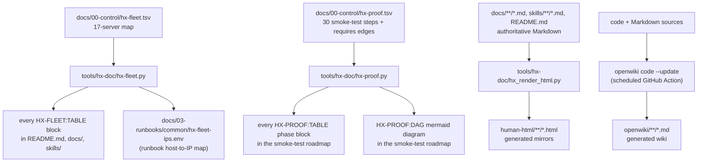
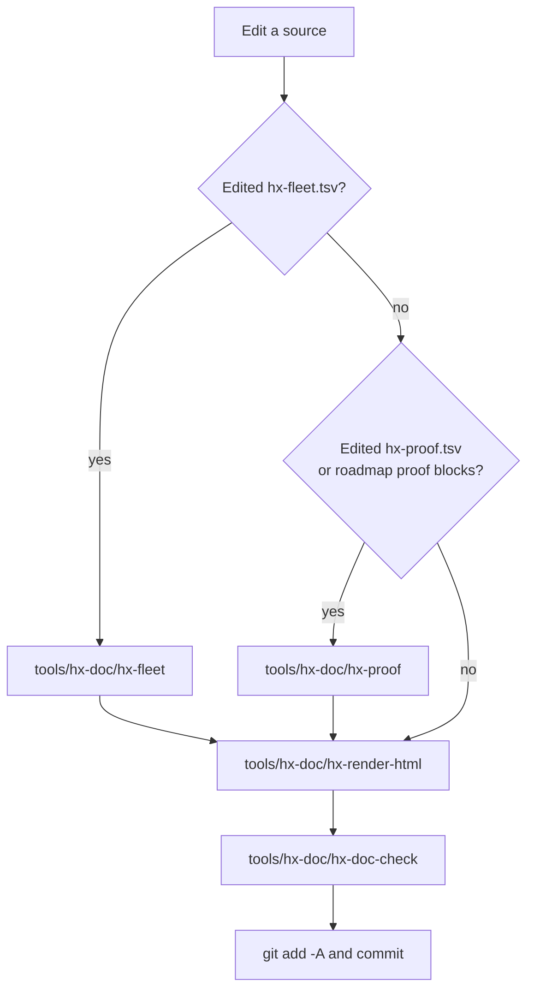

# Refresh Generated Documentation

The HX Eco-System repository treats a written rule as something that must **fail loudly**, and a large part of that is the rule that **derived documentation is generated, not hand-typed**. Several derived artifacts used to be maintained by hand — six copies of the server table, a hand-drawn dependency diagram, and prose HTML mirrors — and every one of them drifted from its source the day after it was written. This page documents the pipeline that keeps those artifacts in sync with their sources: the source-to-generated relationships, the opt-in marker syntax, the standard regeneration sequence before a commit, the `--check` modes CI runs, the supersede/archive procedure for replacing a document, and the constraints that keep exactly one current version active.

The individual tools are documented in [/openwiki/operations/hx-doc-tooling.md](/openwiki/operations/hx-doc-tooling.md); this page is the *workflow* an editor follows when touching a source and refreshing everything that depends on it.

## 1. Source-to-generated relationships

Three pipelines produce derived output. Each has one authoritative source and one generator, and every generated artifact is a pure function of its source:


*The three generator pipelines (fleet, proof, HTML) plus the scheduled OpenWiki regeneration. Each arrow is a pure source-to-output mapping.*

### Fleet: `hx-fleet.tsv` → tables + IP map

`docs/00-control/hx-fleet.tsv` holds the 17-server map with columns `id`, `ip`, `role`, `state`, `gate`, `note`. Edit it, then run `tools/hx-doc/hx-fleet`. The generator regenerates **every marked `HX-FLEET:TABLE` block** across `README.md`, `docs/`, and `skills/`, plus `docs/03-runbooks/common/hx-fleet-ips.env` — a generated shell function (`hx_ip_for()`) that the runbooks `source` for the host → IP lookup, so the runbooks carry no private copy of the IP map. `tools/` is deliberately excluded from the table scan: its README documents the marker syntax and must not have a live table injected into the example.

### Proof: `hx-proof.tsv` → phase tables + DAG

`docs/00-control/hx-proof.tsv` holds the 30 smoke-test steps (foundation `P0` plus phases A–G) and the `requires` edges between them. Edit it, then run `tools/hx-doc/hx-proof`. The generator regenerates **every marked `HX-PROOF:TABLE phase=X` block** and the **`HX-PROOF:DAG` mermaid flowchart** in `docs/00-control/HX-ECO-SYSTEM-SMOKE-TEST-ROADMAP.md`. The hand-maintained diagram it replaced carried 19 nodes against 30 TSV rows — 11 steps were missing, including every MCP companion gate, both Web UI gates, and the reranker. The TSV is now the source; the tables and the diagram cannot disagree because they are generated from the same rows. The same DAG is enforced at promote time by `hx-smoke-promote`, which refuses a PASS whose required prior step has not passed and been cited.

### HTML mirrors: Markdown → `human-html/`

`docs/**/*.md`, `skills/**/*.md`, and `README.md` are the authoritative sources. `tools/hx-doc/hx-render-html` generates the `human-html/` mirrors from them, implementing a minimal CommonMark/GFM subset in the standard library, rewriting `.md` link targets to `.html` so mirror-to-mirror links keep working, and stamping each page with a banner stating the Markdown source is authoritative and the page is not execution authority. The mirrors were once hand-written summaries that drifted; they are now generated so a mirror cannot silently lose content its source contains.

### OpenWiki: code + Markdown → `openwiki/`

`openwiki/` is also generated output. The `openwiki-update.yml` GitHub Action runs `openwiki code --update` weekly (Sunday 08:00 UTC) or on manual dispatch, using a pinned OpenWiki plus pinned `mermaid` and `jsdom` for strict diagram validation, and opens a pull request scoped to `add-paths: openwiki`. Do not hand-edit generated OpenWiki pages unless explicitly asked; prefer updating the source and letting OpenWiki regenerate. `hx-doc-check` already treats `openwiki/` as a skip tree (like `human-html/`), so findings there are not raised against the repository.

## 2. Marker opt-in syntax

A document opts in to fleet generation by carrying a marker pair. The generator replaces only the content between the markers:

```text
<!-- HX-FLEET:TABLE columns=id,ip,role,state -->
...generated table...
<!-- /HX-FLEET:TABLE -->
```

The `columns=` attribute selects which TSV columns appear and in what order; valid column names are `id`, `ip`, `role`, `state`, `gate`, `note`. The `state` and `gate` columns render bold; `ip` renders as code. An unknown column name is rejected as drift (it once fell through to a heading of its own name and a row of em dashes that matched itself).

Proof generation uses an analogous pair, with the phase (or `DAG`) named in the opening marker:

```text
<!-- HX-PROOF:TABLE phase=B -->
...generated phase table...
<!-- /HX-PROOF -->
```

```text
<!-- HX-PROOF:DAG -->
...generated mermaid flowchart...
<!-- /HX-PROOF -->
```

Both generators require the **full marker set** to be present and self-consistent. An unclosed opening marker matches nothing and leaves the text unchanged, which used to read as "current"; an orphan closing marker is the same defect from the other end. The fleet tool counts opening markers, closing markers, and complete pairs and requires all three to agree. The proof tool counts (not collects) the phase markers, because a duplicated table reduced a set to one value and reported no drift. A missing or repeated marker is therefore drift in itself, independent of the table content.

## 3. The standard regeneration sequence

Before committing a documentation change, regenerate anything derived and check it. The canonical sequence, from `AGENTS.md` section 13:

```bash
tools/hx-doc/hx-fleet && tools/hx-doc/hx-render-html && tools/hx-doc/hx-doc-check
```

Run `hx-fleet` after editing `hx-fleet.tsv`; run `hx-render-html` after editing any Markdown (it re-renders only the mirrors whose sources changed); run `hx-doc-check` before every commit to confirm links resolve, vocabulary is defined, control frontmatter is complete, filenames are stable, and evidence is committable. For smoke-roadmap edits — anything touching `hx-proof.tsv` or the roadmap's proof blocks — also run:

```bash
tools/hx-doc/hx-proof
```


*The regeneration sequence run before committing. Fleet and proof generators run only when their source changed; the HTML render and doc-check always run.*

`hx-doc-check` is not itself a generator — it does not rewrite files — but it is the consistency gate that catches a doc edit the other tools do not regenerate, such as a broken internal link or a duplicated filename.

## 4. `--check` mode and the CI gates

Every generator has a `--check` mode that **writes nothing** and exits non-zero if a generated block is stale relative to its source. This is how CI catches a doc edit that forgot to regenerate: a contributor changes the TSV or the Markdown but not the derived table or mirror, and the `--check` run reports it as drift rather than silently accepting it.

- `hx-fleet --check` — exits 1 if any `HX-FLEET:TABLE` block or `hx-fleet-ips.env` does not match `hx-fleet.tsv`, and reports `STALE <path>` for each.
- `hx-proof --check` — validates the DAG (dangling `requires`, cycles, missing authority files, unknown hosts, unrecognised statuses, blank/duplicate ids) and exits 1 if any `HX-PROOF` block does not match `hx-proof.tsv`.
- `hx-render-html --check` — exits 1 if any mirror is out of date with its source, and also reports `ORPHAN <path>` for any `human-html/*.html` that has no corresponding source (a deleted Markdown file whose mirror was left behind).
- `hx-doc-check` — exits 1 on any failed check; it has no `--check` flag because it is already read-only.

CI runs these on every pull request (and every push to `main`) in `.github/workflows/hx-checks.yml`, in the `documentation` job, in order:

```text
hx-doc-check → hx-fleet --check → hx-proof --check → hx-render-html --check → hx-record-check → hx-smoke-lint --quiet → hx-gate-tests
```

A failing gate breaks the build, so a stale generated artifact cannot merge. After them, `hx-gate-tests` proves each gate above still *fails* on the case it guards — the meta-check against a gate that quietly stops catching anything. The `scripts` job adds `shellcheck`, a CRLF/executable-bit check, and a Python compile, and the `secrets` job runs a pinned gitleaks scan. So the full set a documentation PR must pass is: `hx-doc-check`, `hx-fleet --check`, `hx-proof --check`, `hx-render-html --check`, `hx-record-check`, `hx-smoke-lint`, plus the scripts and secrets jobs.

## 5. Superseding a document

When an active document needs to be replaced rather than edited in place, the repository's document-control standard requires the old version be archived under `archive/<today>/` and exactly one active copy kept. `tools/hx-doc/hx-doc-supersede` performs that procedure in one command so it happens the same way every time (the history shows six commits spent archiving a single README by hand):

```bash
tools/hx-doc/hx-doc-supersede docs/00-control/DECISIONS.md --suffix pre-d019
```

The tool:

1. creates `archive/<today>/<same-path>/` (preserving the document's directory layout under the archive root);
2. copies the current Markdown there, named `<stem>-<suffix>.md`;
3. archives the matching `human-html/` mirror, if one is committed, under the same dated archive path with the same suffix;
4. **leaves the active file untouched** in place for you to edit; and
5. prints a reminder to re-render and check: run `tools/hx-doc/hx-render-html` then `tools/hx-doc/hx-doc-check`, and commit the edit and the archive copy together in one commit.

Add `--dry-run` first to see exactly what it would archive without writing anything. The tool refuses to operate on a path under `archive/` or `human-html/` (those are history or generated output, not active documents), refuses a path outside the repository, and refuses a suffix that would collide with an already-archived file. The mirror mapping it uses is the same layout `hx-render-html` writes: `docs/.../*.md` → `human-html/.../*.html`, `skills/*.md` → `human-html/skills/*.html`, `README.md` → `human-html/README.html`.

`hx-doc-check`'s duplicate check enforces the other half of the standard: it refuses any active Markdown whose filename contains a version marker, date stamp, `(1)`, or `final-final` style suffix — active documents use stable names, and superseded versions live only under `archive/`.

## 6. Constraints and invariants

- **Never hand-edit `human-html/`.** Edit the Markdown source and run `tools/hx-doc/hx-render-html`. A change to a mirror without the matching source changing is itself the finding (both in CodeRabbit review and in `--check`). The mirrors are not execution authority.
- **`openwiki/` is generated output.** Do not hand-edit generated OpenWiki pages unless explicitly asked; prefer updating the source and letting OpenWiki regenerate. It is a skip tree for `hx-doc-check`.
- **Only one current version stays active.** Superseded versions go to `archive/<today>/`. Stable active filenames are mandatory; no duplicate active documents with timestamps, `(1)`, `final-final`, or model-name prefixes.
- **No third-party dependencies.** Every generator is Python 3 standard library only, so the gates run on a bare CI runner and a lab machine alike.
- **A check that cannot fail is a defect.** `hx-gate-tests` breaks each gate on purpose and requires a non-zero exit; if a gate stops catching its case, that is a bug in the gate, not something to weaken.
- **`main` is not a working branch.** Every change — including a regenerated artifact — goes through a pull request so CodeRabbit reviews it. Regenerate, commit, review locally (`coderabbit review --agent`), then push and open the PR.

## 7. Relationships to other pages

- The thirteen `hx-doc` tools, their per-tool enforcement and failure modes, are documented in [/openwiki/operations/hx-doc-tooling.md](/openwiki/operations/hx-doc-tooling.md).
- The CI workflows, CodeRabbit configuration, gate-tests, and the OpenWiki update workflow (D-023) are covered in [/openwiki/integrations/ci-and-review.md](/openwiki/integrations/ci-and-review.md).
- The fleet source, its columns, and the build-state progression are in [/openwiki/architecture/server-fleet-and-states.md](/openwiki/architecture/server-fleet-and-states.md).
- The truth order and the one-active-version document-control standard that the supersede procedure serves are in [/openwiki/concepts/truth-order-and-authority.md](/openwiki/concepts/truth-order-and-authority.md).
