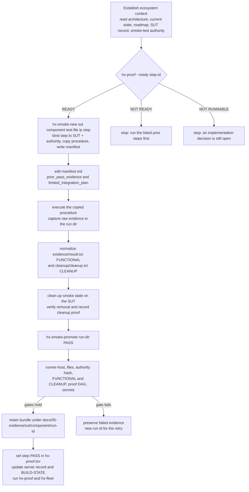

# Workflow — Run a Smoke Test

A smoke test is not "turn it on and see." It is a known-answer proof of one
component's primary contract, executed from HX-5 CentCom against a system under
test (SUT), recorded as evidence, and closed only when the cumulative-proof and
cleanup gates hold. This page is the end-to-end control flow an agent follows
during the smoke phase: establish ecosystem context, ask the proof DAG whether
the step may run, create a disposable run with `hx-smoke-new`, execute the copied
authority, normalize the result and cleanup evidence, promote with
`hx-smoke-promote`, retain the bundle under `docs/05-evidence/`, and close the
server record and proof step.

The governing rule is strictly serial and cumulative:

```text
one proof step
→ establish ecosystem context
→ ask the proof DAG if the step may run
→ create a disposable run
→ fill the proof-chain manifest
→ execute the copied procedure
→ capture and normalize evidence
→ clean up and verify cleanup
→ promote reviewed evidence
→ close the server record and proof step
→ move to the next step
```

A step is not closed until its functional and cleanup gates pass **and** its
proof-DAG dependency chain is satisfied and cited. There is no bypass flag:
`hx-smoke-promote` re-derives the dependency set from `hx-proof.tsv` at
promotion time, the same logic `hx-proof --ready` reports before the run.

## The smoke-run flow



*Figure: the smoke-run flow from ecosystem context through the proof-readiness
gate, run creation, evidence normalization, the promotion gates, and retained
evidence to server-record and proof-step closure.*

## 1. Establish ecosystem context

The runner is a validation layer on top of the ecosystem architecture. It does
not define server roles, network design, model placement, or permanent
integration — those must already be established before validation. Read, in
order: the architecture orientation, current state, `BUILD-STATE`, decisions,
base implementation priority, the SUT server record and runbook, the applicable
application/model standard, the smoke-test roadmap, the smoke-testing operating
model, the HX-5 process/procedures standard, the HX-5 CentCom toolset standard,
and finally the exact `smoke-tests/<component>-smoke-test.md` authority. Do not
use archive material or rendered HTML as execution authority.

Before starting a run, the agent must be able to state:

```text
SUT host + target IP
component role
current build state
architectural layer
applicable domain/network/deployment baseline
required dependencies
validation-only dependencies
BASE PASS boundary
required prior PASS evidence
```

If any of those is unclear, **stop** and resolve ecosystem context before
validation — do not improvise. The smoke roadmap does not authorize a test
before the deployment roadmap has installed and prepared the SUT, and the runner
deliberately does not infer dependencies the roadmap does not declare.

## 2. Check the proof-readiness gate

Before touching the SUT, confirm the step may run at all:

```bash
tools/hx-doc/hx-proof --ready <id>
```

`hx_proof.py` answers one of three ways:

- `READY — every required prior proof has passed.` — go. Every step in the
  step's `requires` column is `PASS`, and the step itself is not blocked.
- `NOT READY — these must pass first:` followed by the blocking steps — the
  remedy is to run those steps, not to change any pin. An already-`PASS` step
  reports `ALREADY PASSED` rather than `READY`, so a re-run cannot overwrite
  accepted evidence.
- `NOT RUNNABLE — status is NOT_EXECUTABLE; an implementation decision is still
  open.` — dependencies are not the blocker; an owner decision is.

`hx-smoke-promote` enforces the same DAG at promotion time, so a `NOT READY`
result here is not advisory — the run will be refused later. There is no bypass
flag. This is the second of three questions the run sheet keeps separate:

| Question | Ask |
|---|---|
| Where is the code | graft |
| May this step run | `tools/hx-doc/hx-proof --ready <id>` |
| What must it prove | the `smoke-tests/` authority — read it |

## 3. Create the run with hx-smoke-new

From HX-5 (or an authorized operator station for pre-CentCom steps — see
§Runner-host gate), create a disposable run:

```bash
hx-smoke-doctor
RUN_DIR="$(hx-smoke-new <sut-host> <component> <smoke-test-file> [sut-ip] [proof-step])"
cd "$RUN_DIR"
```

`hx-smoke-new` validates its arguments strictly (`sut-host` matches
`^hx-[0-9]+$`; `component` is a lowercase slug; the smoke-test file is a simple
`.md` filename) and refuses to start from an untracked or locally modified
authority: the file must be committed, have no uncommitted working-tree changes,
and no staged-but-uncommitted changes. This prevents an agent from quietly
changing acceptance criteria during a run.

### Proof-step resolution and binding

The proof step (e.g. `B1`, `D3`) is the run's identity in the cumulative-proof
DAG. When omitted, `hx-smoke-new` looks in `docs/00-control/hx-proof.tsv` for
rows whose SUT host and authority match exactly: **exactly one** match derives
the step automatically; **zero** matches error out; **multiple** matches
(several steps share one companion authority, e.g. `mcp-companion-smoke-test.md`)
require the id passed explicitly as the fifth argument. Whether derived or
explicit, the step is **bound** to the run: the id must exist in the TSV and its
row must belong to this SUT host and this authority. An explicit id for another
host or authority is refused, because `hx-smoke-promote` would otherwise enforce
that wrong step's dependency set.

### The manifest contract

`hx-smoke-new` creates a `manifest.md` whose frontmatter records the run. The
fields the proof-chain and promotion gates depend on are:

```text
run_id: <UTC timestamp>_<sut-host>_<component>
sut_host: <hx-N>
component: <slug>
proof_step: <derived from hx-proof.tsv or explicit; NONE only if no TSV>
smoke_test_sha256: <sha256 of the authority file; recorded to detect in-run authority drift>
prior_pass_evidence: TO_RECORD
limited_integration_plan: TO_RECORD
```

The two `TO_RECORD` fields are the **proof-chain contract** and must be resolved
before promotion:

- **`prior_pass_evidence`** — one entry per step this step requires, written as
  `<step-id> -> <evidence>`, separated by `;`, on **one line**. Use `NONE` when
  nothing is required. `hx-smoke-promote` reads the inline value only; it refuses
  a bare list of paths because a path alone does not say which dependency it
  proves, and it refuses the indented multi-line form the roadmap once
  documented because `sed` never read it.
- **`limited_integration_plan`** — a brief description of the temporary live
  dependency/wiring used for proof, or `NONE` when the test is standalone. It
  must not create a new permanent architecture dependency.

For dependent tests, record the exact current retained evidence path(s) or
accepted server record(s) the roadmap requires. Do not use archive material as
current proof. If a dependency changed materially after its recorded PASS (model
or dimension change, vector-store/API change, SUT rebuild, material config
replacement), revalidate it before relying on that evidence downstream.

Example, exactly as the manifest header documents it:

```text
prior_pass_evidence: B5 -> docs/05-evidence/hx-10/qdrant/<run-id>; A2 -> docs/02-server-records/HX-4.md
limited_integration_plan: NONE
```

### Seeded result and cleanup files

`hx-smoke-new` also seeds `evidence/result.txt`
(`FUNCTIONAL=IN_PROGRESS`) and `cleanup/cleanup.txt`
(`CLEANUP=IN_PROGRESS`). After execution the operator normalizes them to the
forms `hx-smoke-promote` reads:

```text
# evidence/result.txt
FUNCTIONAL=PASS|FAIL|NOT_EXECUTABLE
STATUS=<same as final>
SUMMARY=<what happened>
```

```text
# cleanup/cleanup.txt
CLEANUP=PASS|NOT_APPLICABLE|FAIL
DETAIL=<what was torn down and verified>
```

## 4. Execute the copied procedure and capture evidence

Use the copy in `procedure/` as the acceptance authority for this run — do not
edit it to make a failing test pass, and do not alter the authoritative
`smoke-tests/` file during an in-progress run (the recorded `smoke_test_sha256`
would no longer match). Execute exactly enough to prove the component's defined
contract with a known answer: process health alone is not a functional PASS.

Prefer remote surfaces from HX-5: HTTP/REST/gRPC endpoints, native database
clients (`psql`, `redis-cli`), MCP client calls, or a direct-LAN browser proof.
SSH execution on the SUT is an exception, used only when local execution is
intrinsic to the product. Do not copy general test scripts, Python virtual
environments, fixtures, or evidence bundles onto the SUT; keep all of that in
the disposable run workspace. Use only synthetic/disposable test data and
clearly smoke-namespaced server-side objects (`hx_smoke_*` or the exact name the
component authority defines).

Capture the smallest evidence set that proves what happened: UTC timestamp,
runner identity, SUT hostname/IP, application version/revision, endpoint used,
command identity, known-answer input, the relevant response, explicit PASS/FAIL
marker, temporary object names, and cleanup result. Redirect stdout/stderr into
`raw/` while preserving an operator-readable console result. Never record
passwords, PATs, API keys, private keys, bearer tokens, or other secrets in the
manifest or retained output; redact accidental secret output before promotion
while preserving the functional result.

For Web UI proof, use `hx-smoke-ui-capture` against the application's direct LAN
UI, waiting for the expected live-state text before taking the full-page
screenshot. A page title, HTTP 200, or generic login page is insufficient when
the component requires proof of live backend state.

## 5. Clean up and verify cleanup

Run the exact teardown defined by the component smoke-test file — drop temporary
PostgreSQL objects, delete Redis smoke keys, delete Qdrant smoke collections,
remove temporary routes/connections/workflows, delete disposable agent projects.
Do not delete or alter anything the smoke test did not create. If cleanup would
risk deleting non-smoke data, **stop** and report.

Cleanup is not assumed from a successful delete command. Query the SUT again and
prove the smoke object is gone; record the verification in `cleanup/` and the
final evidence summary. If cleanup cannot be verified:

```text
FUNCTIONAL TEST = PASS
CLEANUP GATE    = FAIL
OVERALL STATUS  = FAIL / INCOMPLETE
```

A functional success with failed or unverified cleanup is **not** a complete
PASS. Do not close BASE PASS until the validation-only residue is resolved or
explicitly approved to remain.

## 6. Promote with hx-smoke-promote

After the result and cleanup files are normalized:

```bash
hx-smoke-promote "$RUN_DIR" PASS
```

`hx-smoke-promote <run-dir> <PASS|FAIL|NOT_EXECUTABLE>` is the gatekeeper. The
status vocabulary is exactly `PASS`, `FAIL`, `NOT_EXECUTABLE`; `NOT_EXECUTABLE`
is translated in narrative evidence as `NOT EXECUTABLE — PREREQUISITE OR OWNER
DECISION REQUIRED`. It never auto-commits.

### Common gates (all statuses)

1. **Runner-host gate** — `hx-5` or `HX_SMOKE_ALLOW_HOST`.
2. **Run directory inside `HX_SMOKE_ROOT`** — a path outside it is refused.
3. **Required files present** — `manifest.md`, `evidence/result.txt`, and
   `cleanup/cleanup.txt` must exist; `HX_ECO_REPO` must be a git checkout.
4. **Manifest identity** — `run_id`, `sut_host`, and `component` present and
   non-empty.
5. **Authority-drift detection** — re-hashes the procedure copy and refuses
   promotion if it does not match the recorded `smoke_test_sha256`. If the
   authority drifted, the run is rejected: correct the authority in a separate
   committed change, then start a new run id.

### Promotion gates for PASS

For `PASS`, promotion additionally requires:

6. **`FUNCTIONAL=PASS`** in `result.txt`.
7. **`CLEANUP=PASS` or `CLEANUP=NOT_APPLICABLE`** in `cleanup.txt`.
8. **`prior_pass_evidence` recorded** — non-empty and not `TO_RECORD` (`NONE`
   is valid when genuinely not applicable).
9. **`limited_integration_plan` recorded** — non-empty and not `TO_RECORD`
   (`NONE` is valid).
10. **`proof_step` present and bound** — when `hx-proof.tsv` exists, the
    manifest must name a proof step (not `NONE`); it must exist in the TSV and
    its row must belong to this SUT host and authority. `hx-smoke-promote`
    re-binds the step itself rather than trusting the manifest field.
11. **Step not `NOT_EXECUTABLE`** — a step whose TSV status is `NOT_EXECUTABLE`
    cannot hold a PASS; an implementation decision is still open.
12. **Every required prior step is `PASS` and cited** — for each step in the
    step's `requires` column, the dependency's TSV status must be `PASS` and
    `prior_pass_evidence` must contain a matching `<dep> -> <evidence>` entry.
    This replaces the old honour-system check, which only verified
    `prior_pass_evidence` was non-empty.
13. **Component identity fields recorded** — `component_version_or_revision`,
    `transport_or_endpoint`, and `sut_ip` must each be recorded (not
    `TO_RECORD`), so every retained run identifies the component version, the
    SUT, and the transport used.

### Secret screening and retention

After the status-specific gates pass, the helper scans `manifest.md`, the
`evidence/` tree, and the `cleanup/` tree (excluding images) for obvious
credential patterns — GitHub tokens, private keys, `Authorization: Bearer/Basic`,
AWS keys, Slack tokens, `sk-` keys, and `PASSWORD/SECRET/API_KEY/TOKEN`
assignments — and refuses promotion if any are found.

It then stamps the final status and UTC end time into the manifest and
`result.txt`, and copies the normalized bundle — `manifest.md`, `result.txt`,
`cleanup.txt`, and any `evidence/supporting/*` captures — to:

```text
docs/05-evidence/<sut>/<component>/<run-id>/
```

It refuses to overwrite an existing destination, so a retry can never silently
overwrite a failed run. A generated `README.md` summarizes the run, final
status, prior PASS evidence, and limited-integration plan, and notes that the
bundle must be reviewed before committing. The script prints `PROMOTED=<dest>`
and, for a PASS with a real proof step, advises setting that step's status to
`PASS` in `hx-proof.tsv` and running `tools/hx-doc/hx-proof`.

## 7. The two evidence shapes

HX has two evidence shapes; both are current. Use the one that matches when the
proof was taken.

- **Inline record evidence — HX-1, HX-2, HX-3.** These servers closed before the
  CentCom runner existed. Their proof is recorded inside the relevant record
  under `docs/02-server-records/` as exact commands and exact responses. This
  is accepted evidence; `hx-smoke-promote` accepts an accepted server record as
  `prior_pass_evidence`, which is why the inline-record evidence for HX-1–HX-3
  can be cited by later steps. Do not retrofit these into run bundles.
- **Run-bundle evidence — everything from HX-4 onward.** Created by
  `hx-smoke-new`, promoted by `hx-smoke-promote`, retained under
  `docs/05-evidence/<server>/<component>/<run-id>/` containing `manifest.md`,
  `result.txt`, `cleanup.txt`, and supporting captures as required.

Every retained run must identify the runner host, SUT, component/version or
revision, smoke-test authority file, repository commit, known-answer input,
PASS/FAIL determination, cleanup result and verification, and reboot-persistence
result when applicable. **Failed evidence is not overwritten** by a later PASS;
a retry receives a new run id. Secret values must not appear in retained
evidence.

## 8. Runner-host gate and pre-CentCom runs

`hx-smoke-new` and `hx-smoke-promote` run on **HX-5 CentCom** (decision D-014).
Each carries an identical runner-host gate as its first action: execution is
refused unless `hostname -s` equals `hx-5` or the host named by
`HX_SMOKE_ALLOW_HOST`, and the station actually used is recorded as
`runner_host` in the manifest so a pre-CentCom run is distinguishable from a
CentCom run in retained evidence.

For pre-CentCom roadmap steps A1–A4 (which prove HX-4 and HX-5 themselves before
CentCom is activated at A5), there is no HX-5 station yet, so an operator station
is authorized explicitly:

```bash
export HX_SMOKE_ALLOW_HOST="$(hostname -s)"
export HX_ECO_REPO=~/src/HX-Eco-System
hx-smoke-new hx-4 ollama-inference ollama-inference-smoke-test.md 192.168.50.204
```

After A5 passes, HX-5 is the station and these variables are not set. Clear them
in the shell that ran the pre-CentCom steps so a later run cannot pick up an
authorization that no longer applies:

```bash
unset HX_SMOKE_ALLOW_HOST HX_ECO_REPO
```

## 9. Stop conditions

Stop and report instead of improvising when:

- ecosystem architecture/ownership for the SUT is unclear;
- the smoke roadmap requires prior PASS evidence that does not exist or is
  stale;
- current live behavior contradicts the architecture, server record, or
  smoke-test authority;
- the required model/checkpoint/runtime is still TBD;
- a test would require permanent integration not yet approved;
- the test would require copying a general harness onto the SUT;
- cleanup would risk deleting non-smoke data;
- a required credential is unavailable;
- a proposed workaround changes network/security/storage architecture.

A prerequisite gap is not silently converted into `FAIL` if the test is not
executable by design; it is `NOT_EXECUTABLE — PREREQUISITE OR OWNER DECISION
REQUIRED`. On failure, preserve the failed run's evidence before changing the
SUT, identify the failure category, correct only that issue, and create a **new
run id** for the retry.

## 10. Close the server record and proof step

Only after evidence is promoted and reviewed:

```bash
$EDITOR docs/02-server-records/HX-<N>.md      # fill every section
$EDITOR docs/00-control/hx-fleet.tsv           # state -> PASS, gate -> CLOSED
$EDITOR docs/00-control/hx-proof.tsv           # set the step status -> PASS
tools/hx-doc/hx-proof                          # regenerate the roadmap tables and DAG
tools/hx-doc/hx-fleet                          # regenerate the fleet tables
```

Closure requires SUT base/service health, required prior PASS evidence resolved,
the component smoke test from HX-5, the companion MCP/UI gate where assigned,
cleanup and cleanup verification, reboot-persistence proof, retained evidence,
and the server record / `BUILD-STATE` update — together that equals BASE PASS /
CLOSED. The procedure standardizes **how** HX proves components; the smoke
roadmap defines **when** a test may run; the files under `smoke-tests/` remain
the authority for **what** each component must prove.

At the end of the day, confirm nothing has drifted:

```bash
tools/hx-doc/hx-doc-check
tools/hx-doc/hx-record-check
tools/hx-doc/hx-fleet --check
tools/hx-doc/hx-proof --check
git status
```

## Related pages

- [/openwiki/operations/smoke-runner.md](../operations/smoke-runner.md) — the
  `hx-smoke-runner` helpers, their gates, and the disposable-workspace model.
- [/openwiki/testing/proof-dag-and-evidence.md](../testing/proof-dag-and-evidence.md)
  — the proof DAG in `hx-proof.tsv`, cumulative proof, and the closure gates.
- [/openwiki/testing/smoke-test-authorities.md](../testing/smoke-test-authorities.md)
  — the per-component `smoke-tests/*.md` acceptance procedures and the known-answer model.
- [/openwiki/workflows/build-a-server.md](build-a-server.md) — the build-day
  workflow that precedes the smoke phase.
