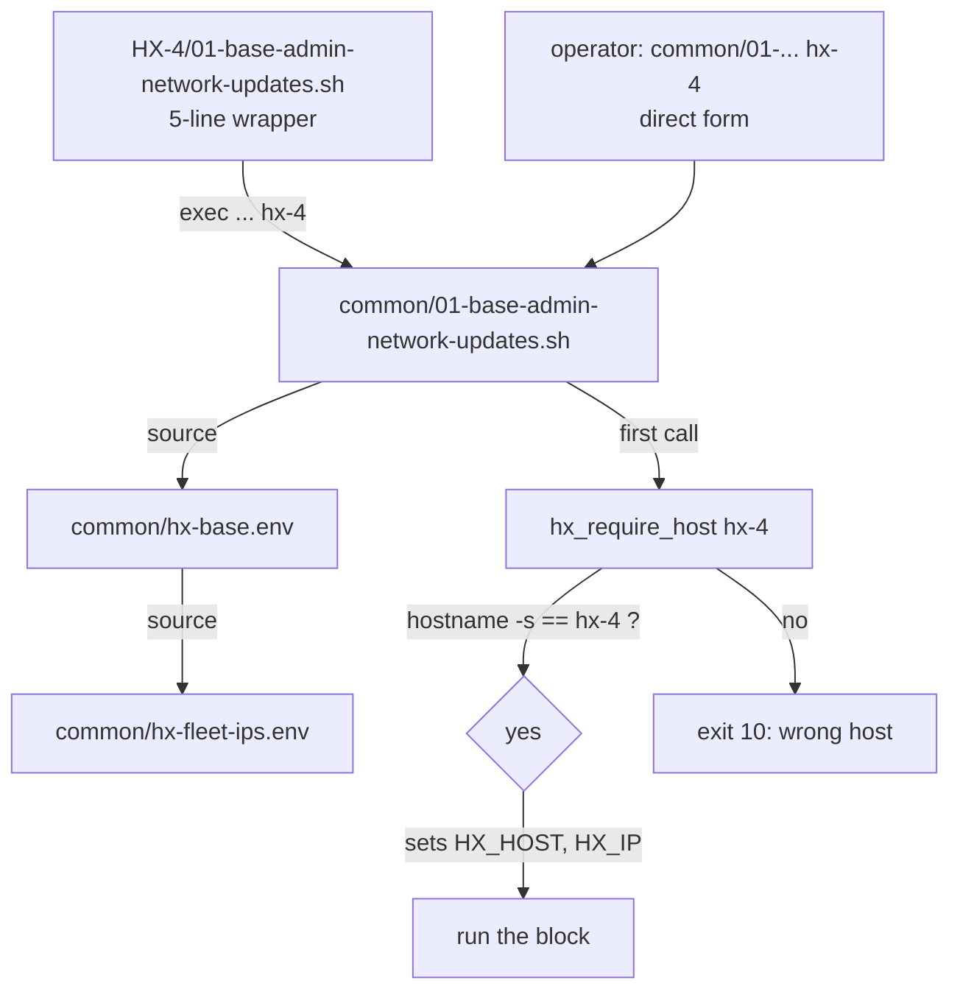

# Runbook Delegation Pattern

The HX runbooks are built so that **every server runs the same shared implementation**, and the only thing that varies is the host name passed to it. A per-host runbook directory (`docs/03-runbooks/HX-N/`) holds five-line wrappers that `exec` into the shared block under `docs/03-runbooks/common/`, passing the host name as the sole argument. The shared block sources `hx-base.env` for its pins and fleet facts, sources `hx-app-lib.sh` for its helpers, and the very first thing it does is call `hx_require_host` — which refuses to run on any server whose hostname does not match the argument. That guard is the single mechanism that stops an operator from running HX-4's block on HX-5.

This page is context. The runbooks themselves and `AGENTS.md` are authority.

## Layout

```text
docs/03-runbooks/
├── common/                  one implementation of every shared block
│   ├── hx-base.env          version pins, LAN facts, host->IP map, host guard, shared helpers
│   ├── hx-fleet-ips.env     generated host->IP lookup, sourced by hx-base.env
│   ├── hx-app-lib.sh        service user, venv, systemd unit, validate, done, Node installer
│   ├── 01-base-admin-network-updates.sh
│   ├── 02-domain-nvidia.sh
│   ├── 03-storage-ollama.sh
│   ├── 04-reranker.sh  05-gpt-oss.sh  06-embeddings.sh
│   ├── 10-<app>.sh          one per application host
│   └── 90-ollama-upgrade.sh
├── HX-4/                    thin wrappers that call common/ with the host name
└── HX-5/                    thin wrappers plus the HX-5-only CentCom bootstrap
```

There is one implementation of each block. The `HX-N/` directories carry no logic of their own.

## The wrapper and the two invocation forms

A wrapper is a fixed shape: set `pipefail`, resolve the sibling `common/` directory, and `exec` the shared block with the host name. The HX-4 wrapper for block 1 is the whole pattern in five lines:

```bash
#!/usr/bin/env bash
# HX-4 wrapper for the common base block. All logic lives in ../common/.
# Pins and the host->IP map are in ../common/hx-base.env.
set -euo pipefail
exec "$(cd -- "$(dirname -- "${BASH_SOURCE[0]}")/../common" && pwd)/01-base-admin-network-updates.sh" hx-4
```

Because the wrapper just forwards the host name, the two invocation forms are exactly equivalent:

```bash
./docs/03-runbooks/HX-4/01-base-admin-network-updates.sh      # via the wrapper
./docs/03-runbooks/common/01-base-admin-network-updates.sh hx-4   # direct, same block
```

Every wrapper in `HX-4/` and `HX-5/` follows this shape; the only difference is the host name argument and which block it forwards to. `HX-5/` additionally contains `04-centcom-smoke-runner-bootstrap.sh`, which is host-specific and not a wrapper.



*The wrapper and the direct call resolve to the same shared block; both reach `hx_require_host` first, which is the only thing that authorizes the block to proceed.*

## The host guard: `hx_require_host`

`hx_require_host` is defined in `hx-base.env` (not `hx-app-lib.sh`) and is the first call in every common block — base blocks and application blocks alike. It compares `hostname -s` against the expected host name and exits `10` on mismatch before anything is touched:

```bash
hx_require_host() {
  local expected="$1"
  local actual; actual="$(hostname -s)"
  [ "$actual" = "$expected" ] || {
    echo "STOP: this block is for $expected but this host is $actual" >&2
    exit 10
  }
  HX_HOST="$expected"
  HX_IP="$(hx_ip_for "$expected")" || {
    echo "STOP: no IP recorded for $expected in docs/00-control/hx-fleet.tsv" >&2
    exit 10
  }
  ...
}
```

A mistyped server name stops the build rather than damaging the wrong server. It also resolves `HX_IP` from the host→IP map, so every block downstream uses the recorded LAN address for listener and health checks rather than re-deriving it. Each common block enforces the argument contract before calling it: `[ $# -eq 1 ] || { echo "Usage: ..." >&2; exit 2; }`.

## `hx-base.env`: pins, facts, and the host guard

`hx-base.env` is the single source of truth for version pins and LAN facts, sourced by every common block. Its header states the operating rule: *"One place to change a version for every server not yet built. Changing a pin here does not retro-change a closed server record."*

It holds:

- **Foundation and LAN baseline** — `HX_DC_IP`, `HX_GATEWAY`, `HX_DOMAIN`, `HX_DOMAIN_TEST_USER`, `HX_LAN_CIDR`. Block 1 asserts the expected IP and gateway against these; PostgreSQL's `pg_hba.conf` reads `HX_LAN_CIDR` rather than repeating the literal.
- **Ollama pins** — `HX_OLLAMA_VERSION` (fleet target, defaulting to what HX-2/HX-3 closed on) and `HX_OLLAMA_ARCHIVE_SHA256` (the hash of the release archive that actually lands on the server).
- **NVIDIA driver pin** — `HX_NVIDIA_BRANCH` and `HX_NVIDIA_PKG_VERSION`. The Ubuntu archive is allowed here and only here for application software, because a driver must match the running kernel ABI.
- **HX-4 model and reranker pins** — `HX_GPT_OSS_MODEL`, `HX_EMBED_PRIMARY_MODEL`/`HX_EMBED_ALT_MODEL` with their dimensions, `HX_RERANKER_*`. These are guarded by `hx_require_pinned_ref`, which rejects `:latest` and bare names.
- **Application pins** — one `HX_<APP>_VERSION` (and usually a `*_SHA256`) per application host, verified 2026-09-10.
- **Service ports** — every application port, all binding `0.0.0.0` to match the Ollama/reranker posture.
- **Shared helpers defined inline** — `hx_require_host`, `hx_fetch_verified`, `hx_ollama_install`, `hx_require_pinned_ref`, `hx_ollama_provenance`.

It sources `hx-fleet-ips.env` for the host→IP map at load time.

### Pin semantics and moving the fleet forward

Pins default to the versions the closed inference servers (HX-2, HX-3) settled on, so a newly built server matches the recorded fleet baseline instead of silently taking whatever shipped that morning. **Block 3 verifies the installed Ollama version against the pin and stops on mismatch** (exit `22`); it also refuses to run at all if `HX_OLLAMA_VERSION` is unset (exit `30`), because *"whatever was current that day is not a baseline a server record can state."*

Moving the fleet forward is a deliberate, three-step act: change the pin in `hx-base.env`, build, then record the resolved version in that server's record. Clearing a pin accepts the current upstream release, but the resolved version must then be recorded in the server record before that server can close. `90-ollama-upgrade.sh` is the in-place upgrade path for already-closed inference servers: it installs the pinned archive, asserts the post-install version equals the pin, and leaves `/srv/ollama` and the storage drop-in alone so models are not re-downloaded.

### `hx_fetch_verified` and checksum enforcement

`hx_fetch_verified <url> <dest> <sha256>` downloads an artifact and refuses it unless its SHA-256 matches the pin, deleting the file on mismatch (exit `30`). It exists because only `10-postgresql.sh` historically verified a download; release assets can be replaced in place, and the vendor Ollama installer streams a 1.4 GB archive straight into `sudo tar` with no checksum. Every binary, tarball, and source archive install now routes through it (PostgreSQL, Redis, Qdrant, NGINX, Ollama). `hx_node_install` performs its own equivalent check against nodejs.org's `SHASUMS256.txt`.

## `hx-fleet-ips.env`: generated, never hand-edited

`hx-fleet-ips.env` is generated from `docs/00-control/hx-fleet.tsv` by `tools/hx-doc/hx-fleet`. It defines `hx_ip_for <host>`, a `case` statement mapping each `hx-N` to its `192.168.50.20N` address. Its header is explicit: *"Do not edit. Change the TSV and re-run the generator."* `hx-base.env` sources it, and `hx_require_host` calls `hx_ip_for` to populate `HX_IP`. To change an IP, edit the TSV and regenerate — never the generated file.

## `hx-app-lib.sh`: the shared application helpers

`hx-app-lib.sh` is sourced by the `10-<app>.sh` blocks (and by `04-reranker.sh`). It is not executable on its own. It provides six helpers that give every application install the same shape: a dedicated system user, a pinned venv, a systemd unit, a start check, a closing note, and a Node installer. Validation throughout is deliberately minimal — *"does the service start, and does it survive a reboot. Nothing else is checked."*

### `hx_app_user`

Creates a dedicated system user with a nologin shell and its home directory, idempotently:

```bash
hx_app_user() {
  local user="$1" home="$2"
  sudo mkdir -p "$home"
  id -u "$user" >/dev/null 2>&1 || \
    sudo useradd --system --home-dir "$home" --shell /usr/sbin/nologin "$user"
  sudo chown -R "$user:$user" "$home"
}
```

### `hx_app_venv`

Builds a venv and installs one pinned PyPI spec into it, running as the service user. It installs `python3-venv` from apt, which is a language runtime, not application software. Extra pip args are forwarded, so a block can pin a transitive dependency (e.g. Crawl4AI pins `playwright` alongside `crawl4ai`).

### `hx_app_unit`

Writes a simple `Type=simple` systemd unit, then `daemon-reload` and `enable --now`. The unit template is fixed: `After=network-online.target`, `Restart=on-failure`, `RestartSec=5`, `TimeoutStartSec=600`, `WantedBy=multi-user.target`. Environment lines are passed as trailing `K=V` arguments. Blocks that need a different unit shape (PostgreSQL uses `Type=notify` and `KillSignal=SIGINT`; NGINX uses `Type=forking` with a PID file) write their own unit file inline and call `systemctl` directly, rather than fighting the helper.

### `hx_app_validate`

Waits up to 60×5 s for a TCP port to answer via `curl`, then asserts `systemctl is-active` and `is-enabled`, and (when a port is given) confirms the listener with `ss`. When no port is given (PostgreSQL, Redis validate via their own CLI afterward), it skips the port wait and just checks the unit state.

### `hx_app_done` — and the `NONE` form for libraries/CLIs

`hx_app_done` prints the closing note every block ends with: what was installed, on which host, the reboot-persistence check to run, and the record/fleet steps that follow. It has two modes:

- **With a unit name** — the fourth argument is an optional endpoint URL, and the reboot check is `systemctl is-active <unit>`.
- **With `NONE`** — the component is a library or CLI with no daemon, and the fourth argument is **required**: the exact command to run after the reboot instead. This form exists because the helper used to take a unit name unconditionally, so the five library/CLI blocks told the operator to run `systemctl is-active hx-<name>` after the reboot — a command that can only fail. With `NONE`, the block prints the real check.

### `hx_node_install`

Installs Node.js from the official nodejs.org binary tarball under `/usr/local`, verifying against the published `SHASUMS256.txt`. Not Snap, not the Ubuntu archive, not NodeSource. It is idempotent: if `node --version` already matches, it returns early. Used by the npm-based application blocks (`10-omniroute.sh`, `10-n8n.sh`).

## The three common base blocks

Every server that is not an inference host runs blocks 1 and 2, then its application block. Inference hosts (HX-2, HX-3, HX-4, HX-5) also run block 3. The run sheet fixes the shape: two reboots, then the application, then validate, then record.

| Block | Purpose | Reboots | Scope |
|---|---|---|---|
| `01-base-admin-network-updates.sh` | Identity, network/DNS validation, admin sudo policy, apt update/upgrade | yes | all hosts |
| `02-domain-nvidia.sh` | Domain join, SSSD, domain user resolution, pinned NVIDIA driver | yes | all hosts |
| `03-storage-ollama.sh` | Domain/GPU/storage re-validation, pinned Ollama, systemd override, listener + API proof | no | inference hosts only |

Block 1 asserts the expected IP, gateway, and DNS against `hx-base.env` values and stops (exit 11/12/13) on mismatch; it installs the `hxsa` NOPASSWD sudo policy and disables the local firewall (D-018: trusted lab segment). Block 2 joins `hx.local.arpa` and installs the pinned `nvidia-driver-<branch>-server-open`, accepting the current archive version only if the pin is cleared. Block 3 requires `/srv/ollama` to be mounted and empty, installs the pinned Ollama via `hx_ollama_install`, writes the storage drop-in (`OLLAMA_MODELS`, `OLLAMA_HOST=0.0.0.0:11434`), and proves the listener on both loopback and the LAN IP — then asserts the installed version equals the pin.

Blocks `04-reranker.sh`, `05-gpt-oss.sh`, and `06-embeddings.sh` are HX-4-specific model blocks that also live in `common/` and follow the same delegation shape; HX-4 runs them in the order 05, 06, then 04 (the reranker's number is historical).

## Application blocks: `10-<app>.sh`

Each application host has one block in `common/`, named `10-<app>.sh`, taking the host name. They are written once and called from the server's runbook directory the same way the base blocks are. Every application comes from PyPI, npm, a GitHub release, an upstream source tarball, a direct binary, or Hugging Face — **never apt for applications, never Snap for anything** (D-020/D-021). The Ubuntu archive is used only for the NVIDIA driver and for build toolchains and library headers (`build-essential`, `libreadline-dev`, `libpcre2-dev`, `python3-venv`, `zstd`, etc.).

| Host | Block | Source |
|---|---|---|
| HX-6 | `10-omniroute.sh` | npm, on Node from the official binary tarball |
| HX-7 | `10-nginx.sh` | nginx.org stable source tarball, built natively |
| HX-8 | `10-open-webui.sh` | PyPI |
| HX-9 | `10-postgresql.sh` | postgresql.org source tarball, hash-verified, built natively |
| HX-9 | `10-redis.sh` | download.redis.io release tarball, built natively |
| HX-10 | `10-qdrant.sh` | prebuilt Linux binary from the GitHub release |
| HX-11 | `10-lightrag.sh` | PyPI |
| HX-12 | `10-deep-agents.sh` | PyPI |
| HX-13 | `10-mem0.sh` | PyPI |
| HX-14 | `10-n8n.sh` | npm, on Node from the official binary tarball |
| HX-15 | `10-fastmcp.sh` | PyPI |
| HX-16 | `10-docling.sh` | PyPI plus Hugging Face for Granite-Docling |
| HX-17 | `10-crawl4ai.sh` | PyPI plus pinned Playwright Chromium |

HX-9 carries two applications (PostgreSQL and Redis); they close separately. The Redis block deliberately uses the `download.redis.io` release tarball rather than the GitHub tag archive, because the tag archive is generated on request and its bytes are not guaranteed stable, so it cannot carry a checksum pin.

## Library/CLI vs daemon distinction

Not every application is a daemon. Docling, Crawl4AI, Deep Agents, FastMCP, and Mem0 are libraries or CLIs: the block installs and proves the runtime, but there is no unit for the core install. These blocks call `hx_app_done NONE`, passing the command that constitutes the reboot-persistence check (e.g. Docling's `docling --version`, Deep Agents' import probe, Crawl4AI's `crawl4ai-doctor`).

The thing that gets a unit — the companion MCP server or a small local service — is a **separate gate**, not part of the base build. This is a deliberate boundary: the base install proves the runtime exists and survives a reboot; the MCP companion is its own closure decision. Mem0 is the edge case: its block installs the library and then stops with `exit 3` and an operator-decision note, because whether Mem0 runs inside the assigned MCP server or behind a small FastAPI service has not been decided — so it refuses to name a unit that nothing creates.

## Validation: starts, and survives a reboot

Validation is the same two questions everywhere, by design: **does it start, and does it survive a reboot.** Nothing more is checked in the base build. `hx_app_validate` answers the first; the reboot-persistence check printed by `hx_app_done` answers the second. The run sheet makes this explicit at step 5: run what the block printed, `sudo reboot`, run it again once the host is back. For library/CLI blocks, the printed command *is* the reboot-persistence check.

This minimalism is a rule, not a gap. Additional checks belong in the smoke-test authority, not in the install block. The blocks do carry targeted guards where a health check would otherwise lie — block 3 asserts the Ollama version, `06-embeddings.sh` proves the embedding *dimension* (a wrong model answers with the wrong vector length, which a health check never catches), Crawl4AI refuses to continue if pip resolved a different Playwright — but the closing validation stays two questions.

## Relationships to other pages

- The build-day flow that drives these blocks in order is documented in [build-day-flow](/openwiki/workflows/build-day-flow.md).
- The proof/readiness gating that controls when a block may run (`hx-proof --ready`) and the smoke authority that defines what a step must prove live in [doc-gates](/openwiki/operations/doc-gates.md).
- Where the resolved version, source URI, and SHA-256 of each install are recorded — and the `UNRESOLVED`-never-blank rule — is covered in [server-records-and-evidence](/openwiki/operations/server-records-and-evidence.md).
- The fleet orientation and host roles are in [ecosystem-orientation](/openwiki/architecture/ecosystem-orientation.md).
