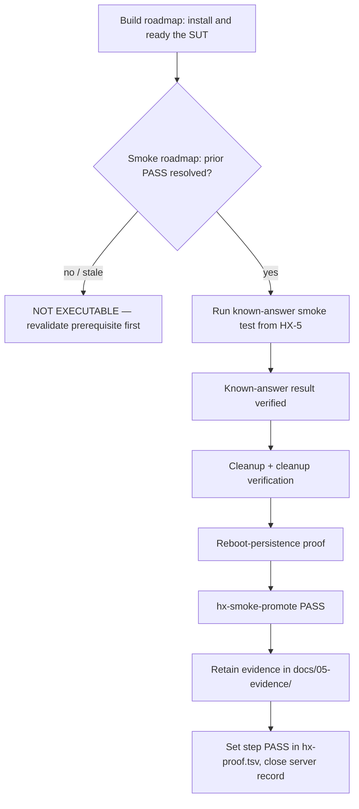
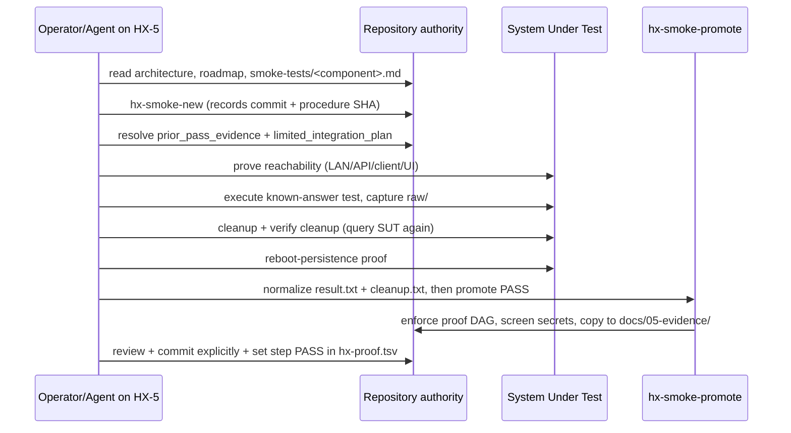

# Smoke-Test Execution Workflow

> This page is **context, not authority**. The smoke authorities live in
> `/smoke-tests/`, the proof order in
> `docs/00-control/HX-ECO-SYSTEM-SMOKE-TEST-ROADMAP.md`, and the validation-layer
> architecture in `docs/01-architecture/HX-SMOKE-TESTING-OPERATING-MODEL.md`.
> Where this page and those authorities disagree, the authorities win and this
> page is a defect to fix.

The HX Eco-System proves each component with a **known-answer** smoke test run
remotely from HX-5 ("CentCom") against the system under test (SUT), then retains
the evidence under `docs/05-evidence/`. This page is the operator/agent's
end-to-end view of how a run is created, executed, gated, cleaned up, and
promoted. It ties together the two-roadmap rule, CentCom activation, the runner
toolset, remote execution patterns, the proof-chain DAG, and cleanup/retention.

## 1. The two-roadmap rule

The ecosystem is governed by **two roadmaps**, and confusing them is the most
common failure mode.

- The **build roadmap** (`docs/00-control/HX-ECO-SYSTEM-BASE-IMPLEMENTATION-PRIORITY.md`)
  defines *what is built and in what deployment order*. It is the authority for
  the SUT's BASE PASS boundary.
- The **smoke roadmap** (`docs/00-control/HX-ECO-SYSTEM-SMOKE-TEST-ROADMAP.md`)
  defines *what is proven and in what proof-dependency order*. It records the
  required prior PASS evidence and the permitted minimal temporary integration
  for each step.

The smoke roadmap **inherits** the build roadmap. It never authorizes a test
before the build roadmap has installed and prepared the SUT. A failed or
not-yet-installed prerequisite makes a downstream step
`NOT EXECUTABLE — PREREQUISITE OR OWNER DECISION REQUIRED`, not a FAIL and not a
bypass.



The dependency graph itself is generated from `docs/00-control/hx-proof.tsv`
into the roadmap's Phase A–G tables and DAG. Every step (P0 cornerstone, A1–A5,
B1–G1) appears; the `Requires` column is what `hx-smoke-promote` enforces.

## 2. Authority layers

Each authority layer answers exactly one question. No layer silently replaces
another.

| Authority | Question it answers |
|---|---|
| `HX-ECO-SYSTEM-SMOKE-TEST-ROADMAP.md` | **WHICH** proof runs next, and what prior PASS evidence + limited integration it permits |
| `HX-SMOKE-TESTING-OPERATING-MODEL.md` | **HOW** the validation subsystem fits the ecosystem (roles, boundaries, run lifecycle) |
| `/smoke-tests/<component>-smoke-test.md` | **WHAT** this component must prove and how the known-answer test is executed/cleaned |
| `HX-5-SMOKE-TEST-PROCESS-AND-PROCEDURES.md` | **HOW** HX executes, cleans up, and retains a run |
| `HX-5-CENTCOM-SMOKE-RUNNER-TOOLSET-AND-BOOTSTRAP.md` | **WHAT** permanent client toolset and bootstrap live on HX-5 |
| `tools/hx-smoke-runner/` | The repository-owned runner implementation that performs the repeatable operations |

## 3. Ecosystem-first preconditions

Before validating, an agent must be able to state, from the repository alone:
the component's owner server and target IP, role, current build state,
architectural layer, applicable domain/network/deployment baseline, required
dependencies versus validation-only dependencies, the BASE PASS boundary, and
the required prior PASS evidence. If any of those is unclear, stop and resolve
ecosystem context before validation. This is the ecosystem-first rule
(AGENTS.md §4): the smoke roadmap and component procedure execute *after* the
operator has established the SUT's place in the architecture, not in place of
it.

## 4. CentCom activation at A5

The CentCom smoke-runner is not available from the start. It is **activated** as
a proof step (A5) only after HX-5 closes its own base inference foundation
(A4). The operating-model activation sequence is:

```text
HX-5 base/domain/GPU accepted
  AND Ollama + Ornith PASS
  AND HX-5 reboot persistence PASS
  AND CentCom client toolset/bootstrap complete
  AND hx-smoke-doctor PASS
  AND remote known-good HX-2 activation probe PASS
  = CENTCOM SMOKE-RUNNER ACTIVE
```

After A5 closes, **HX-5 is the standard remote execution station**. Subsequent
smoke tests run from HX-5 over LAN/API/protocol/native-client/UI. Approved SSH
to the SUT is an **exception**, used only when local execution is intrinsic to
the component's primary contract (e.g. a product whose contract cannot be proven
over a remote interface). DeepSeek Harness is *not* a prerequisite for CentCom
activation — its smoke test (C3) is a later HX-5 workload gate.

The activation probe is `hx-smoke-doctor --remote`, which makes one known-answer
call to the already-proven HX-2 Ollama endpoint and requires the exact response
`HX-CENTCOM-RUNNER-PASS`.

## 5. Pre-CentCom runs (A1–A4)

Steps A1–A4 prove HX-4 and HX-5 *before* CentCom exists, so there is no HX-5
station to run the tooling from yet. Instead, run the runner from the operator
station by authorizing it explicitly:

```bash
export HX_SMOKE_ALLOW_HOST="$(hostname -s)"
export HX_ECO_REPO=~/src/HX-Eco-System
hx-smoke-new hx-4 ollama-inference ollama-inference-smoke-test.md 192.168.50.204
```

The station actually used is written to `runner_host` in the manifest, so a
pre-CentCom run (e.g. `runner_host: operator-laptop`) is distinguishable from a
CentCom run (`runner_host: hx-5`) in the retained evidence.

After A5 passes, HX-5 is the station and these variables must **not** be set.
Clear them in the shell that ran the pre-CentCom steps so a later run cannot
pick up stale authorization:

```bash
unset HX_SMOKE_ALLOW_HOST HX_ECO_REPO
```

## 6. The runner toolset

The repository-owned helpers live in `tools/hx-smoke-runner/`. Four of them —
`hx-smoke-doctor`, `hx-smoke-new`, `hx-smoke-promote`, and
`hx-smoke-ui-capture` — are **extensionless shell/Python entry points** and are
intentionally **not indexed by graft** (graft indexes the code graph; the smoke
authorities and control docs are read directly). They are linked into
`$HOME/.local/bin` by the bootstrap.

| Command | Responsibility |
|---|---|
| `hx-smoke-doctor` | Validate the CentCom client toolchain and headless Chromium; `--remote` additionally proves a known-good call to already-PASS HX-2 |
| `hx-smoke-new` | Create a timestamped disposable run workspace + proof-chain manifest from a **committed** smoke-test authority |
| `hx-smoke-ui-capture` | Capture direct-LAN UI evidence *only after* the expected live backend text is visible |
| `hx-smoke-promote` | Enforce the proof DAG, validate normalized status/cleanup, screen for obvious secrets, and promote selected evidence to `docs/05-evidence/`; never auto-commits |

The helpers are deliberately small: they do not deploy applications, change
ecosystem ownership, alter network architecture, create permanent integration,
infer dependencies not in the roadmap, replace component smoke tests, or
auto-commit.

### 6.1 `hx-smoke-new` — create a run

```bash
RUN_DIR="$(hx-smoke-new hx-9 postgresql postgresql-smoke-test.md 192.168.50.209)"
cd "$RUN_DIR"
```

It refuses to start from an untracked or locally modified smoke-test authority
(it checks `git ls-files`, working-tree diff, and staged diff). It derives the
proof step from `docs/00-control/hx-proof.tsv` when the host + authority
identify exactly one step; for shared companion authorities (e.g.
`mcp-companion-smoke-test.md` is reused by B2, B4, B7, …) you pass the step id
explicitly as the fifth argument. It then binds the step to *this* run's host
and authority, so a hand-edited manifest cannot name a step belonging to another
host and have promotion enforce the wrong dependency set.

The run ID is `<UTC timestamp>_<server>_<component>`
(e.g. `20260909T193000Z_hx-9_postgresql`). The workspace is created under
`$HX_SMOKE_ROOT` (default `$HOME/hx-smoke-runs`) with a fixed layout:
`manifest.md`, `procedure/`, `runner/`, `fixtures/`, `raw/`, `evidence/`,
`cleanup/`. The manifest records run identity, operator, `runner_host`, SUT
host/IP, component, proof step, the repository commit SHA, the smoke-test file's
SHA-256, and placeholders (`TO_RECORD`) for the proof-chain fields.

### 6.2 The proof-chain manifest

Before executing the test, the operator/agent resolves two manifest fields, each
on **one line** (the promote helper reads only the inline value):

```text
prior_pass_evidence: <step-id> -> <evidence>; <step-id> -> <evidence>   (or NONE)
limited_integration_plan: <brief temporary integration plan or NONE>
```

`prior_pass_evidence` needs one entry per step in the roadmap `Requires` column,
written `<step-id> -> <evidence>`, separated by `;`. The evidence is the exact
retained evidence path or the current accepted server record. A bare list of
paths is refused — it cannot say which path proves which dependency. An
indented multi-line value reads as empty and is refused. Use `NONE` only when
genuinely nothing is required. Example for a LightRAG (E1) run:

```text
prior_pass_evidence: B5 -> docs/05-evidence/hx-10/qdrant/<run-id>; A2 -> docs/05-evidence/hx-4/embedding-models/<run-id>; P0 -> docs/02-server-records/HX-2.md
limited_integration_plan: HX-10 Qdrant + HX-4 BGE-M3 + one approved HX LLM; synthetic data only; remove LightRAG smoke document/state after proof
```

### 6.3 `hx-smoke-promote` — enforce the proof DAG and promote PASS

```bash
hx-smoke-promote "$RUN_DIR" PASS
```

For `PASS`, promotion requires `FUNCTIONAL=PASS`, `CLEANUP=PASS` or
`NOT_APPLICABLE`, and both proof-chain fields resolved. It then enforces the
DAG: it re-derives `proof_step` from the manifest, re-binds it to the run's SUT
host and authority, refuses if the step is `NOT_EXECUTABLE` in
`hx-proof.tsv` (an open implementation decision), and for each dependency in the
step's `Requires` column checks that the dependency's status in the TSV is
`PASS` **and** that `prior_pass_evidence` contains a
`<dep> -> <evidence>` entry for it. A required prior step that has not passed —
or that has passed but is not cited — refuses promotion. **There is no bypass
flag.** It also requires `component_version_or_revision`,
`transport_or_endpoint`, and `sut_ip` to be recorded (or `NONE`).

To prevent an agent from quietly changing acceptance criteria mid-run,
promotion re-hashes the procedure copy in `procedure/` against the SHA-256
recorded by `hx-smoke-new`; a mismatch aborts with "the smoke-test authority
changed during this run."

Finally it screens the promotion set for obvious credential patterns (GitHub
PATs, private keys, `Authorization: Bearer …`, AWS keys, Slack tokens,
`sk-…`, `PASSWORD=…`, etc.), stamps final status and UTC end time, and copies
the normalized bundle to `docs/05-evidence/<sut>/<component>/<run-id>/`. It
prints the promoted path and the next action: review, commit explicitly, then
set the step `PASS` in `hx-proof.tsv` and run `tools/hx-doc/hx-proof`. It
**never auto-commits** — an execution helper is not a Git authority.

## 7. Standard run lifecycle

Every component follows the same lifecycle:



The phases:

1. **Prepare** — read authorities, confirm deployment readiness, create the run,
   copy the procedure without editing its acceptance criteria.
2. **Validate the proof chain** — confirm each prior evidence reference exists
   and is current PASS/CLOSED; confirm no material dependency changed. Missing or
   stale proof → `NOT EXECUTABLE`, not a workaround.
3. **Prove reachability** — only the surface the component test requires; a ping
   or TCP open is not the functional test.
4. **Execute the authority** — run exactly enough to prove the defined
   contract (e.g. PostgreSQL create/write/read/drop; Redis PING/SET/GET/DELETE;
   Qdrant create/write/query/delete; MCP discover/call/known-result). Do not
   expand into full integration/performance/security testing.
5. **Capture raw evidence** — UTC, runner identity, SUT IP, version, endpoint,
   known-answer input, response, prior evidence refs, cleanup result. No
   secrets.
6. **Cleanup** — run the exact teardown the smoke-test file defines; delete
   only objects the test created.
7. **Verify cleanup** — query the SUT again and prove the smoke object is gone.
   Unverified cleanup keeps the run incomplete even if the function passed.
8. **Determine status** — only `PASS`, `FAIL`, or
   `NOT EXECUTABLE — PREREQUISITE OR OWNER DECISION REQUIRED`.
9. **Reboot-persistence gate** — reboot, confirm service returns active/enabled,
   confirm storage/config persists, run the minimum post-reboot proof. Do not
   recreate the full dataset unless the authority requires it.
10. **Promote evidence** — `hx-smoke-promote`; retain under
    `docs/05-evidence/<server>/<component>/<run-id>/`.
11. **Remove disposable workspace** — `rm -rf -- "$HX_SMOKE_ROOT/<run-id>"`,
    only the exact run directory; never a wildcard against the parent.

## 8. Remote execution patterns

Preferred order (remote-first), all run from HX-5:

1. **LAN/API/protocol endpoint** — curl, Python, native API client.
2. **Native client from HX-5** — `psql` to HX-9 PostgreSQL, `redis-cli` to
   HX-9 Redis, FastMCP client to a product MCP endpoint.
3. **MCP client from HX-5** — discovery plus one safe known-answer tool call.
4. **Direct-LAN browser/UI** — Playwright-managed headless Chromium on HX-5, or
   operator capture when product auth/navigation requires it.
5. **Approved SSH remote command** — exception only when local execution is
   intrinsic; if a temporary script must be copied to the SUT, place it in a
   unique smoke-namespaced path, run it, capture output back to HX-5, remove it
   immediately, and verify removal.

NGINX (HX-7) is not inserted to make another component's UI test work unless
NGINX itself is the SUT. MCP companion tests use the CentCom MCP client and do
not depend on the HX-15 FastMCP server.

### 8.1 UI capture

```bash
hx-smoke-ui-capture \
  "http://<sut-ip>:<port>/" \
  "<expected live backend text>" \
  "$RUN_DIR/evidence/supporting/ui-live-state.png"
```

The helper waits for the expected visible text to be present before
screenshotting; a page title, HTTP 200, or generic login page alone is not
sufficient. It writes a `.meta.txt` sidecar with UTC, runner, final URL, title,
expected text, and `UI_CAPTURE=PASS`. Use the application's direct LAN UI; do
not persist browser profiles, cookies, or auth state as evidence; do not put
credentials in retained command lines.

## 9. Cleanup and SUT cleanliness

Cleanup is a **mandatory part of PASS**, not an afterthought. A functional
success that leaves validation-only state behind is not complete. Do **not**
leave on the SUT: test scripts, Python environments, fixture libraries, runner
dependencies, manifests, or evidence bundles. The SUT keeps only its installed
application, approved service configuration, and explicitly authorized
`hx_smoke_*` (or authority-named) temporary state — and that state must be
removed by the teardown step and its removal verified by re-querying the SUT.

Cleanup failure is recorded as:

```text
FUNCTIONAL TEST = PASS
CLEANUP GATE    = FAIL
OVERALL STATUS  = FAIL / INCOMPLETE
```

Do not close BASE PASS until validation-only residue is resolved or explicitly
approved to remain. Do not delete or alter anything the smoke test did not
create.

## 10. In-progress authority immutability

An AI agent must **not** modify acceptance criteria inside an in-progress run.
If the smoke-test authority appears defective, stale, or inconsistent with live
evidence, stop the run, correct the authority in a separate reviewed and
committed change, then start a **new run ID**. `hx-smoke-promote` enforces this
mechanically by re-hashing the procedure copy against the manifest's recorded
SHA-256; a mid-run edit of the authority aborts promotion. Retries always
receive new run IDs; a later PASS never overwrites a materially useful failed
run.

## 11. Evidence retention

Evidence is retained under the repository structure, not in the disposable
workspace:

```text
docs/05-evidence/<server>/<component>/<run-id>/
├── manifest.md
├── result.txt
├── cleanup.txt
└── supporting captures as required
```

HX has two accepted evidence shapes. HX-1/HX-2/HX-3 closed before CentCom
existed, so their proof is inline inside `docs/02-server-records/` — this is
accepted evidence, and `hx-smoke-promote` accepts an accepted server record as
`prior_pass_evidence`. Everything from HX-4 onward uses run-bundle evidence
created by `hx-smoke-new` and promoted by `hx-smoke-promote`. Every retained run
identifies runner host, SUT, component/revision, smoke-test authority file,
repository commit, known-answer input, PASS/FAIL determination, cleanup result
+ verification, and reboot-persistence result when applicable. See the
[server-records-and-evidence](../operations/server-records-and-evidence.md) page
for retention detail. Evidence supports current state but does not independently
override an explicit owner decision.

## 12. Proof eligibility and the proof chain

Before a run, check whether the step may run with the proof-chain tool:

```bash
tools/hx-doc/hx-proof --ready <step-id>
```

`--ready` reports `READY` only when every required prior proof has `PASS` *and*
the step itself is not `NOT_EXECUTABLE`/`PASS`. It distinguishes "an
implementation decision is still open" (not runnable) from "dependencies have
not passed" (not ready), and refuses to report a closed PASS as `READY` so an
accidental re-run cannot overwrite accepted evidence. See the
[proof-chain](../operations/proof-chain.md) page for the full toolset. After a
PASS is promoted, set the step status to `PASS` in `hx-proof.tsv` and run
`tools/hx-doc/hx-proof` to regenerate the roadmap's generated blocks.

Material changes to a prerequisite (model alias/revision/dimension, embedding
change, vector-store/database upgrade affecting behavior, major API/MCP contract
change, SUT rebuild) can stale prior evidence. Revalidate the dependency before
citing it for a downstream PASS.

## 13. Stop conditions

Stop and report rather than improvising when: ecosystem ownership for the SUT is
unclear; the roadmap requires prior evidence that does not exist or is stale;
live behavior contradicts the architecture, server record, or smoke-test
authority; the required model/checkpoint/runtime is still TBD; a test would
require unapproved permanent integration or copying a general harness onto the
SUT; cleanup would risk non-smoke data; a required credential is unavailable; or
a workaround would change network/security/storage architecture.
